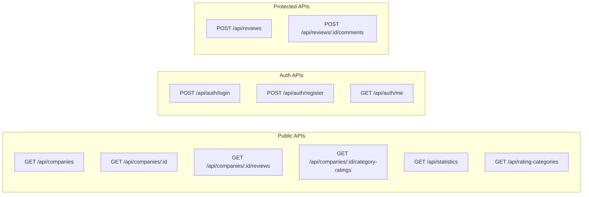
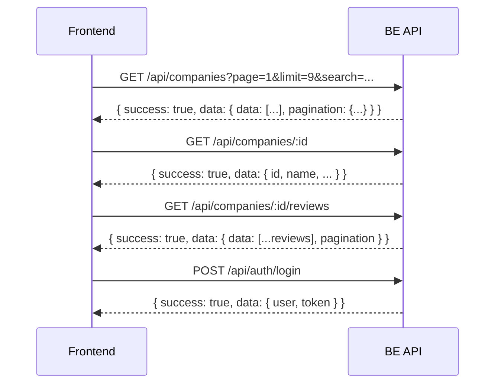

# Kế hoạch tích hợp API Backend vào Frontend

## Phân tích hiện trạng

### Backend API (https://api.reviewscongty.com/api/)

Response format chuẩn:

```json
{
  "success": true,
  "message": "Thành công",
  "data": {
    "data": [...],
    "pagination": { "page": 1, "limit": 10, "total": 100, "totalPages": 10, "hasNext": true, "hasPrev": false }
  }
}
```

### Frontend hiện tại

- Đang dùng local JSON từ [lib/data.ts](review-company-web/lib/data.ts) với các hàm như `getActiveCompanies()`, `getCompanyById()`, etc.
- Auth context tại [contexts/auth-context.tsx](review-company-web/contexts/auth-context.tsx) cũng dùng local data

## Các API Endpoints cần tích hợp



## Các file cần tạo/sửa

### 1. Tạo API Client mới

**File:** `review-company-web/lib/api.ts`

```typescript
const API_BASE_URL = 'https://api.reviewscongty.com/api';

// Các hàm fetch data từ API
export async function fetchCompanies(params) { ... }
export async function fetchCompanyById(id) { ... }
export async function fetchCompanyReviews(companyId) { ... }
export async function fetchStatistics() { ... }
export async function fetchCategoryRatings(companyId) { ... }
export async function login(email, password) { ... }
export async function register(data) { ... }
```

### 2. Cập nhật Types

**File:** [review-company-web/lib/types.ts](review-company-web/lib/types.ts)

Thêm các types cho API response:

- `ApiResponse<T>` - wrapper response
- `PaginatedResponse<T>` - response có pagination
- Điều chỉnh các types hiện có để khớp với BE response

### 3. Cập nhật Auth Context

**File:** [review-company-web/contexts/auth-context.tsx](review-company-web/contexts/auth-context.tsx)

- Gọi API `/api/auth/login` thay vì local auth
- Lưu JWT token vào localStorage
- Thêm token vào headers khi gọi protected APIs
- Gọi `/api/auth/me` để verify session

### 4. Cập nhật các Pages

| Page | Thay đổi |

|------|----------|

| [app/page.tsx](review-company-web/app/page.tsx) | `getTopRatedCompanies()` -> `fetchCompanies({ sort: 'rating_desc', limit: 6 })` |

| [app/companies/page.tsx](review-company-web/app/companies/page.tsx) | Dùng Server Component fetch hoặc Client Component với SWR/React Query |

| [app/companies/[id]/page.tsx](review-company-web/app/companies/[id]/page.tsx) | `getCompanyById()` -> `fetchCompanyById()` |

### 5. Cập nhật Components

| Component | Thay đổi |

|-----------|----------|

| [components/company/company-list.tsx](review-company-web/components/company/company-list.tsx) | Thay local data bằng API calls với loading states |

## Luồng data mới



## Lưu ý quan trọng

1. **CORS**: BE cần cho phép origin từ FE domain
2. **Error handling**: Xử lý các trường hợp API fail
3. **Loading states**: Thêm skeleton/spinner khi đang fetch
4. **Caching**: Cân nhắc dùng SWR hoặc React Query để cache và revalidate
5. **Token refresh**: Xử lý khi token hết hạn