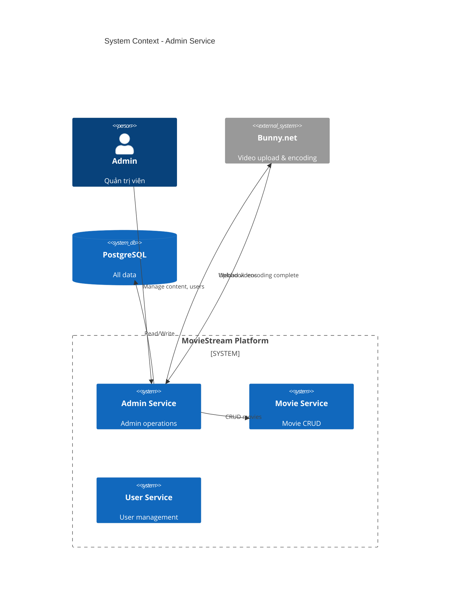
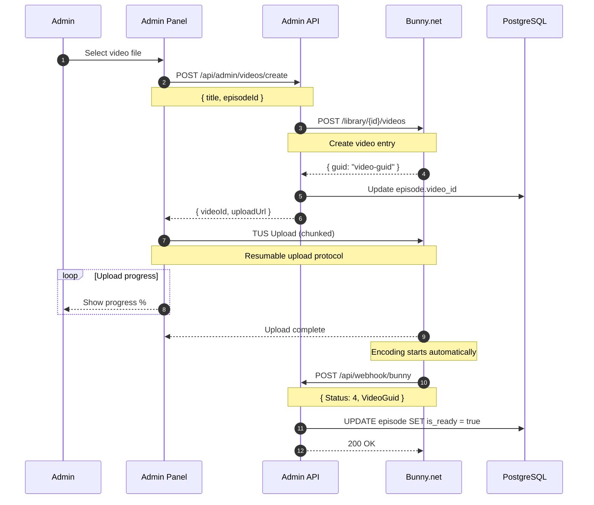
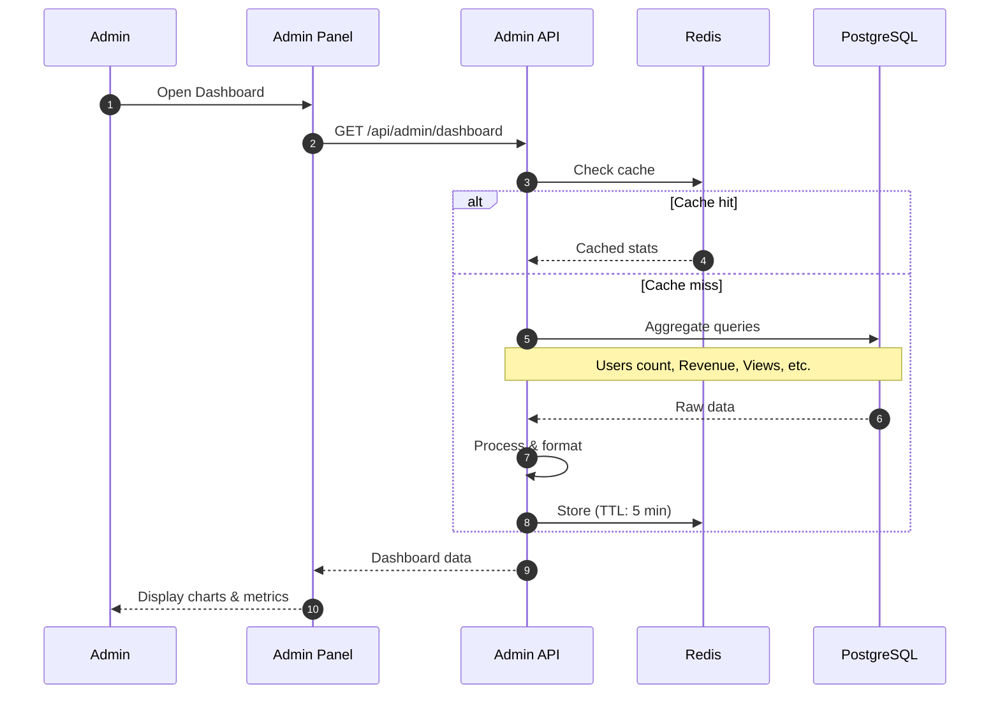

# HLD - MS-ADMIN (Admin Panel)

## 1. Context (Bối cảnh)

### 1.1 Business Context (Bối cảnh kinh doanh)

Module Admin cung cấp giao diện quản trị cho platform:
- Content Management: Quản lý phim, tập, categories
- Video Upload: Upload video lên Bunny.net
- User Management: Quản lý users, subscriptions
- Analytics: Dashboard thống kê

**User Stories:**

| ID | As a | I want to | So that |
|----|------|-----------|---------|
| US-01 | Admin | upload video mới | thêm nội dung |
| US-02 | Admin | quản lý phim/tập | duy trì catalog |
| US-03 | Admin | xem dashboard | theo dõi business |
| US-04 | Admin | quản lý users | hỗ trợ khách hàng |
| US-05 | Admin | xem payment history | theo dõi doanh thu |

**Business Rules:**
- Chỉ users với role ADMIN mới truy cập được
- Video upload qua TUS protocol (resumable)
- Webhook từ Bunny khi encode xong
- Dashboard data cached 5 phút

### 1.2 System Context

**Services:**
| Service | Tech Stack | Vai trò |
|---------|------------|---------|
| ms-admin | Node.js + Express | Admin APIs |
| Bunny.net | CDN | Video upload & storage |
| PostgreSQL | PostgreSQL 15 | Data |

### 1.3 Out Of Scope

- Advanced analytics (Phase 2)
- Bulk operations (Phase 2)
- Audit logs (Phase 2)
- Role-based permissions (Phase 2)

### 1.4 Actors

| Actor | Mô tả | Quyền hạn |
|-------|-------|-----------|
| **Admin** | Quản trị viên | Full access to admin panel |

---

## 2. Context Diagram



---

## 3. Core Business Workflow

### 3.1 Video Upload Flow



### 3.2 Dashboard Data Flow



---

## 4. Data Model

Admin module uses existing tables:
- `users` - User management
- `movies` - Movie management
- `episodes` - Episode management
- `subscriptions` - Subscription stats
- `payments` - Revenue tracking

### Additional Views/Queries

```sql
-- Dashboard stats view
CREATE VIEW admin_dashboard_stats AS
SELECT
    (SELECT COUNT(*) FROM users WHERE is_active = true) as total_users,
    (SELECT COUNT(*) FROM users WHERE created_at > NOW() - INTERVAL '30 days') as new_users_30d,
    (SELECT COUNT(*) FROM subscriptions WHERE status = 'ACTIVE') as active_subscribers,
    (SELECT COALESCE(SUM(amount), 0) FROM payments WHERE status = 'SUCCESS' AND created_at > NOW() - INTERVAL '30 days') as revenue_30d,
    (SELECT COUNT(*) FROM movies WHERE status = 'PUBLISHED') as published_movies,
    (SELECT SUM(view_count) FROM movies) as total_views;
```

---

## 5. API Specification

### 5.1 REST Endpoints

#### Dashboard
| Method | Endpoint | Description |
|--------|----------|-------------|
| GET | /api/admin/dashboard | Dashboard statistics |
| GET | /api/admin/dashboard/revenue | Revenue chart data |
| GET | /api/admin/dashboard/users | User growth chart |

#### Movies Management
| Method | Endpoint | Description |
|--------|----------|-------------|
| GET | /api/admin/movies | List all movies (incl drafts) |
| POST | /api/admin/movies | Create movie |
| PUT | /api/admin/movies/:id | Update movie |
| DELETE | /api/admin/movies/:id | Delete movie |
| PATCH | /api/admin/movies/:id/status | Change status |

#### Episodes Management
| Method | Endpoint | Description |
|--------|----------|-------------|
| GET | /api/admin/movies/:movieId/episodes | List episodes |
| POST | /api/admin/movies/:movieId/episodes | Create episode |
| PUT | /api/admin/episodes/:id | Update episode |
| DELETE | /api/admin/episodes/:id | Delete episode |

#### Video Upload
| Method | Endpoint | Description |
|--------|----------|-------------|
| POST | /api/admin/videos/create | Create video entry |
| POST | /api/webhook/bunny | Bunny encoding webhook |

#### Users Management
| Method | Endpoint | Description |
|--------|----------|-------------|
| GET | /api/admin/users | List users |
| GET | /api/admin/users/:id | User detail |
| PATCH | /api/admin/users/:id/status | Activate/Deactivate |

#### Subscriptions & Payments
| Method | Endpoint | Description |
|--------|----------|-------------|
| GET | /api/admin/subscriptions | List subscriptions |
| GET | /api/admin/payments | Payment history |
| PATCH | /api/admin/subscriptions/:id/extend | Manual extend |

### 5.2 Request/Response Examples

#### GET /api/admin/dashboard

**Response (200 OK):**
```json
{
  "success": true,
  "data": {
    "overview": {
      "totalUsers": 5420,
      "newUsersToday": 45,
      "newUsersThisMonth": 890,
      "activeSubscribers": 1250,
      "subscriberGrowth": 12.5
    },
    "revenue": {
      "today": 2500000,
      "thisWeek": 15000000,
      "thisMonth": 58000000,
      "growth": 8.3
    },
    "content": {
      "totalMovies": 156,
      "publishedMovies": 142,
      "totalEpisodes": 2450,
      "pendingUploads": 5
    },
    "engagement": {
      "totalViews": 1250000,
      "viewsToday": 8500,
      "avgWatchTime": 45,
      "topMovies": [
        { "id": "mov1", "title": "Phim A", "views": 15000 },
        { "id": "mov2", "title": "Phim B", "views": 12000 }
      ]
    },
    "cachedAt": "2026-01-27T10:00:00Z"
  }
}
```

#### POST /api/admin/videos/create

**Request:**
```json
{
  "title": "Tập 10",
  "episodeId": "ep123"
}
```

**Response (200 OK):**
```json
{
  "success": true,
  "data": {
    "videoId": "abc-123-def",
    "uploadUrl": "https://video.bunnycdn.com/tusupload",
    "uploadHeaders": {
      "AuthorizationSignature": "xxx",
      "AuthorizationExpire": "1706400000",
      "VideoId": "abc-123-def",
      "LibraryId": "12345"
    }
  }
}
```

#### POST /api/webhook/bunny

**Request (from Bunny):**
```json
{
  "VideoLibraryId": 12345,
  "VideoGuid": "abc-123-def",
  "Status": 4,
  "Length": 2700
}
```

**Status codes:**
- 0: Created
- 1: Uploaded
- 2: Processing
- 3: Transcoding
- 4: Finished
- 5: Error

**Response:**
```json
{
  "success": true
}
```

---

## 6. Admin Panel UI Structure

```
/admin
├── /dashboard              # Overview stats
├── /movies                 # Movie list
│   ├── /new               # Create movie
│   └── /:id/edit          # Edit movie
├── /episodes              # Episode management
│   └── /:id/upload        # Upload video
├── /users                 # User list
│   └── /:id               # User detail
├── /subscriptions         # Subscription list
├── /payments              # Payment history
└── /settings              # Admin settings
```

---

## 7. Non-Functional Requirements

### 7.1 Performance

| Metric | Target |
|--------|--------|
| Dashboard load (P95) | < 500ms |
| List queries (P95) | < 200ms |
| Video upload (10GB) | < 30 min |

### 7.2 Security

- Admin-only access (role check)
- All actions logged (Phase 2)
- HTTPS for video upload
- Webhook signature verification

### 7.3 Upload Limits

| Limit | Value |
|-------|-------|
| Max file size | 10 GB |
| Supported formats | MP4, MKV, MOV, AVI |
| Concurrent uploads | 3 |

---

## 8. Appendix

### 8.1 Error Codes

| Code | HTTP Status | Message |
|------|-------------|---------|
| ADMIN_ACCESS_DENIED | 403 | Không có quyền admin |
| ADMIN_MOVIE_NOT_FOUND | 404 | Phim không tồn tại |
| ADMIN_EPISODE_NOT_FOUND | 404 | Tập không tồn tại |
| ADMIN_USER_NOT_FOUND | 404 | User không tồn tại |
| ADMIN_UPLOAD_FAILED | 500 | Upload video thất bại |
| ADMIN_WEBHOOK_INVALID | 400 | Webhook không hợp lệ |

### 8.2 Bunny.net Configuration

```env
BUNNY_API_KEY=your-api-key
BUNNY_LIBRARY_ID=12345
BUNNY_PULL_ZONE=vz-abc123
BUNNY_STREAM_TOKEN_KEY=random-32-char-key
BUNNY_WEBHOOK_SECRET=webhook-secret
```

### 8.3 TUS Upload Headers

```typescript
const tusHeaders = {
  'AuthorizationSignature': generateSignature(),
  'AuthorizationExpire': Math.floor(Date.now() / 1000) + 86400,
  'VideoId': videoGuid,
  'LibraryId': BUNNY_LIBRARY_ID,
};
```

---

*Document Version: 1.0*
*Last Updated: January 2026*
