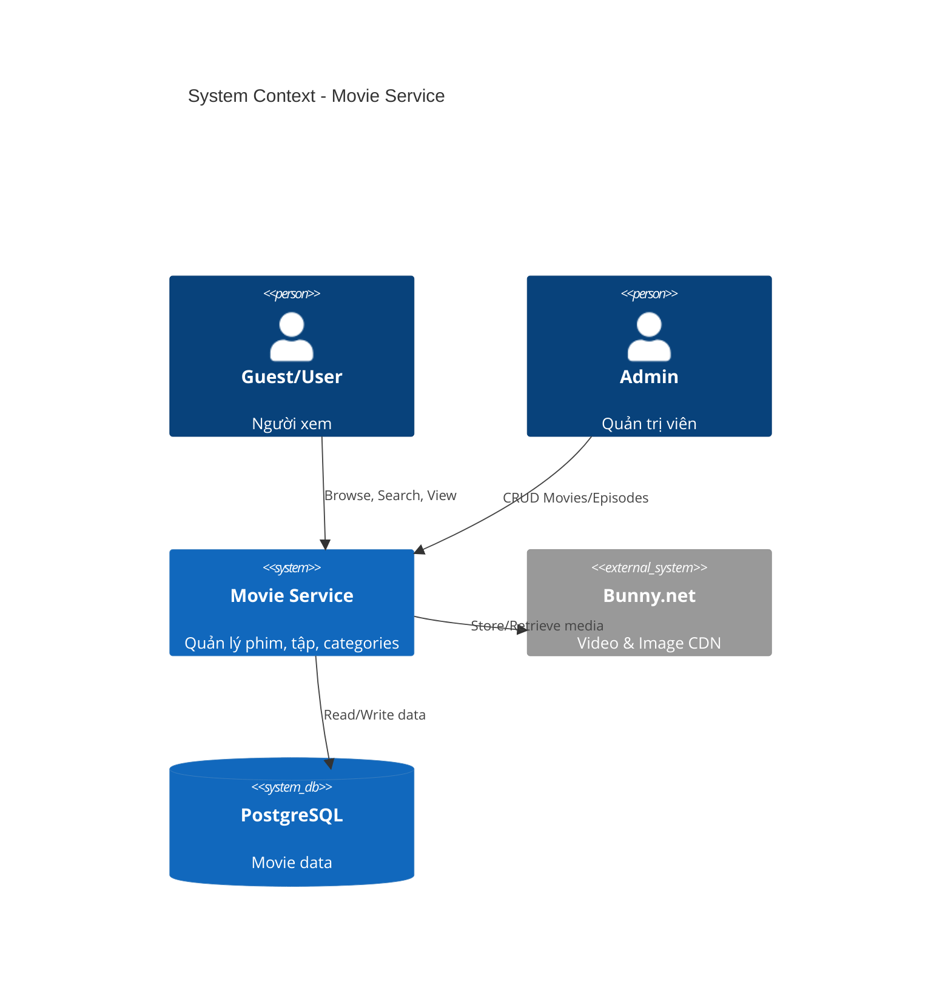
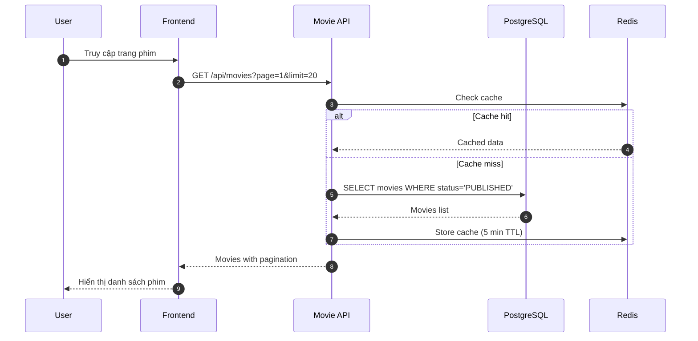
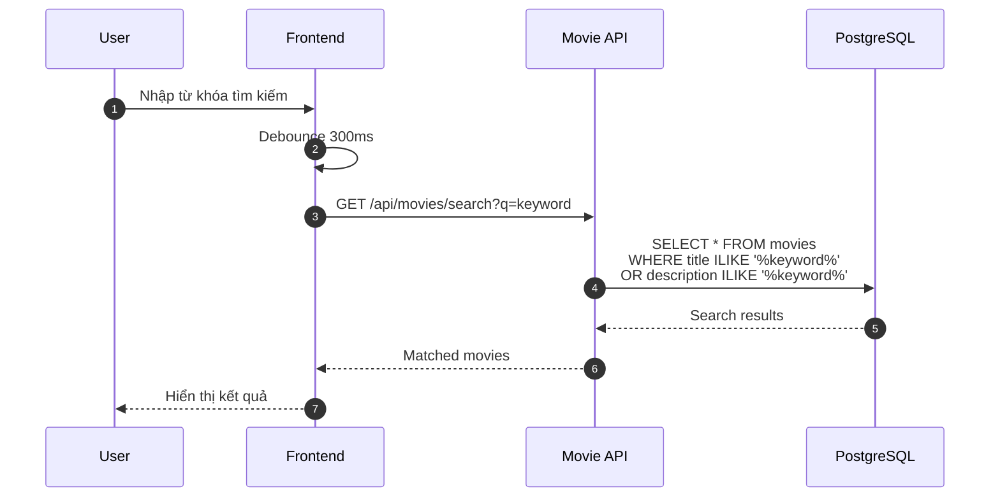
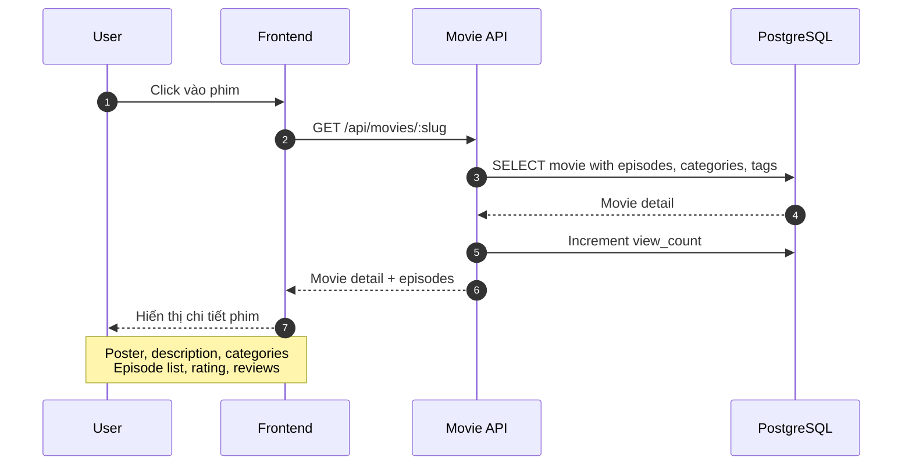
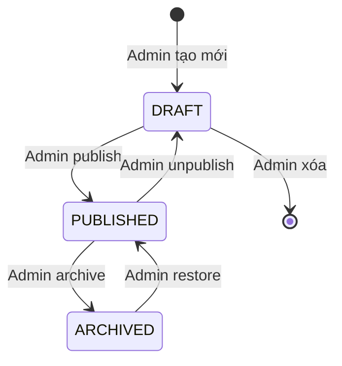
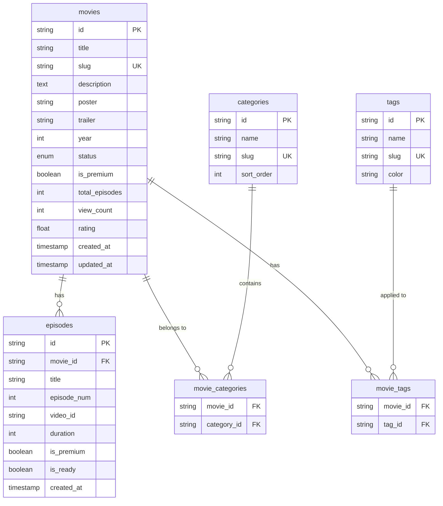

# HLD - MS-MOVIE (Movie & Episode Management)

## 1. Context (Bối cảnh)

### 1.1 Business Context (Bối cảnh kinh doanh)

Module Movie quản lý nội dung phim bộ trên nền tảng:
- Movies: Thông tin phim (title, description, poster, trailer)
- Episodes: Các tập của phim bộ
- Categories: Phân loại thể loại (Hành động, Tình cảm, Hài...)
- Tags: Nhãn phụ (Hot, Mới, Đề cử...)

**User Stories:**

| ID | As a | I want to | So that |
|----|------|-----------|---------|
| US-01 | Guest | xem danh sách phim | tôi chọn phim để xem |
| US-02 | Guest | tìm kiếm phim | tôi tìm phim mong muốn |
| US-03 | Guest | lọc phim theo thể loại | tôi tìm phim theo sở thích |
| US-04 | User | xem chi tiết phim | tôi biết thông tin trước khi xem |
| US-05 | Admin | thêm/sửa/xóa phim | quản lý nội dung |
| US-06 | Admin | quản lý tập phim | cập nhật tập mới |

**Business Rules:**
- Slug phim phải unique
- Mỗi phim thuộc ít nhất 1 category
- Episode number unique trong phim
- Phim có 3 status: DRAFT, PUBLISHED, ARCHIVED
- Chỉ phim PUBLISHED mới hiển thị cho user
- Phim/tập có thể đánh dấu premium (trả phí)

### 1.2 System Context (Bối cảnh hệ thống)

**Services tham gia:**

| Service | Tech Stack | Vai trò |
|---------|------------|---------|
| ms-movie | Node.js + Express | CRUD movies, episodes |
| ms-admin | Node.js + Express | Admin operations |
| PostgreSQL | PostgreSQL 15 | Data storage |
| Bunny.net | CDN | Video & image storage |

### 1.3 Out Of Scope (Phạm vi ngoài)

- Video streaming (xem HLD-MS-STREAMING)
- Reviews/Ratings (xem HLD-MS-REVIEW)
- Video upload (xem HLD-MS-ADMIN)
- Watch history (xem HLD-MS-USER)

### 1.4 Actors (Các vai trò)

| Actor | Mô tả | Quyền hạn |
|-------|-------|-----------|
| **Guest** | Chưa đăng nhập | Xem list, search, filter |
| **User** | Đã đăng nhập | + Xem detail, episodes |
| **Subscriber** | Có subscription | + Xem premium content |
| **Admin** | Quản trị viên | Full CRUD |

---

## 2. Context Diagram



---

## 3. Core Business Workflow

### 3.1 Browse Movies Flow



### 3.2 Search Movies Flow



### 3.3 Movie Detail Flow



### 3.4 Movie State Machine



| Status | Hiển thị | Có thể xem | Editable |
|--------|----------|------------|----------|
| DRAFT | Admin only | No | Yes |
| PUBLISHED | Public | Yes | Yes |
| ARCHIVED | Admin only | No | No |

---

## 4. Data Model

### 4.1 ERD



### 4.2 Table Definitions

#### movies

```sql
CREATE TABLE movies (
    id VARCHAR(30) PRIMARY KEY,
    title VARCHAR(255) NOT NULL,
    slug VARCHAR(255) NOT NULL UNIQUE,
    description TEXT,
    poster VARCHAR(500),
    trailer VARCHAR(500),
    year INT,
    status VARCHAR(20) NOT NULL DEFAULT 'DRAFT'
        CHECK (status IN ('DRAFT', 'PUBLISHED', 'ARCHIVED')),
    is_premium BOOLEAN NOT NULL DEFAULT false,
    total_episodes INT NOT NULL DEFAULT 0,
    view_count INT NOT NULL DEFAULT 0,
    rating DECIMAL(2,1) DEFAULT 0,
    created_at TIMESTAMP NOT NULL DEFAULT NOW(),
    updated_at TIMESTAMP NOT NULL DEFAULT NOW()
);

CREATE INDEX idx_movies_slug ON movies(slug);
CREATE INDEX idx_movies_status ON movies(status);
CREATE INDEX idx_movies_year ON movies(year);
CREATE INDEX idx_movies_created ON movies(created_at DESC);
CREATE INDEX idx_movies_rating ON movies(rating DESC);
CREATE INDEX idx_movies_view_count ON movies(view_count DESC);

-- Full text search
CREATE INDEX idx_movies_search ON movies USING GIN(
    to_tsvector('simple', title || ' ' || COALESCE(description, ''))
);
```

| Column | Type | Constraints | Description |
|--------|------|-------------|-------------|
| id | VARCHAR(30) | PK | CUID |
| title | VARCHAR(255) | NOT NULL | Tên phim |
| slug | VARCHAR(255) | UNIQUE | URL-friendly slug |
| description | TEXT | nullable | Mô tả phim |
| poster | VARCHAR(500) | nullable | Poster URL |
| trailer | VARCHAR(500) | nullable | Trailer URL |
| year | INT | nullable | Năm sản xuất |
| status | VARCHAR(20) | CHECK | DRAFT/PUBLISHED/ARCHIVED |
| is_premium | BOOLEAN | DEFAULT false | Phim premium |
| total_episodes | INT | DEFAULT 0 | Tổng số tập |
| view_count | INT | DEFAULT 0 | Lượt xem |
| rating | DECIMAL(2,1) | DEFAULT 0 | Điểm đánh giá (0-5) |

#### episodes

```sql
CREATE TABLE episodes (
    id VARCHAR(30) PRIMARY KEY,
    movie_id VARCHAR(30) NOT NULL REFERENCES movies(id) ON DELETE CASCADE,
    title VARCHAR(255),
    episode_num INT NOT NULL,
    video_id VARCHAR(100),
    duration INT DEFAULT 0,
    is_premium BOOLEAN NOT NULL DEFAULT false,
    is_ready BOOLEAN NOT NULL DEFAULT false,
    created_at TIMESTAMP NOT NULL DEFAULT NOW(),

    UNIQUE(movie_id, episode_num)
);

CREATE INDEX idx_episodes_movie ON episodes(movie_id);
CREATE INDEX idx_episodes_movie_num ON episodes(movie_id, episode_num);
```

| Column | Type | Constraints | Description |
|--------|------|-------------|-------------|
| id | VARCHAR(30) | PK | CUID |
| movie_id | VARCHAR(30) | FK | Reference to movie |
| title | VARCHAR(255) | nullable | Tên tập (optional) |
| episode_num | INT | NOT NULL | Số tập |
| video_id | VARCHAR(100) | nullable | Bunny.net video GUID |
| duration | INT | DEFAULT 0 | Thời lượng (giây) |
| is_premium | BOOLEAN | DEFAULT false | Tập premium |
| is_ready | BOOLEAN | DEFAULT false | Video đã encode xong |

#### categories

```sql
CREATE TABLE categories (
    id VARCHAR(30) PRIMARY KEY,
    name VARCHAR(100) NOT NULL,
    slug VARCHAR(100) NOT NULL UNIQUE,
    sort_order INT NOT NULL DEFAULT 0,
    created_at TIMESTAMP NOT NULL DEFAULT NOW()
);

-- Seed data
INSERT INTO categories (id, name, slug, sort_order) VALUES
('cat_action', 'Hành động', 'hanh-dong', 1),
('cat_romance', 'Tình cảm', 'tinh-cam', 2),
('cat_comedy', 'Hài hước', 'hai-huoc', 3),
('cat_horror', 'Kinh dị', 'kinh-di', 4),
('cat_drama', 'Chính kịch', 'chinh-kich', 5),
('cat_scifi', 'Khoa học viễn tưởng', 'khoa-hoc-vien-tuong', 6);
```

#### tags

```sql
CREATE TABLE tags (
    id VARCHAR(30) PRIMARY KEY,
    name VARCHAR(50) NOT NULL,
    slug VARCHAR(50) NOT NULL UNIQUE,
    color VARCHAR(7) DEFAULT '#6B7280',
    created_at TIMESTAMP NOT NULL DEFAULT NOW()
);

-- Seed data
INSERT INTO tags (id, name, slug, color) VALUES
('tag_hot', 'Hot', 'hot', '#EF4444'),
('tag_new', 'Mới', 'moi', '#10B981'),
('tag_recommend', 'Đề cử', 'de-cu', '#F59E0B'),
('tag_complete', 'Hoàn thành', 'hoan-thanh', '#3B82F6');
```

#### movie_categories & movie_tags

```sql
CREATE TABLE movie_categories (
    movie_id VARCHAR(30) NOT NULL REFERENCES movies(id) ON DELETE CASCADE,
    category_id VARCHAR(30) NOT NULL REFERENCES categories(id) ON DELETE CASCADE,
    PRIMARY KEY (movie_id, category_id)
);

CREATE TABLE movie_tags (
    movie_id VARCHAR(30) NOT NULL REFERENCES movies(id) ON DELETE CASCADE,
    tag_id VARCHAR(30) NOT NULL REFERENCES tags(id) ON DELETE CASCADE,
    PRIMARY KEY (movie_id, tag_id)
);
```

---

## 5. API Specification

### 5.1 REST Endpoints

#### Public APIs (No Auth)

| Method | Endpoint | Description |
|--------|----------|-------------|
| GET | /api/movies | Danh sách phim (có pagination, filter) |
| GET | /api/movies/:slug | Chi tiết phim |
| GET | /api/movies/search | Tìm kiếm phim |
| GET | /api/categories | Danh sách categories |
| GET | /api/categories/:slug/movies | Phim theo category |
| GET | /api/tags | Danh sách tags |
| GET | /api/tags/:slug/movies | Phim theo tag |

#### Admin APIs (Require Admin Role)

| Method | Endpoint | Description |
|--------|----------|-------------|
| POST | /api/admin/movies | Tạo phim mới |
| PUT | /api/admin/movies/:id | Cập nhật phim |
| DELETE | /api/admin/movies/:id | Xóa phim |
| PATCH | /api/admin/movies/:id/status | Đổi status |
| POST | /api/admin/movies/:id/episodes | Thêm tập mới |
| PUT | /api/admin/episodes/:id | Cập nhật tập |
| DELETE | /api/admin/episodes/:id | Xóa tập |

### 5.2 Request/Response Examples

#### GET /api/movies

**Query Parameters:**
- `page` (default: 1)
- `limit` (default: 20, max: 50)
- `category` (slug)
- `tag` (slug)
- `year`
- `status` (for admin)
- `sort` (newest, popular, rating)

**Response (200 OK):**
```json
{
  "success": true,
  "data": {
    "items": [
      {
        "id": "clx123",
        "title": "Phim ABC",
        "slug": "phim-abc",
        "poster": "https://cdn.bunny.net/posters/abc.jpg",
        "year": 2026,
        "status": "PUBLISHED",
        "isPremium": false,
        "totalEpisodes": 20,
        "currentEpisodes": 15,
        "viewCount": 10500,
        "rating": 4.5,
        "categories": [
          { "id": "cat_action", "name": "Hành động", "slug": "hanh-dong" }
        ],
        "tags": [
          { "id": "tag_hot", "name": "Hot", "slug": "hot", "color": "#EF4444" }
        ]
      }
    ],
    "pagination": {
      "page": 1,
      "limit": 20,
      "total": 150,
      "totalPages": 8
    }
  }
}
```

#### GET /api/movies/:slug

**Response (200 OK):**
```json
{
  "success": true,
  "data": {
    "id": "clx123",
    "title": "Phim ABC",
    "slug": "phim-abc",
    "description": "Mô tả phim chi tiết...",
    "poster": "https://cdn.bunny.net/posters/abc.jpg",
    "trailer": "https://www.youtube.com/watch?v=xxx",
    "year": 2026,
    "status": "PUBLISHED",
    "isPremium": false,
    "totalEpisodes": 20,
    "viewCount": 10500,
    "rating": 4.5,
    "reviewCount": 120,
    "categories": [
      { "id": "cat_action", "name": "Hành động", "slug": "hanh-dong" }
    ],
    "tags": [
      { "id": "tag_hot", "name": "Hot", "slug": "hot", "color": "#EF4444" }
    ],
    "episodes": [
      {
        "id": "ep1",
        "title": "Tập 1: Khởi đầu",
        "episodeNum": 1,
        "duration": 2700,
        "isPremium": false,
        "isReady": true
      },
      {
        "id": "ep2",
        "title": "Tập 2",
        "episodeNum": 2,
        "duration": 2800,
        "isPremium": true,
        "isReady": true
      }
    ],
    "relatedMovies": [
      {
        "id": "clx456",
        "title": "Phim XYZ",
        "slug": "phim-xyz",
        "poster": "https://cdn.bunny.net/posters/xyz.jpg"
      }
    ],
    "createdAt": "2026-01-01T00:00:00Z",
    "updatedAt": "2026-01-27T10:00:00Z"
  }
}
```

#### GET /api/movies/search

**Query Parameters:**
- `q` (required, min 2 chars)
- `limit` (default: 10)

**Response (200 OK):**
```json
{
  "success": true,
  "data": [
    {
      "id": "clx123",
      "title": "Phim ABC",
      "slug": "phim-abc",
      "poster": "https://cdn.bunny.net/posters/abc.jpg",
      "year": 2026,
      "rating": 4.5
    }
  ]
}
```

#### POST /api/admin/movies

**Request:**
```json
{
  "title": "Phim Mới",
  "description": "Mô tả phim...",
  "poster": "https://cdn.bunny.net/posters/new.jpg",
  "trailer": "https://youtube.com/watch?v=xxx",
  "year": 2026,
  "isPremium": false,
  "categoryIds": ["cat_action", "cat_drama"],
  "tagIds": ["tag_new"]
}
```

**Response (201 Created):**
```json
{
  "success": true,
  "data": {
    "id": "clx789",
    "title": "Phim Mới",
    "slug": "phim-moi",
    "status": "DRAFT",
    "createdAt": "2026-01-27T10:00:00Z"
  }
}
```

---

## 6. Integration Points

### 6.1 Upstream Dependencies

| Service | Data | Purpose |
|---------|------|---------|
| ms-auth | JWT token | Authorization |

### 6.2 Downstream Consumers

| Service | Integration | Purpose |
|---------|-------------|---------|
| ms-streaming | Episode video_id | Get video URL |
| ms-user | Movie/Episode IDs | Favorites, history |
| ms-review | Movie ID | Reviews |

### 6.3 External Services

| Service | Integration | Purpose |
|---------|-------------|---------|
| Bunny.net | REST API | Store posters, thumbnails |

---

## 7. Non-Functional Requirements

### 7.1 Performance

| Metric | Target |
|--------|--------|
| List movies (P95) | < 100ms |
| Movie detail (P95) | < 150ms |
| Search (P95) | < 200ms |
| Cache hit ratio | > 80% |

### 7.2 Caching Strategy

| Data | Cache Key | TTL |
|------|-----------|-----|
| Movies list | `movies:list:{filters}` | 5 min |
| Movie detail | `movies:detail:{slug}` | 10 min |
| Categories | `categories:all` | 1 hour |
| Tags | `tags:all` | 1 hour |

**Cache Invalidation:**
- Khi admin thêm/sửa/xóa movie → Clear related caches
- Khi status thay đổi → Clear list caches

---

## 8. Appendix

### 8.1 Error Codes

| Code | HTTP Status | Message |
|------|-------------|---------|
| MOVIE_NOT_FOUND | 404 | Phim không tồn tại |
| MOVIE_SLUG_EXISTS | 409 | Slug đã tồn tại |
| EPISODE_NOT_FOUND | 404 | Tập phim không tồn tại |
| EPISODE_NUM_EXISTS | 409 | Số tập đã tồn tại |
| CATEGORY_NOT_FOUND | 404 | Category không tồn tại |

### 8.2 Validation Rules

| Field | Rules |
|-------|-------|
| title | Required, max 255 chars |
| slug | Auto-generated from title, unique |
| description | Max 10000 chars |
| poster | Valid URL |
| year | 1900 - current year + 1 |
| episode_num | Integer > 0, unique per movie |
| duration | Integer >= 0 |

---

*Document Version: 1.0*
*Last Updated: January 2026*
