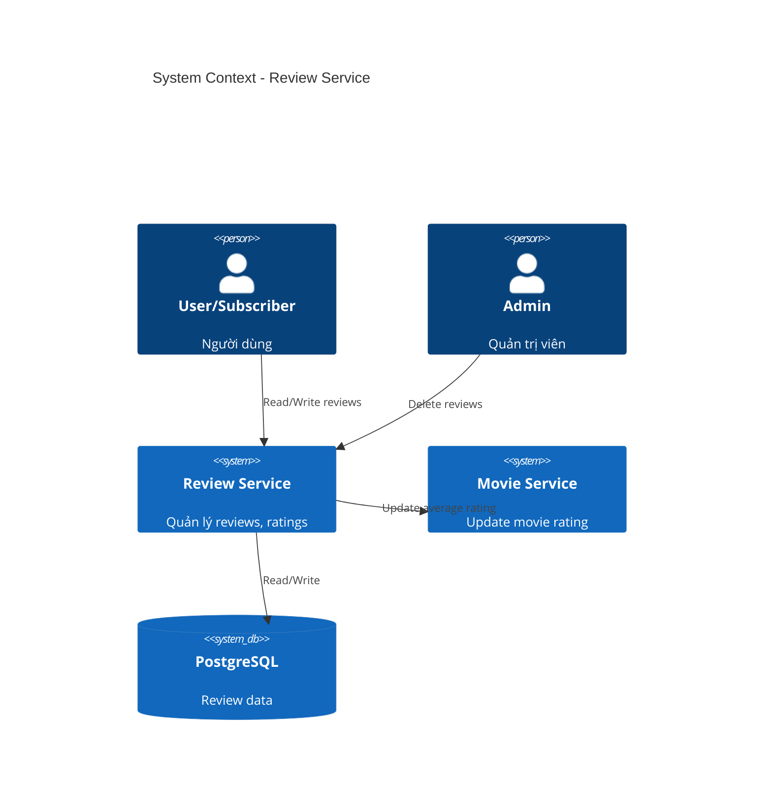
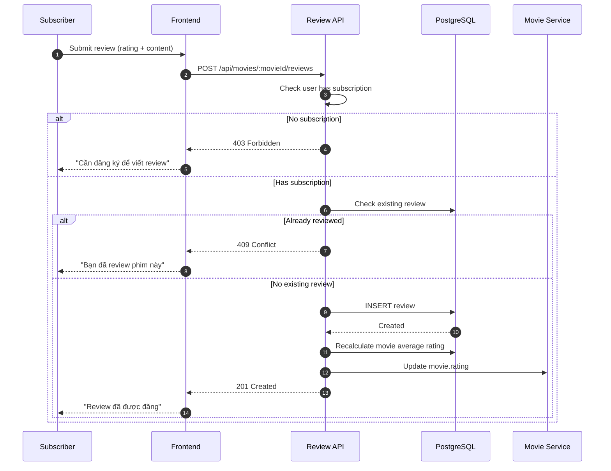
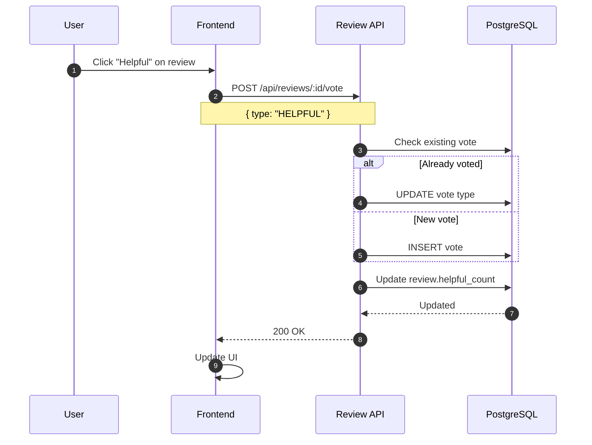
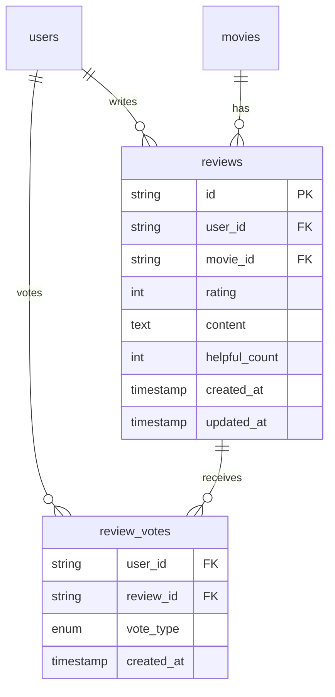

# HLD - MS-REVIEW (Review & Rating System)

## 1. Context (Bối cảnh)

### 1.1 Business Context (Bối cảnh kinh doanh)

Module Review quản lý đánh giá và bình luận của người dùng:
- Reviews: Bài đánh giá phim (rating + content)
- Ratings: Điểm số 1-5 sao
- Votes: Vote helpful/not helpful cho reviews

**User Stories:**

| ID | As a | I want to | So that |
|----|------|-----------|---------|
| US-01 | User | xem reviews của phim | biết chất lượng phim |
| US-02 | Subscriber | viết review | chia sẻ ý kiến |
| US-03 | User | vote review helpful | đánh dấu review hữu ích |
| US-04 | Admin | xóa review vi phạm | duy trì chất lượng |

**Business Rules:**
- Mỗi user chỉ được 1 review per movie
- Chỉ subscriber mới được viết review
- Rating từ 1-5 sao
- Review content tối thiểu 10 ký tự
- Average rating tính từ tất cả reviews
- Admin có thể xóa review vi phạm

### 1.2 System Context

**Services:**
| Service | Tech Stack | Vai trò |
|---------|------------|---------|
| ms-review | Node.js + Express | CRUD reviews |
| PostgreSQL | PostgreSQL 15 | Data storage |

### 1.3 Out Of Scope

- Comments trên review (Phase 2)
- Report review (Phase 2)
- Review moderation AI (Phase 2)

### 1.4 Actors

| Actor | Mô tả | Quyền hạn |
|-------|-------|-----------|
| **Guest** | Chưa đăng nhập | Xem reviews |
| **User** | Đăng nhập | + Vote helpful |
| **Subscriber** | Có subscription | + Viết/sửa review |
| **Admin** | Quản trị | + Xóa reviews |

---

## 2. Context Diagram



---

## 3. Core Business Workflow

### 3.1 Create Review Flow



### 3.2 Vote Review Flow



---

## 4. Data Model

### 4.1 ERD



### 4.2 Table Definitions

#### reviews

```sql
CREATE TABLE reviews (
    id VARCHAR(30) PRIMARY KEY,
    user_id VARCHAR(30) NOT NULL REFERENCES users(id) ON DELETE CASCADE,
    movie_id VARCHAR(30) NOT NULL REFERENCES movies(id) ON DELETE CASCADE,
    rating INT NOT NULL CHECK (rating >= 1 AND rating <= 5),
    content TEXT NOT NULL,
    helpful_count INT NOT NULL DEFAULT 0,
    created_at TIMESTAMP NOT NULL DEFAULT NOW(),
    updated_at TIMESTAMP NOT NULL DEFAULT NOW(),

    UNIQUE(user_id, movie_id)
);

CREATE INDEX idx_reviews_movie ON reviews(movie_id);
CREATE INDEX idx_reviews_user ON reviews(user_id);
CREATE INDEX idx_reviews_rating ON reviews(rating);
CREATE INDEX idx_reviews_helpful ON reviews(helpful_count DESC);
```

#### review_votes

```sql
CREATE TABLE review_votes (
    user_id VARCHAR(30) NOT NULL REFERENCES users(id) ON DELETE CASCADE,
    review_id VARCHAR(30) NOT NULL REFERENCES reviews(id) ON DELETE CASCADE,
    vote_type VARCHAR(20) NOT NULL CHECK (vote_type IN ('HELPFUL', 'NOT_HELPFUL')),
    created_at TIMESTAMP NOT NULL DEFAULT NOW(),

    PRIMARY KEY (user_id, review_id)
);
```

---

## 5. API Specification

### 5.1 REST Endpoints

| Method | Endpoint | Auth | Description |
|--------|----------|------|-------------|
| GET | /api/movies/:movieId/reviews | No | Lấy reviews của phim |
| POST | /api/movies/:movieId/reviews | Subscriber | Tạo review |
| PUT | /api/reviews/:id | Owner | Cập nhật review |
| DELETE | /api/reviews/:id | Owner/Admin | Xóa review |
| POST | /api/reviews/:id/vote | User | Vote helpful |
| DELETE | /api/reviews/:id/vote | User | Remove vote |

### 5.2 Request/Response Examples

#### GET /api/movies/:movieId/reviews

**Query:** `?page=1&limit=10&sort=helpful`

**Response (200 OK):**
```json
{
  "success": true,
  "data": {
    "summary": {
      "averageRating": 4.2,
      "totalReviews": 156,
      "ratingDistribution": {
        "5": 80,
        "4": 45,
        "3": 20,
        "2": 8,
        "1": 3
      }
    },
    "items": [
      {
        "id": "rev123",
        "user": {
          "id": "user456",
          "name": "Nguyễn Văn A",
          "avatar": "https://..."
        },
        "rating": 5,
        "content": "Phim rất hay, diễn xuất tuyệt vời!",
        "helpfulCount": 25,
        "userVote": "HELPFUL",
        "createdAt": "2026-01-20T10:00:00Z",
        "updatedAt": "2026-01-20T10:00:00Z"
      }
    ],
    "pagination": {
      "page": 1,
      "limit": 10,
      "total": 156
    }
  }
}
```

#### POST /api/movies/:movieId/reviews

**Request:**
```json
{
  "rating": 5,
  "content": "Phim rất hay, diễn xuất tuyệt vời! Recommend cho mọi người."
}
```

**Response (201 Created):**
```json
{
  "success": true,
  "data": {
    "id": "rev123",
    "rating": 5,
    "content": "Phim rất hay...",
    "createdAt": "2026-01-27T10:00:00Z"
  }
}
```

---

## 6. Integration Points

### 6.1 Downstream Consumers

| Service | Integration | Purpose |
|---------|-------------|---------|
| ms-movie | Update rating | Recalculate average rating |

### 6.2 Rating Calculation

```sql
-- Trigger or scheduled job
UPDATE movies m
SET rating = (
    SELECT COALESCE(AVG(rating)::DECIMAL(2,1), 0)
    FROM reviews r
    WHERE r.movie_id = m.id
),
review_count = (
    SELECT COUNT(*)
    FROM reviews r
    WHERE r.movie_id = m.id
)
WHERE m.id = :movieId;
```

---

## 7. Non-Functional Requirements

### 7.1 Performance

| Metric | Target |
|--------|--------|
| Get reviews (P95) | < 100ms |
| Create review (P95) | < 200ms |
| Vote (P95) | < 50ms |

### 7.2 Content Moderation

- Basic word filter for inappropriate content
- Admin review queue for flagged content (Phase 2)

---

## 8. Appendix

### 8.1 Error Codes

| Code | HTTP Status | Message |
|------|-------------|---------|
| REVIEW_NOT_FOUND | 404 | Review không tồn tại |
| REVIEW_ALREADY_EXISTS | 409 | Bạn đã review phim này |
| REVIEW_SUBSCRIPTION_REQUIRED | 403 | Cần subscription để viết review |
| REVIEW_NOT_OWNER | 403 | Không có quyền sửa review này |
| REVIEW_CONTENT_TOO_SHORT | 400 | Review phải có ít nhất 10 ký tự |

### 8.2 Validation Rules

| Field | Rules |
|-------|-------|
| rating | Required, integer 1-5 |
| content | Required, min 10 chars, max 2000 chars |

---

*Document Version: 1.0*
*Last Updated: January 2026*
