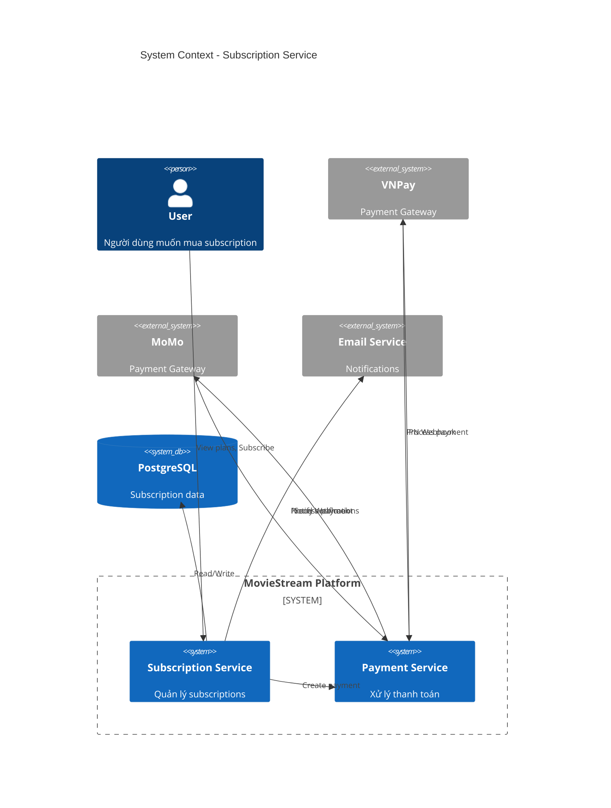
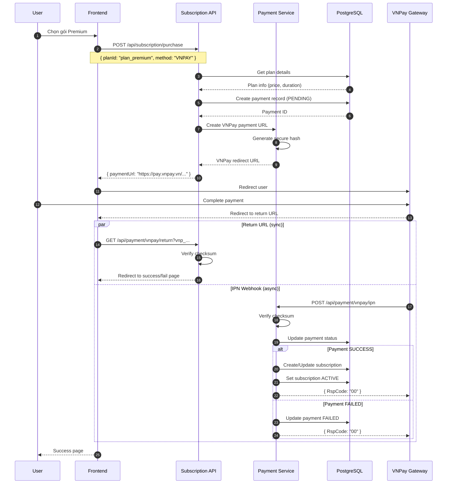
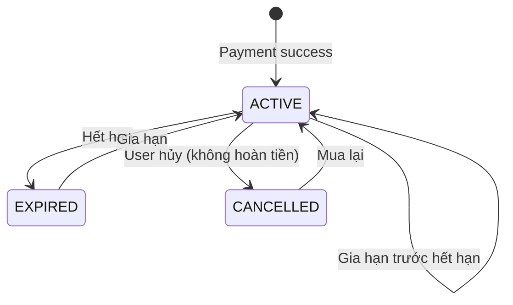
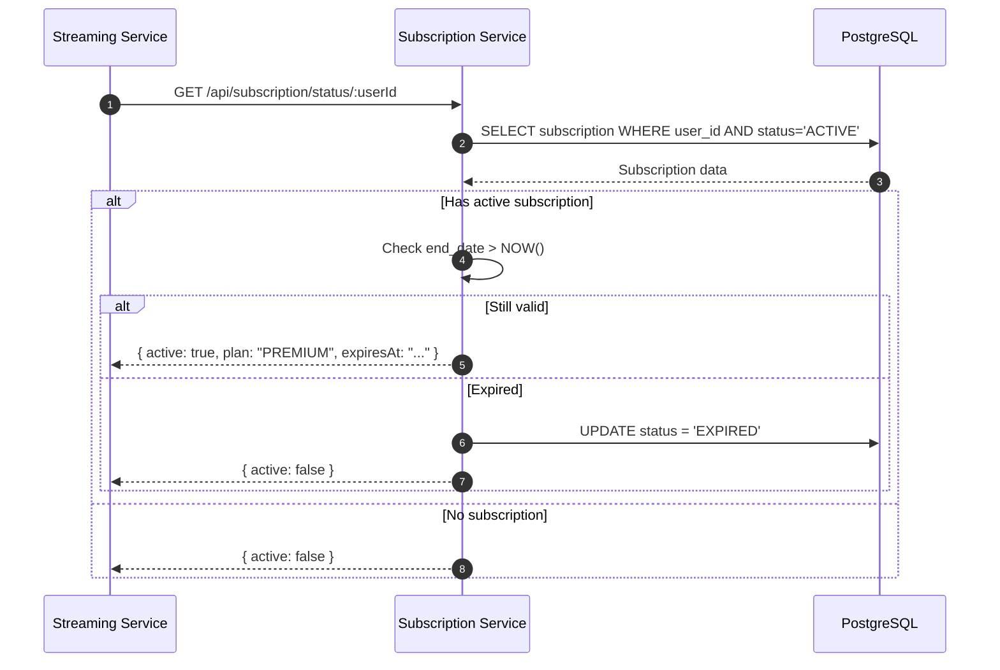
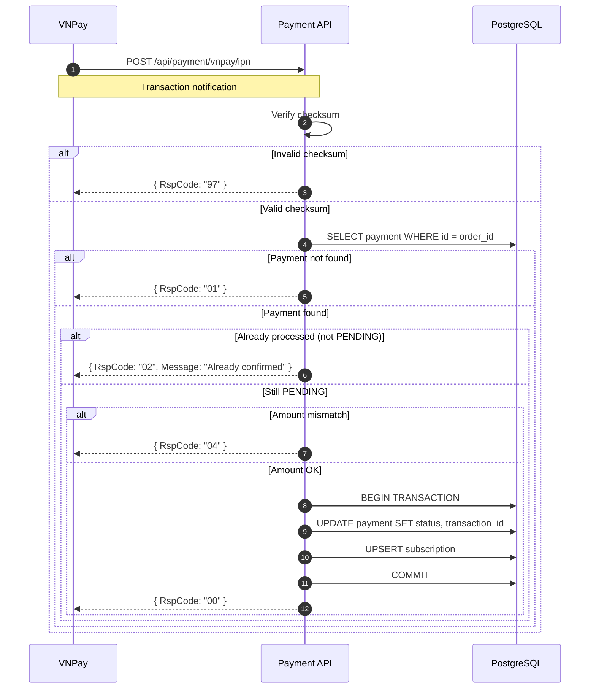
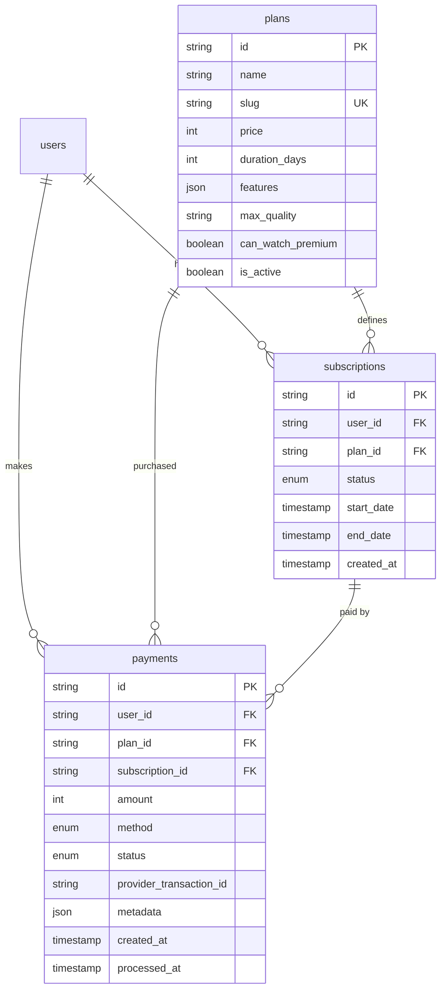

# HLD - MS-SUBSCRIPTION (Subscription & Payment)

## 1. Context (Bối cảnh)

### 1.1 Business Context (Bối cảnh kinh doanh)

Module Subscription quản lý gói dịch vụ và thanh toán:
- Plans: Các gói đăng ký (Basic, Premium, VIP)
- Subscriptions: Trạng thái đăng ký của user
- Payments: Lịch sử thanh toán
- Payment Gateways: VNPay, MoMo

**Mô hình kinh doanh:**

| Gói | Giá | Thời hạn | Quyền lợi |
|-----|-----|----------|-----------|
| Cơ bản | 49,000 VNĐ | 1 tháng | Xem phim thường, 720p |
| Premium | 79,000 VNĐ | 1 tháng | Xem tất cả + premium, 1080p |
| VIP Năm | 699,000 VNĐ | 12 tháng | Premium + giảm 26% |

**User Stories:**

| ID | As a | I want to | So that |
|----|------|-----------|---------|
| US-01 | User | xem các gói subscription | tôi chọn gói phù hợp |
| US-02 | User | thanh toán qua VNPay/MoMo | tôi mua subscription |
| US-03 | Subscriber | xem subscription hiện tại | biết khi nào hết hạn |
| US-04 | Subscriber | gia hạn subscription | tiếp tục xem phim |
| US-05 | Admin | xem thống kê doanh thu | theo dõi kinh doanh |

**Business Rules:**
- User chỉ có 1 active subscription tại 1 thời điểm
- Gia hạn trước khi hết hạn → cộng dồn thời gian
- Subscription không hoàn tiền
- Webhook từ payment gateway phải idempotent
- Gửi email nhắc gia hạn trước 3 ngày hết hạn

### 1.2 System Context (Bối cảnh hệ thống)

**Services tham gia:**

| Service | Tech Stack | Vai trò |
|---------|------------|---------|
| ms-subscription | Node.js + Express | Quản lý subscription logic |
| ms-payment | Node.js + Express | Xử lý thanh toán |
| VNPay | External | Payment gateway |
| MoMo | External | Payment gateway |
| PostgreSQL | PostgreSQL 15 | Data storage |

### 1.3 Out Of Scope (Phạm vi ngoài)

- Refund processing (manual qua admin)
- Recurring payment tự động (VNPay/MoMo không hỗ trợ)
- Invoice/VAT generation - Phase 2
- Multiple subscriptions per user
- Pay-per-view model

### 1.4 Actors (Các vai trò)

| Actor | Mô tả | Quyền hạn |
|-------|-------|-----------|
| **User** | Người dùng đăng nhập | Mua subscription |
| **Subscriber** | Có subscription active | Xem premium content |
| **Admin** | Quản trị viên | Xem reports, manual actions |
| **VNPay** | Payment gateway | Process payments |
| **MoMo** | Payment gateway | Process payments |

---

## 2. Context Diagram



---

## 3. Core Business Workflow

### 3.1 Purchase Subscription Flow (VNPay)



### 3.2 Subscription State Machine



| Status | Description | Can Watch Premium |
|--------|-------------|-------------------|
| ACTIVE | Subscription đang có hiệu lực | Yes |
| EXPIRED | Subscription đã hết hạn | No |
| CANCELLED | User đã hủy | No |

### 3.3 Subscription Check Flow



### 3.4 Payment Webhook Processing (Idempotent)



---

## 4. Data Model

### 4.1 ERD



### 4.2 Table Definitions

#### plans

```sql
CREATE TABLE plans (
    id VARCHAR(30) PRIMARY KEY,
    name VARCHAR(100) NOT NULL,
    slug VARCHAR(100) NOT NULL UNIQUE,
    price INT NOT NULL,
    duration_days INT NOT NULL,
    features JSONB NOT NULL DEFAULT '[]',
    max_quality VARCHAR(10) NOT NULL DEFAULT '720p',
    can_watch_premium BOOLEAN NOT NULL DEFAULT false,
    is_active BOOLEAN NOT NULL DEFAULT true,
    sort_order INT NOT NULL DEFAULT 0,
    created_at TIMESTAMP NOT NULL DEFAULT NOW(),
    updated_at TIMESTAMP NOT NULL DEFAULT NOW()
);

-- Seed data
INSERT INTO plans (id, name, slug, price, duration_days, features, max_quality, can_watch_premium, sort_order) VALUES
('plan_basic', 'Cơ bản', 'co-ban', 49000, 30, '["Xem phim thường", "Chất lượng 720p"]', '720p', false, 1),
('plan_premium', 'Premium', 'premium', 79000, 30, '["Xem tất cả phim", "Chất lượng 1080p", "Không quảng cáo"]', '1080p', true, 2),
('plan_vip_year', 'VIP Năm', 'vip-nam', 699000, 365, '["Premium + Giảm 26%", "Xem sớm 1 tuần"]', '1080p', true, 3);
```

#### subscriptions

```sql
CREATE TABLE subscriptions (
    id VARCHAR(30) PRIMARY KEY,
    user_id VARCHAR(30) NOT NULL REFERENCES users(id) ON DELETE CASCADE,
    plan_id VARCHAR(30) NOT NULL REFERENCES plans(id),
    status VARCHAR(20) NOT NULL DEFAULT 'ACTIVE'
        CHECK (status IN ('ACTIVE', 'EXPIRED', 'CANCELLED')),
    start_date TIMESTAMP NOT NULL DEFAULT NOW(),
    end_date TIMESTAMP NOT NULL,
    created_at TIMESTAMP NOT NULL DEFAULT NOW(),
    updated_at TIMESTAMP NOT NULL DEFAULT NOW(),

    UNIQUE(user_id, plan_id)
);

CREATE INDEX idx_subscriptions_user ON subscriptions(user_id);
CREATE INDEX idx_subscriptions_status ON subscriptions(status);
CREATE INDEX idx_subscriptions_end_date ON subscriptions(end_date);
```

#### payments

```sql
CREATE TABLE payments (
    id VARCHAR(30) PRIMARY KEY,
    user_id VARCHAR(30) NOT NULL REFERENCES users(id),
    plan_id VARCHAR(30) NOT NULL REFERENCES plans(id),
    subscription_id VARCHAR(30) REFERENCES subscriptions(id),
    amount INT NOT NULL,
    method VARCHAR(20) NOT NULL CHECK (method IN ('VNPAY', 'MOMO')),
    status VARCHAR(20) NOT NULL DEFAULT 'PENDING'
        CHECK (status IN ('PENDING', 'SUCCESS', 'FAILED', 'REFUNDED')),
    provider_transaction_id VARCHAR(100),
    metadata JSONB,
    created_at TIMESTAMP NOT NULL DEFAULT NOW(),
    processed_at TIMESTAMP,

    INDEX idx_payments_user (user_id),
    INDEX idx_payments_status (status),
    INDEX idx_payments_created (created_at)
);
```

---

## 5. API Specification

### 5.1 REST Endpoints

| Method | Endpoint | Auth | Description |
|--------|----------|------|-------------|
| GET | /api/subscription/plans | No | Danh sách các gói |
| GET | /api/subscription/current | Yes | Subscription hiện tại |
| POST | /api/subscription/purchase | Yes | Tạo thanh toán |
| GET | /api/subscription/status/:userId | Internal | Check subscription status |
| GET | /api/payment/vnpay/return | No | VNPay return URL |
| POST | /api/payment/vnpay/ipn | No | VNPay IPN webhook |
| POST | /api/payment/momo/create | Yes | Create MoMo payment |
| POST | /api/payment/momo/notify | No | MoMo notify webhook |
| GET | /api/subscription/history | Yes | Payment history |

### 5.2 Request/Response Examples

#### GET /api/subscription/plans

**Response (200 OK):**
```json
{
  "success": true,
  "data": [
    {
      "id": "plan_basic",
      "name": "Cơ bản",
      "slug": "co-ban",
      "price": 49000,
      "priceFormatted": "49,000đ",
      "duration": "1 tháng",
      "durationDays": 30,
      "features": [
        "Xem phim thường",
        "Chất lượng 720p"
      ],
      "maxQuality": "720p",
      "canWatchPremium": false,
      "popular": false
    },
    {
      "id": "plan_premium",
      "name": "Premium",
      "slug": "premium",
      "price": 79000,
      "priceFormatted": "79,000đ",
      "duration": "1 tháng",
      "durationDays": 30,
      "features": [
        "Xem tất cả phim kể cả Premium",
        "Chất lượng 1080p",
        "Không quảng cáo"
      ],
      "maxQuality": "1080p",
      "canWatchPremium": true,
      "popular": true
    }
  ]
}
```

#### GET /api/subscription/current

**Response (200 OK - Has subscription):**
```json
{
  "success": true,
  "data": {
    "id": "sub123",
    "plan": {
      "id": "plan_premium",
      "name": "Premium",
      "maxQuality": "1080p",
      "canWatchPremium": true
    },
    "status": "ACTIVE",
    "startDate": "2026-01-01T00:00:00Z",
    "endDate": "2026-02-01T00:00:00Z",
    "daysRemaining": 5,
    "isExpiringSoon": true
  }
}
```

**Response (200 OK - No subscription):**
```json
{
  "success": true,
  "data": null
}
```

#### POST /api/subscription/purchase

**Request:**
```json
{
  "planId": "plan_premium",
  "paymentMethod": "VNPAY"
}
```

**Response (200 OK):**
```json
{
  "success": true,
  "data": {
    "paymentId": "pay123",
    "paymentUrl": "https://sandbox.vnpayment.vn/paymentv2/vpcpay.html?vnp_Amount=7900000&vnp_Command=pay&..."
  }
}
```

#### POST /api/payment/vnpay/ipn

**Request (from VNPay):**
```
vnp_Amount=7900000
vnp_BankCode=NCB
vnp_CardType=ATM
vnp_OrderInfo=Thanh+toan+goi+Premium
vnp_PayDate=20260127100000
vnp_ResponseCode=00
vnp_TmnCode=DEMO123
vnp_TransactionNo=14123456
vnp_TransactionStatus=00
vnp_TxnRef=pay123
vnp_SecureHash=ABC123...
```

**Response:**
```json
{
  "RspCode": "00",
  "Message": "Confirm Success"
}
```

---

## 6. Integration Points

### 6.1 VNPay Integration

**Configuration:**
```env
VNPAY_TMN_CODE=DEMO123
VNPAY_HASH_SECRET=XXXXX
VNPAY_URL=https://sandbox.vnpayment.vn/paymentv2/vpcpay.html
VNPAY_RETURN_URL=https://moviestream.vn/payment/vnpay/return
```

**VNPay Response Codes:**
| Code | Meaning |
|------|---------|
| 00 | Success |
| 07 | Suspicious transaction |
| 09 | Card not registered for Internet Banking |
| 24 | User cancelled |
| 51 | Insufficient balance |
| 99 | Unknown error |

### 6.2 MoMo Integration

**Configuration:**
```env
MOMO_PARTNER_CODE=MOMO
MOMO_ACCESS_KEY=F8BBA842ECF85
MOMO_SECRET_KEY=K951B6PE1waDMi640xX08PD3vg6EkVlz
MOMO_ENDPOINT=https://test-payment.momo.vn/v2/gateway/api
MOMO_RETURN_URL=https://moviestream.vn/payment/momo/return
MOMO_NOTIFY_URL=https://moviestream.vn/api/payment/momo/notify
```

### 6.3 Downstream Consumers

| Service | Integration | Purpose |
|---------|-------------|---------|
| ms-streaming | GET /subscription/status | Check premium access |
| ms-auth | Subscription in JWT | Include in token refresh |

---

## 7. Non-Functional Requirements

### 7.1 Performance

| Metric | Target |
|--------|--------|
| Create payment (P95) | < 500ms |
| Webhook processing (P95) | < 200ms |
| Check subscription (P95) | < 50ms |

### 7.2 Reliability

- Idempotent webhook processing
- Transaction for payment + subscription update
- Retry logic for failed webhooks
- Dead letter queue for failed notifications

### 7.3 Security

- Verify all webhook signatures
- Never store card details
- HTTPS only
- PCI DSS compliance via payment gateway

---

## 8. Appendix

### 8.1 Error Codes

| Code | HTTP Status | Message |
|------|-------------|---------|
| SUB_PLAN_NOT_FOUND | 404 | Gói không tồn tại |
| SUB_ALREADY_ACTIVE | 400 | Bạn đã có subscription active |
| SUB_PAYMENT_FAILED | 400 | Thanh toán thất bại |
| SUB_INVALID_CHECKSUM | 400 | Checksum không hợp lệ |
| SUB_AMOUNT_MISMATCH | 400 | Số tiền không khớp |

### 8.2 Cron Jobs

**Check Expiring Subscriptions (Daily):**
```typescript
// Chạy mỗi ngày lúc 9:00 AM
async function checkExpiringSubscriptions() {
  const expiringSoon = await prisma.subscription.findMany({
    where: {
      status: 'ACTIVE',
      endDate: {
        gte: new Date(),
        lte: addDays(new Date(), 3),
      },
    },
    include: { user: true, plan: true },
  });

  for (const sub of expiringSoon) {
    await sendEmail({
      to: sub.user.email,
      template: 'subscription-expiring',
      data: {
        name: sub.user.name,
        planName: sub.plan.name,
        expiryDate: sub.endDate,
        renewUrl: `${BASE_URL}/subscription?renew=true`,
      },
    });
  }
}
```

**Auto-Expire Subscriptions (Hourly):**
```typescript
// Chạy mỗi giờ
async function autoExpireSubscriptions() {
  await prisma.subscription.updateMany({
    where: {
      status: 'ACTIVE',
      endDate: { lt: new Date() },
    },
    data: {
      status: 'EXPIRED',
      updatedAt: new Date(),
    },
  });
}
```

---

*Document Version: 1.0*
*Last Updated: January 2026*
