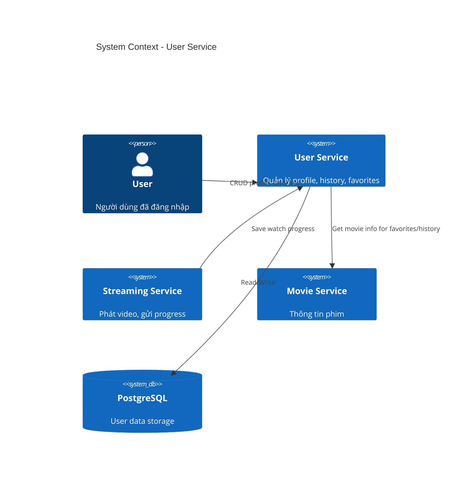
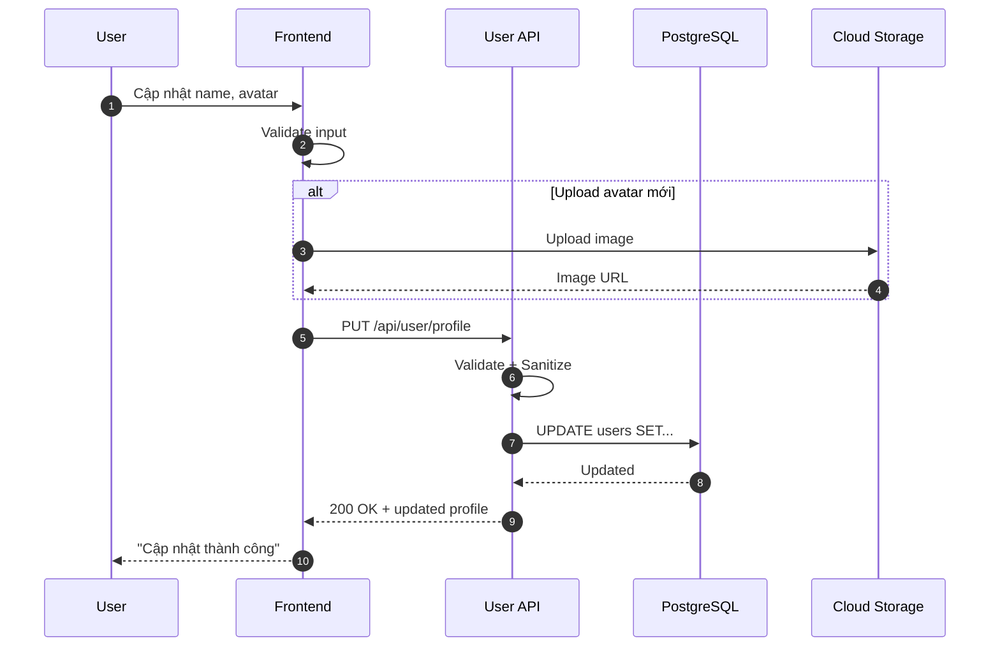
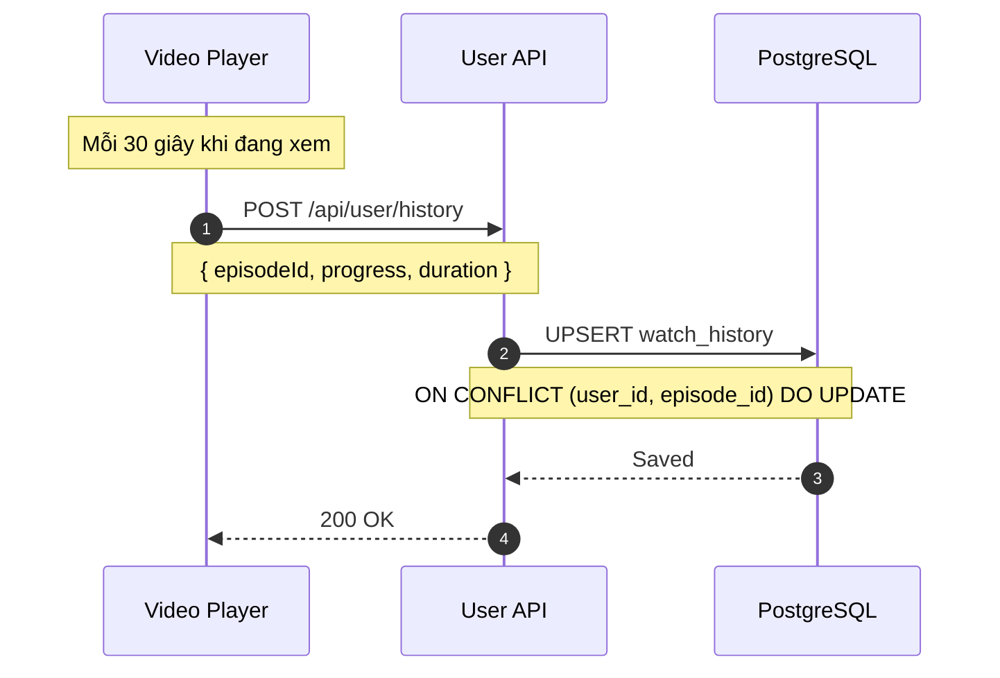
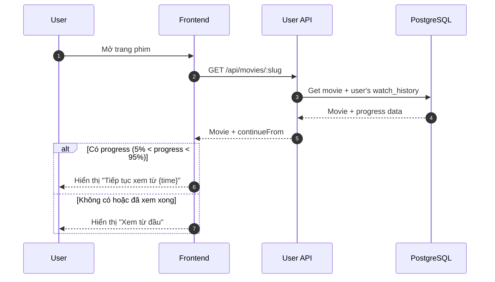
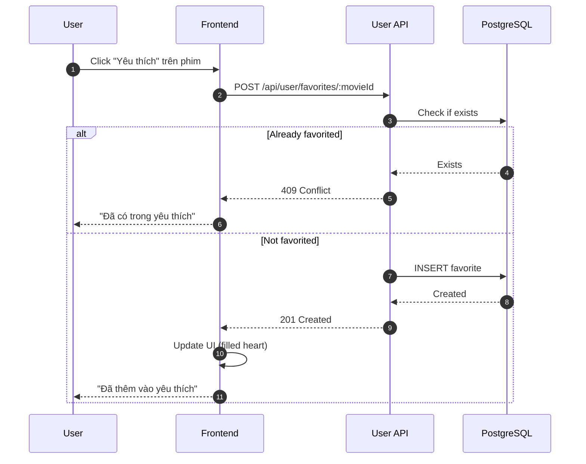
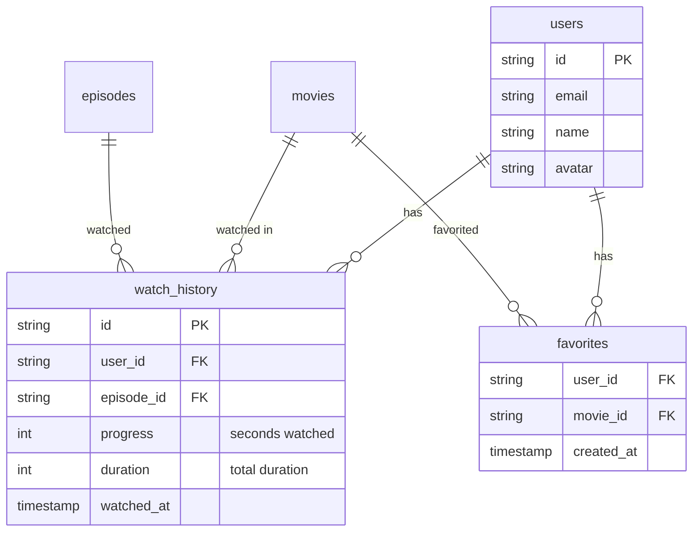

# HLD - MS-USER (User Profile & Preferences)

## 1. Context (Bối cảnh)

### 1.1 Business Context (Bối cảnh kinh doanh)

Module User quản lý thông tin cá nhân và preferences của người dùng:
- Profile: avatar, tên hiển thị, thông tin liên hệ
- Watch History: lịch sử xem phim, tiến độ xem
- Favorites: danh sách phim yêu thích
- Settings: cài đặt chất lượng video, notifications

**User Stories:**

| ID | As a | I want to | So that |
|----|------|-----------|---------|
| US-01 | User | cập nhật profile | thông tin của tôi chính xác |
| US-02 | User | xem lịch sử xem | tôi tiếp tục xem dở |
| US-03 | User | thêm phim vào yêu thích | tôi xem lại sau |
| US-04 | User | xóa lịch sử xem | bảo vệ quyền riêng tư |
| US-05 | User | cài đặt chất lượng mặc định | không phải chọn mỗi lần |

**Business Rules:**
- Mỗi user chỉ có 1 profile
- Watch history lưu tiến độ xem (giây) cho mỗi tập
- Favorites không giới hạn số lượng
- History tự động lưu khi người dùng xem video
- Tiếp tục xem từ vị trí dừng nếu > 5% và < 95% tiến độ

### 1.2 System Context (Bối cảnh hệ thống)

**Services tham gia:**

| Service | Tech Stack | Vai trò |
|---------|------------|---------|
| ms-user | Node.js + Express | Quản lý user data |
| ms-streaming | Node.js + Express | Gửi watch progress |
| PostgreSQL | PostgreSQL 15 | Lưu trữ dữ liệu |

### 1.3 Out Of Scope (Phạm vi ngoài)

- Authentication (xem HLD-MS-AUTH)
- Subscription management (xem HLD-MS-SUBSCRIPTION)
- Reviews/Ratings (xem HLD-MS-REVIEW)
- Social features (comments, share) - Phase 2
- Multiple profiles per account - Phase 2

### 1.4 Actors (Các vai trò)

| Actor | Mô tả | Quyền hạn |
|-------|-------|-----------|
| **User** | Đã đăng nhập | CRUD profile, history, favorites |
| **System** | Video player | Auto-save watch progress |

---

## 2. Context Diagram



---

## 3. Core Business Workflow

### 3.1 Update Profile Flow



### 3.2 Watch History - Auto Save Progress



### 3.3 Continue Watching Logic



### 3.4 Add to Favorites



---

## 4. Data Model

### 4.1 ERD



### 4.2 Table Definitions

#### watch_history

```sql
CREATE TABLE watch_history (
    id VARCHAR(30) PRIMARY KEY,
    user_id VARCHAR(30) NOT NULL REFERENCES users(id) ON DELETE CASCADE,
    episode_id VARCHAR(30) NOT NULL REFERENCES episodes(id) ON DELETE CASCADE,
    progress INT NOT NULL DEFAULT 0,
    duration INT NOT NULL,
    watched_at TIMESTAMP NOT NULL DEFAULT NOW(),
    created_at TIMESTAMP NOT NULL DEFAULT NOW(),
    updated_at TIMESTAMP NOT NULL DEFAULT NOW(),

    UNIQUE(user_id, episode_id)
);

CREATE INDEX idx_watch_history_user ON watch_history(user_id);
CREATE INDEX idx_watch_history_user_watched ON watch_history(user_id, watched_at DESC);
```

| Column | Type | Constraints | Description |
|--------|------|-------------|-------------|
| id | VARCHAR(30) | PK | CUID |
| user_id | VARCHAR(30) | FK → users | Owner |
| episode_id | VARCHAR(30) | FK → episodes | Watched episode |
| progress | INT | NOT NULL | Seconds watched |
| duration | INT | NOT NULL | Total duration |
| watched_at | TIMESTAMP | NOT NULL | Last watch time |

#### favorites

```sql
CREATE TABLE favorites (
    user_id VARCHAR(30) NOT NULL REFERENCES users(id) ON DELETE CASCADE,
    movie_id VARCHAR(30) NOT NULL REFERENCES movies(id) ON DELETE CASCADE,
    created_at TIMESTAMP NOT NULL DEFAULT NOW(),

    PRIMARY KEY (user_id, movie_id)
);

CREATE INDEX idx_favorites_user ON favorites(user_id);
CREATE INDEX idx_favorites_movie ON favorites(movie_id);
```

| Column | Type | Constraints | Description |
|--------|------|-------------|-------------|
| user_id | VARCHAR(30) | PK, FK → users | Owner |
| movie_id | VARCHAR(30) | PK, FK → movies | Favorited movie |
| created_at | TIMESTAMP | NOT NULL | When added |

---

## 5. API Specification

### 5.1 REST Endpoints

| Method | Endpoint | Auth | Description |
|--------|----------|------|-------------|
| GET | /api/user/profile | Yes | Lấy profile user |
| PUT | /api/user/profile | Yes | Cập nhật profile |
| GET | /api/user/history | Yes | Lấy watch history |
| POST | /api/user/history | Yes | Lưu watch progress |
| DELETE | /api/user/history | Yes | Xóa toàn bộ history |
| DELETE | /api/user/history/:episodeId | Yes | Xóa 1 item history |
| GET | /api/user/favorites | Yes | Lấy danh sách yêu thích |
| POST | /api/user/favorites/:movieId | Yes | Thêm yêu thích |
| DELETE | /api/user/favorites/:movieId | Yes | Xóa yêu thích |
| GET | /api/user/continue-watching | Yes | Phim đang xem dở |

### 5.2 Request/Response Examples

#### GET /api/user/profile

**Response (200 OK):**
```json
{
  "success": true,
  "data": {
    "id": "clx1234567890",
    "email": "user@example.com",
    "name": "Nguyễn Văn A",
    "avatar": "https://cdn.example.com/avatars/user123.jpg",
    "createdAt": "2026-01-01T00:00:00Z"
  }
}
```

#### PUT /api/user/profile

**Request:**
```json
{
  "name": "Nguyễn Văn B",
  "avatar": "https://cdn.example.com/avatars/new-avatar.jpg"
}
```

**Response (200 OK):**
```json
{
  "success": true,
  "data": {
    "id": "clx1234567890",
    "name": "Nguyễn Văn B",
    "avatar": "https://cdn.example.com/avatars/new-avatar.jpg",
    "updatedAt": "2026-01-27T10:00:00Z"
  }
}
```

#### GET /api/user/history

**Query params:** `?page=1&limit=20`

**Response (200 OK):**
```json
{
  "success": true,
  "data": {
    "items": [
      {
        "id": "history123",
        "episode": {
          "id": "ep123",
          "title": "Tập 5",
          "episodeNum": 5,
          "movie": {
            "id": "mov123",
            "title": "Phim ABC",
            "slug": "phim-abc",
            "poster": "https://cdn.example.com/posters/abc.jpg"
          }
        },
        "progress": 1800,
        "duration": 3600,
        "progressPercent": 50,
        "watchedAt": "2026-01-27T09:00:00Z"
      }
    ],
    "pagination": {
      "page": 1,
      "limit": 20,
      "total": 45,
      "totalPages": 3
    }
  }
}
```

#### POST /api/user/history

**Request:**
```json
{
  "episodeId": "ep123",
  "progress": 1800,
  "duration": 3600
}
```

**Response (200 OK):**
```json
{
  "success": true,
  "message": "Progress saved"
}
```

#### GET /api/user/favorites

**Response (200 OK):**
```json
{
  "success": true,
  "data": {
    "items": [
      {
        "movie": {
          "id": "mov123",
          "title": "Phim ABC",
          "slug": "phim-abc",
          "poster": "https://cdn.example.com/posters/abc.jpg",
          "year": 2026,
          "rating": 4.5,
          "totalEpisodes": 20,
          "status": "ONGOING"
        },
        "addedAt": "2026-01-20T10:00:00Z"
      }
    ],
    "pagination": {
      "page": 1,
      "limit": 20,
      "total": 10,
      "totalPages": 1
    }
  }
}
```

#### GET /api/user/continue-watching

Lấy danh sách phim đang xem dở (5% < progress < 95%)

**Response (200 OK):**
```json
{
  "success": true,
  "data": [
    {
      "movie": {
        "id": "mov123",
        "title": "Phim ABC",
        "slug": "phim-abc",
        "poster": "https://cdn.example.com/posters/abc.jpg"
      },
      "episode": {
        "id": "ep123",
        "title": "Tập 5",
        "episodeNum": 5
      },
      "progress": 1800,
      "duration": 3600,
      "progressPercent": 50,
      "continueUrl": "/movies/phim-abc/watch/5?t=1800"
    }
  ]
}
```

---

## 6. Integration Points

### 6.1 Upstream Dependencies

| Service | Data | Purpose |
|---------|------|---------|
| ms-auth | user_id from JWT | Identify user |

### 6.2 Downstream Consumers

| Service | Integration | Purpose |
|---------|-------------|---------|
| ms-streaming | POST /history | Save watch progress |
| ms-movie | GET favorites count | Show favorite count on movie |

---

## 7. Non-Functional Requirements

### 7.1 Performance

| Metric | Target |
|--------|--------|
| Get history (P95) | < 100ms |
| Save progress (P95) | < 50ms |
| Get favorites (P95) | < 100ms |

### 7.2 Data Retention

| Data | Retention |
|------|-----------|
| Watch history | 1 year |
| Favorites | Permanent |

---

## 8. Appendix

### 8.1 Error Codes

| Code | HTTP Status | Message |
|------|-------------|---------|
| USER_NOT_FOUND | 404 | User không tồn tại |
| USER_PROFILE_UPDATE_FAILED | 500 | Không thể cập nhật profile |
| USER_FAVORITE_EXISTS | 409 | Phim đã có trong danh sách yêu thích |
| USER_FAVORITE_NOT_FOUND | 404 | Phim không có trong danh sách yêu thích |

### 8.2 Validation Rules

| Field | Rules |
|-------|-------|
| name | Min 2, max 100 chars |
| avatar | Valid URL, max 500 chars |
| progress | Integer >= 0 |
| duration | Integer > 0 |

---

*Document Version: 1.0*
*Last Updated: January 2026*
