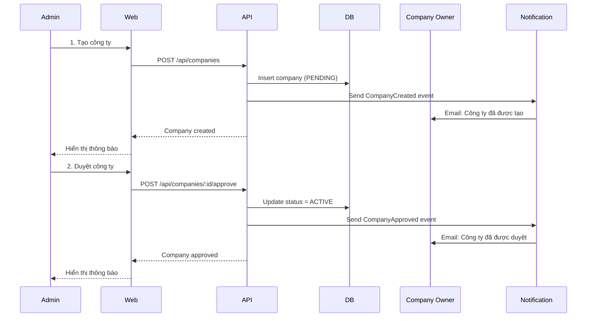
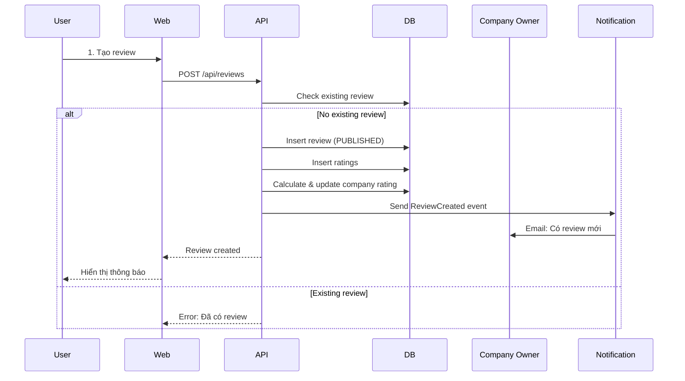

# DD-REVIEW-COMPANY - Review Company System (Detailed Design)

> **Module**: Review Company System
> **Version**: 1.0.0
> **Ngày cập nhật**: 2025-01-26
> **Tham chiếu HLD**: [HLD-REVIEW-COMPANY](../../hld/output/review-company/HLD-REVIEW-COMPANY.md)

---

## Mục lục

1. [HIGH-LEVEL DESIGN KEYPOINTS](#1-high-level-design-keypoints)
   - 1.1 Bối cảnh kinh doanh
   - 1.2 Các thành phần hệ thống
   - 1.3 Các Actor chính
2. [ARCHITECTURE & DESIGN DECISIONS](#2-architecture--design-decisions)
   - 2.1 Architecture Decisions
   - 2.2 Design Patterns
3. [SOURCE CODE](#3-source-code)
   - 3.1 API Endpoints
   - 3.2 Source Code Structure
   - 3.3 Aggregates
   - 3.4 Implementation Roadmap
4. [WORKFLOWS](#4-workflows)
5. [EVENTS](#5-events)
   - 5.1 Event Catalog
   - 5.2 Cache Strategy
6. [ASSUMPTIONS](#6-assumptions)

---

# 1. HIGH-LEVEL DESIGN KEYPOINTS

## 1.1 Bối cảnh kinh doanh (Business Context)

### Tổng quan hệ thống

- **Review Company System** được triển khai dưới dạng Web Application
- Hệ thống cho phép người dùng tìm kiếm, xem thông tin, đánh giá và bình luận về các công ty
- Mục đích chính: Cung cấp nền tảng để người dùng chia sẻ kinh nghiệm và đánh giá về công ty

### Business Contexts

| Business Context | Actor | Domain Access Pattern | Key Actions |
|-----------------|-------|----------------------|-------------|
| **Company Management** | Admin/Manager | WRITE (Full control) | - Tạo công ty<br>- Duyệt công ty<br>- Quản lý công ty |
| **Company Viewing** | All Users | READ | - Tìm kiếm công ty<br>- Xem danh sách<br>- Xem chi tiết |
| **Review & Rating** | Authenticated User | WRITE (Own reviews) | - Tạo review<br>- Đánh giá công ty<br>- Chỉnh sửa review |
| **Company Response** | Company Owner | WRITE (Own company) | - Phản hồi review<br>- Quản lý thông tin công ty |

### Mô hình vận hành

**Các bước chính:**

1. **Bước 1: Tạo công ty**
   - Actor: Admin/Manager
   - Action: Tạo công ty với thông tin cơ bản, liên hệ, logo
   - Result: Company status = PENDING

2. **Bước 2: Duyệt công ty**
   - Actor: Admin
   - Action: Duyệt công ty PENDING
   - Result: Company status = APPROVED → ACTIVE

3. **Bước 3: User tìm kiếm và xem công ty**
   - Actor: Regular User
   - Action: Tìm kiếm, xem danh sách, xem chi tiết công ty
   - Result: User có thông tin để quyết định

4. **Bước 4: User tạo review**
   - Actor: Authenticated User
   - Action: Tạo review với rating tổng thể và categories
   - Result: Review PUBLISHED, rating công ty được cập nhật

5. **Bước 5: Bình luận và phản hồi**
   - Actor: Users, Company Owner
   - Action: Bình luận trên review, Company Owner phản hồi
   - Result: Tăng engagement và giải quyết vấn đề

---

## 1.2 Các thành phần hệ thống

### 1.2.1 Web Applications

| Layer | Component | Technology | Mô tả |
|-------|-----------|------------|-------|
| WEB | review-company-web | Next.js/React | Web application cho tất cả người dùng |

### 1.2.2 Backend Services

| Service | Technology | Vai trò |
|---------|------------|---------|
| **review-company-service** | Next.js API Routes hoặc Java/SpringBoot | Core service quản lý công ty, review, rating, bình luận |
| **auth-service** | Node.js/Express hoặc Java/SpringBoot | Xác thực và phân quyền |

### 1.2.3 External Services

| Service | Technology | Vai trò |
|---------|------------|---------|
| **PostgreSQL** | Database | Lưu trữ dữ liệu |
| **Redis** | Cache | Cache dữ liệu và session |
| **Storage Service** | S3 hoặc tương đương | Lưu trữ logo công ty |
| **Notification Service** | Email/SMS | Gửi thông báo |

---

## 1.3 Các Actor chính

| Actor | Mô tả | Key Actions |
|-------|-------|-------------|
| **Admin** | Quản trị viên hệ thống | Tạo, sửa, xóa công ty, duyệt công ty |
| **Manager** | Quản lý | Tạo và quản lý công ty được assign |
| **Regular User** | Người dùng thông thường | Tìm kiếm, xem công ty, tạo review |
| **Company Owner** | Chủ công ty | Quản lý công ty, phản hồi review |

---

# 2. ARCHITECTURE & DESIGN DECISIONS

## 2.1 Architecture Decisions

| Decision | Rationale | Alternatives Considered |
|----------|-----------|------------------------|
| **Next.js Full-stack** | Fast development, SSR support, API routes built-in | Separate frontend/backend |
| **PostgreSQL** | ACID compliance, complex queries, relational data | NoSQL (MongoDB) |
| **Redis Cache** | Fast read performance, session management | In-memory cache |
| **REST API** | Simple, stateless, easy to integrate | GraphQL |
| **Soft Delete** | Preserve data history, audit trail | Hard delete |

## 2.2 Design Patterns

| Pattern | Usage | Location |
|---------|-------|----------|
| **Repository Pattern** | Data access abstraction | Infrastructure layer |
| **Service Layer** | Business logic encapsulation | Application layer |
| **DDD Aggregates** | Company, Review, Comment aggregates | Domain layer |
| **Optimistic Locking** | Prevent concurrent update conflicts | Company, Review entities |

---

# 3. SOURCE CODE

## 3.1 API Endpoints

### Company Endpoints

| Method | Path | Description | Auth | Response |
|--------|------|-------------|------|----------|
| POST | `/api/companies` | Tạo công ty mới | Admin/Manager | Company |
| GET | `/api/companies` | Lấy danh sách công ty | Public | List[Company] |
| GET | `/api/companies/:id` | Lấy chi tiết công ty | Public | Company |
| PUT | `/api/companies/:id` | Chỉnh sửa công ty | Admin/Manager/Owner | Company |
| DELETE | `/api/companies/:id` | Xóa công ty | Admin | 204 |
| POST | `/api/companies/:id/approve` | Duyệt công ty | Admin | Company |
| GET | `/api/companies/search` | Tìm kiếm công ty | Public | List[Company] |

### Review Endpoints

| Method | Path | Description | Auth | Response |
|--------|------|-------------|------|----------|
| POST | `/api/reviews` | Tạo review mới | User | Review |
| GET | `/api/companies/:id/reviews` | Lấy danh sách review | Public | List[Review] |
| PUT | `/api/reviews/:id` | Chỉnh sửa review | Owner | Review |
| DELETE | `/api/reviews/:id` | Xóa review | Owner/Admin | 204 |

### Comment Endpoints

| Method | Path | Description | Auth | Response |
|--------|------|-------------|------|----------|
| POST | `/api/reviews/:id/comments` | Thêm bình luận | User | Comment |
| PUT | `/api/comments/:id` | Chỉnh sửa bình luận | Owner | Comment |
| DELETE | `/api/comments/:id` | Xóa bình luận | Owner/Admin | 204 |

### Company Response Endpoints

| Method | Path | Description | Auth | Response |
|--------|------|-------------|------|----------|
| POST | `/api/reviews/:id/company-response` | Phản hồi từ công ty | Company Owner | CompanyResponse |
| PUT | `/api/company-responses/:id` | Chỉnh sửa phản hồi | Company Owner | CompanyResponse |

---

## 3.2 Source Code Structure

```
review-company-service/
├── src/
│   ├── api/                    # API routes/controllers
│   │   ├── companies/
│   │   ├── reviews/
│   │   └── comments/
│   ├── application/            # Application services
│   │   ├── company-service.ts
│   │   ├── review-service.ts
│   │   └── rating-service.ts
│   ├── domain/                 # Domain entities
│   │   ├── company/
│   │   │   ├── company.ts
│   │   │   └── company-status.ts
│   │   ├── review/
│   │   │   ├── review.ts
│   │   │   └── review-status.ts
│   │   └── rating/
│   │       └── rating-category.ts
│   └── infrastructure/         # Infrastructure
│       ├── database/
│       │   ├── repositories/
│       │   └── migrations/
│       ├── cache/
│       └── storage/
├── tests/
└── package.json
```

---

## 3.3 Aggregates

### Company Aggregate

**Root Entity:** Company

**Entities:**
- Company
- CompanyOwner
- CompanyCategory

**Business Rules:**
- Company name must be unique
- Only one owner per company
- Status transitions: PENDING → APPROVED → ACTIVE
- Optimistic locking with version field

**Operations:**
- `createCompany(data)` → Company (PENDING)
- `approveCompany(companyId)` → Company (APPROVED/ACTIVE)
- `updateCompany(companyId, data, version)` → Company
- `deleteCompany(companyId)` → Company (DELETED)

### Review Aggregate

**Root Entity:** Review

**Entities:**
- Review
- Rating (Value Objects)

**Business Rules:**
- One user can have only one PUBLISHED review per company
- Max 3 edits per review
- Rating must be 1-5
- Rating categories are optional

**Operations:**
- `createReview(companyId, userId, data)` → Review
- `updateReview(reviewId, data)` → Review (EDITED)
- `deleteReview(reviewId)` → Review (DELETED)
- `calculateCompanyRating(companyId)` → Average Rating

### Comment Aggregate

**Root Entity:** Comment

**Entities:**
- Comment (self-referential for nested comments)

**Business Rules:**
- Comments can be nested (replies)
- Edit allowed within 24 hours
- Max 500 characters

**Operations:**
- `addComment(reviewId, userId, content, parentId?)` → Comment
- `updateComment(commentId, content)` → Comment
- `deleteComment(commentId)` → Comment

---

## 3.4 Implementation Roadmap

### Phase 1: Core Company Management
- [ ] Database schema setup
- [ ] Company CRUD APIs
- [ ] Company approval workflow
- [ ] Basic company listing

### Phase 2: Review & Rating
- [ ] Review CRUD APIs
- [ ] Rating calculation logic
- [ ] Category ratings
- [ ] Review listing and filtering

### Phase 3: Comments & Responses
- [ ] Comment APIs
- [ ] Nested comments support
- [ ] Company response feature
- [ ] Notification integration

### Phase 4: Search & Filter
- [ ] Full-text search
- [ ] Advanced filtering
- [ ] Sorting options
- [ ] Cache optimization

---

# 4. WORKFLOWS

## 4.1 Company Creation & Approval Workflow



## 4.2 Review Creation Workflow



---

# 5. EVENTS

## 5.1 Event Catalog

| Event Name | Producer | Consumer | Purpose |
|-----------|----------|----------|---------|
| CompanyCreated | review-company-service | notification-service | Notify Company Owner |
| CompanyApproved | review-company-service | notification-service | Notify Company Owner |
| CompanyRejected | review-company-service | notification-service | Notify Company Owner with reason |
| ReviewCreated | review-company-service | notification-service | Notify Company Owner |
| ReviewUpdated | review-company-service | - | Recalculate company rating |
| CommentAdded | review-company-service | notification-service | Notify review author |
| CompanyResponseAdded | review-company-service | notification-service | Notify review author |

**Event Payload Example (CompanyCreated):**
```json
{
  "eventType": "CompanyCreated",
  "eventId": "uuid",
  "timestamp": "2025-01-26T10:00:00Z",
  "companyId": "uuid",
  "companyName": "ABC Company",
  "ownerUserId": "uuid",
  "status": "PENDING"
}
```

## 5.2 Cache Strategy

| Cache Key Pattern | TTL | Invalidation |
|-------------------|-----|--------------|
| `company:{id}` | 1 hour | On company update |
| `company:{id}:reviews` | 30 minutes | On review create/update/delete |
| `company:{id}:rating` | 1 hour | On review create/update/delete |
| `companies:list:page:{page}:filter:{filter}` | 15 minutes | On company create/update/delete |
| `search:companies:{query}` | 5 minutes | On company create/update/delete |

**Cache Invalidation Rules:**
- Company cache invalidated when company updated
- Review cache invalidated when review created/updated/deleted
- Rating cache recalculated on review changes
- Search cache invalidated on company changes

---

# 6. ASSUMPTIONS

## Technical Assumptions

- PostgreSQL database is available and configured
- Redis cache is available and configured
- Storage service (S3) is available for logo uploads
- Authentication service (auth-service) is integrated
- Notification service is available for email/SMS

## Business Assumptions

- One user can have only one PUBLISHED review per company
- Reviews can be edited maximum 3 times
- Comments can be edited within 24 hours only
- Company Owner can respond only once per review
- Admin can approve/reject companies

## Security Assumptions

- JWT-based authentication
- Role-based authorization (Admin, Manager, User, Company Owner)
- Input validation on all APIs
- SQL injection prevention via parameterized queries
- XSS prevention via input sanitization

---

**Version:** 1.0.0  
**Last Updated:** 2025-01-26

