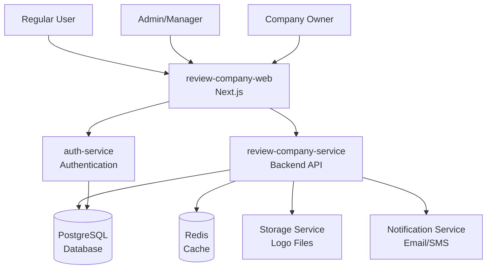
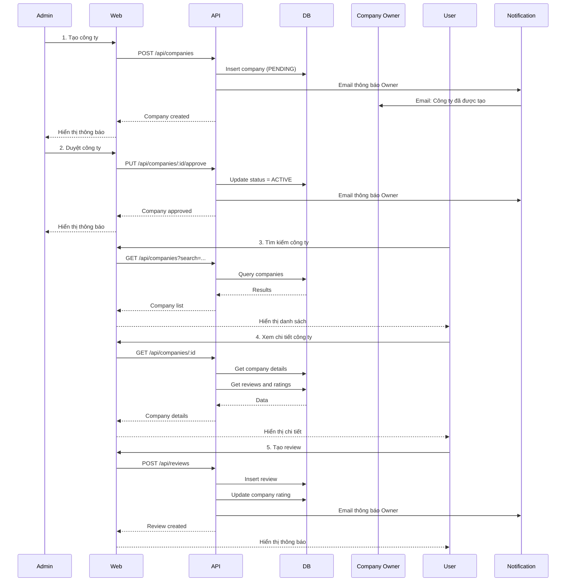
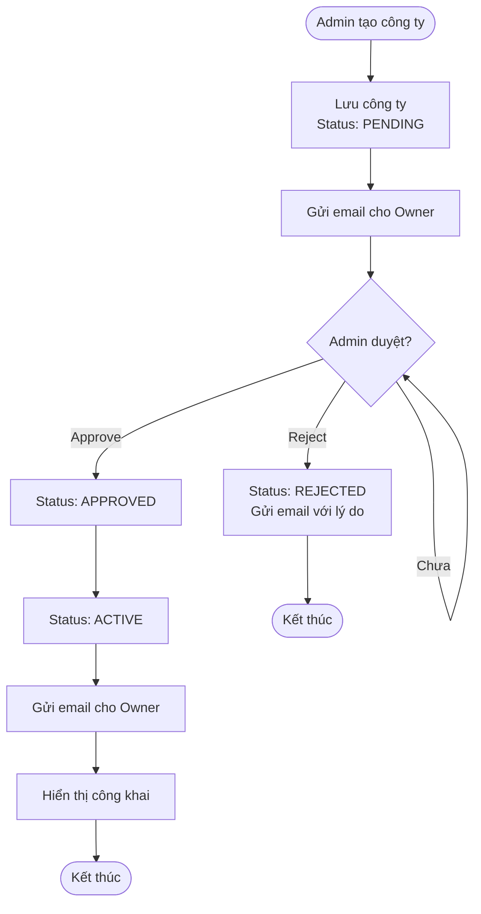
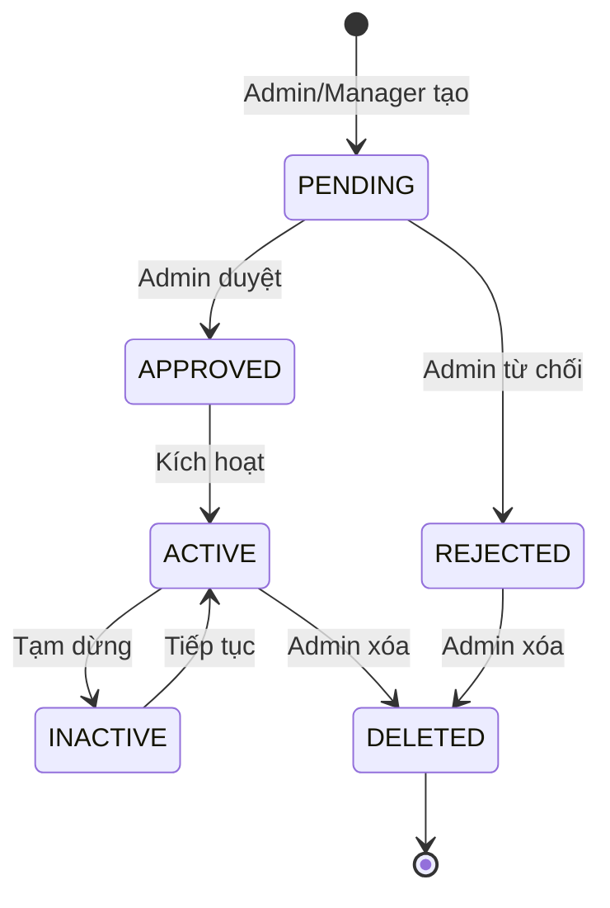
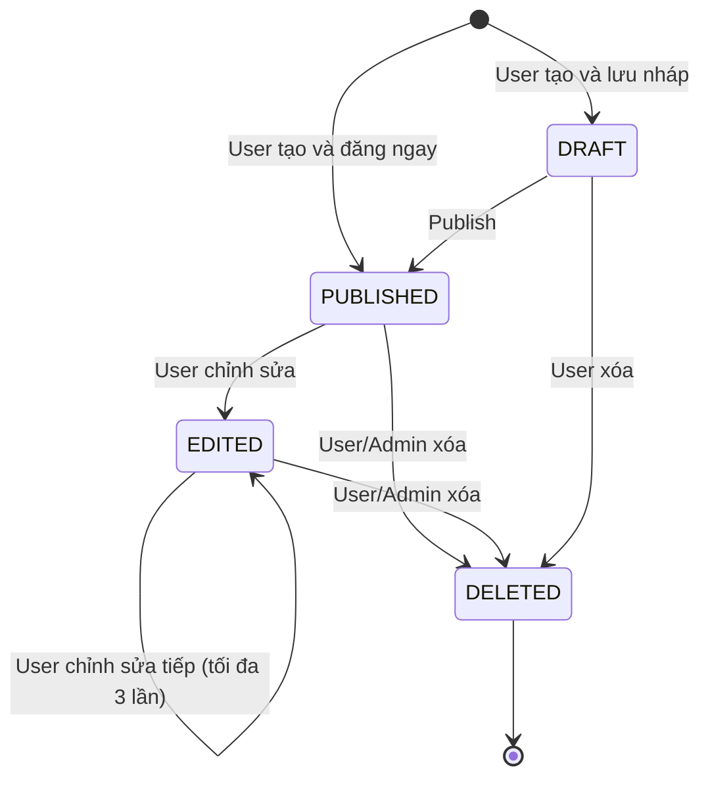
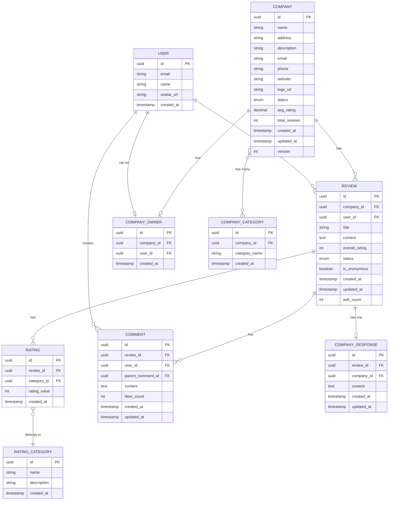

# HLD - Review Company System

> **Hệ thống:** Review Company System
> **Phiên bản:** 1.0
> **Ngày tạo:** 2025-01-26

---

## 1. Bối cảnh (Context)

### 1.1 Bối cảnh về kinh doanh (Business Context)

Hệ thống Review Công ty là một nền tảng cho phép người dùng tìm kiếm, xem thông tin, đánh giá và bình luận về các công ty. Hệ thống hỗ trợ:

- **Admin/Manager**: Tạo và quản lý thông tin công ty
- **Regular Users**: Tìm kiếm công ty, tạo review và đánh giá
- **Company Owners**: Quản lý thông tin công ty và phản hồi review

**Mô hình hoạt động:**

```
ADMIN/MANAGER                  REGULAR USER              COMPANY OWNER
       │                            │                         │
       ├─ 1. Tạo công ty            │                         │
       ├─ 2. Duyệt công ty ─────────┤                         │
       │                            ├─ 3. Tìm kiếm công ty    │
       │                            ├─ 4. Xem chi tiết công ty│
       │                            ├─ 5. Tạo review ─────────┤
       │                            │                         ├─ 6. Phản hồi review
       │                            ├─ 7. Bình luận ──────────┤
       │                            │                         │
       └─ 8. Quản lý công ty        └─ 9. Quản lý review      └─ 10. Quản lý công ty
```

**Các luồng nghiệp vụ chính:**

| STT | Luồng | Mô tả |
|-----|-------|-------|
| 1 | **Tạo và duyệt công ty** | Admin/Manager tạo công ty → Admin duyệt → Công ty hiển thị công khai |
| 2 | **Tìm kiếm và xem công ty** | User tìm kiếm → Xem danh sách → Xem chi tiết công ty |
| 3 | **Tạo review** | User đăng nhập → Tạo review với rating → Đánh giá theo categories |
| 4 | **Bình luận và phản hồi** | User bình luận trên review → Company Owner phản hồi |

### 1.2 Bối cảnh về hệ thống (System Context)

#### Các thành phần Web Applications:

| Layer | Component | Technology | Mô tả |
|-------|-----------|------------|-------|
| **WEB** | review-company-web | Next.js/React | Ứng dụng web cho tất cả người dùng (Admin, Manager, User, Company Owner) |

#### Backend Services:

| Service | Technology | Mô tả | Database |
|---------|------------|-------|----------|
| **review-company-service** | Next.js API Routes hoặc Java/SpringBoot | Backend service quản lý công ty, review, rating, bình luận | PostgreSQL |
| **auth-service** | Node.js/Express hoặc Java/SpringBoot | Xác thực và phân quyền người dùng | PostgreSQL |

#### External Services:

| Service | Mô tả | Vai trò |
|---------|-------|---------|
| **PostgreSQL** | Database | Lưu trữ dữ liệu công ty, review, rating, bình luận |
| **Redis** | Cache | Cache dữ liệu và session |
| **Storage Service** | File Storage | Lưu trữ logo công ty (S3 hoặc tương đương) |
| **Notification Service** | Email/SMS | Gửi thông báo cho người dùng |

### 1.3 Phạm vi ngoài (Out Of Scope)

| STT | Nội dung Out Of Scope | Lý do |
|-----|----------------------|-------|
| 1 | Upload nhiều ảnh trong review | Phase sau - hiện tại chỉ hỗ trợ text |
| 2 | Verification công ty | Phase sau - sẽ bổ sung xác thực công ty |
| 3 | Đa ngôn ngữ | Phase sau - hiện tại chỉ tiếng Việt |
| 4 | Social login | Phase sau - hiện tại chỉ email/password |
| 5 | Mobile app | Phase sau - hiện tại chỉ web |
| 6 | Advanced analytics | Phase sau - sẽ bổ sung sau |

### 1.4 Các chân dung (Actors)

| Actor | Mô tả | Hành động chính |
|-------|-------|-----------------|
| **Admin** | Quản trị viên hệ thống | Tạo, sửa, xóa công ty, duyệt công ty, xóa review/bình luận vi phạm |
| **Manager** | Quản lý | Tạo và quản lý công ty được assign |
| **Regular User** | Người dùng thông thường | Tìm kiếm công ty, xem chi tiết, tạo review, bình luận |
| **Company Owner** | Chủ công ty | Quản lý thông tin công ty, phản hồi review |

---

## 2. Context Diagram



---

## 3. Core Business Workflow

### 3.1 Sequence Diagram - Tạo công ty và review



### 3.2 Activity Diagram - Quy trình duyệt công ty



---

## 4. State Machine

### 4.1 State Machine - Company



**State Transition Table:**

| From State | To State | Trigger | Actor | Notes |
|-----------|----------|---------|-------|-------|
| - | PENDING | Tạo công ty | Admin/Manager | Mặc định khi tạo |
| PENDING | APPROVED | Duyệt công ty | Admin | |
| PENDING | REJECTED | Từ chối công ty | Admin | Có lý do từ chối |
| APPROVED | ACTIVE | Kích hoạt | Admin | Hoặc tự động sau khi approve |
| ACTIVE | INACTIVE | Tạm dừng | Admin/Owner | |
| INACTIVE | ACTIVE | Tiếp tục | Admin/Owner | |
| ACTIVE | DELETED | Xóa công ty | Admin | Soft delete |
| REJECTED | DELETED | Xóa công ty | Admin | Soft delete |

### 4.2 State Machine - Review



**State Transition Table:**

| From State | To State | Trigger | Actor | Notes |
|-----------|----------|---------|-------|-------|
| - | DRAFT | Lưu nháp | User | Tùy chọn |
| - | PUBLISHED | Đăng review | User | Mặc định |
| DRAFT | PUBLISHED | Publish | User | |
| PUBLISHED | EDITED | Chỉnh sửa | User | Tối đa 3 lần |
| EDITED | EDITED | Chỉnh sửa tiếp | User | Tối đa 3 lần tổng cộng |
| PUBLISHED | DELETED | Xóa | User/Admin | Soft delete |
| EDITED | DELETED | Xóa | User/Admin | Soft delete |
| DRAFT | DELETED | Xóa | User | Soft delete |

---

## 5. Mô hình dữ liệu (Data Model - ERD)

### 5.1 Mô hình dữ liệu vật lý



### 5.2 Định nghĩa chi tiết theo từng bảng

#### Table: company

| Cột | Kiểu dữ liệu | Nullable | Mô tả | Constraint |
|-----|--------------|----------|-------|------------|
| id | UUID | NOT NULL | Primary key | PK |
| name | VARCHAR(255) | NOT NULL | Tên công ty | UNIQUE |
| address | VARCHAR(500) | NOT NULL | Địa chỉ | |
| description | TEXT | NULL | Mô tả công ty | |
| email | VARCHAR(255) | NOT NULL | Email liên hệ | |
| phone | VARCHAR(20) | NOT NULL | Số điện thoại | |
| website | VARCHAR(255) | NULL | Website | |
| logo_url | VARCHAR(500) | NULL | URL logo | |
| status | ENUM | NOT NULL | Trạng thái: PENDING, APPROVED, ACTIVE, INACTIVE, DELETED | |
| avg_rating | DECIMAL(3,2) | NULL | Rating trung bình (1.00-5.00) | |
| total_reviews | INT | DEFAULT 0 | Tổng số review | |
| created_at | TIMESTAMP | NOT NULL | Ngày tạo | |
| updated_at | TIMESTAMP | NOT NULL | Ngày cập nhật | |
| version | INT | DEFAULT 0 | Version cho optimistic locking | |

**Indexes:**
- `idx_company_status` on `status`
- `idx_company_name` on `name`
- `idx_company_avg_rating` on `avg_rating`

#### Table: review

| Cột | Kiểu dữ liệu | Nullable | Mô tả | Constraint |
|-----|--------------|----------|-------|------------|
| id | UUID | NOT NULL | Primary key | PK |
| company_id | UUID | NOT NULL | Foreign key to company | FK |
| user_id | UUID | NOT NULL | Foreign key to user | FK |
| title | VARCHAR(200) | NULL | Tiêu đề review | |
| content | TEXT | NOT NULL | Nội dung review | |
| overall_rating | INT | NOT NULL | Rating tổng thể (1-5) | CHECK (1-5) |
| status | ENUM | NOT NULL | Trạng thái: DRAFT, PUBLISHED, EDITED, DELETED | |
| is_anonymous | BOOLEAN | DEFAULT FALSE | Ẩn danh | |
| created_at | TIMESTAMP | NOT NULL | Ngày tạo | |
| updated_at | TIMESTAMP | NOT NULL | Ngày cập nhật | |
| edit_count | INT | DEFAULT 0 | Số lần chỉnh sửa | |

**Indexes:**
- `idx_review_company_id` on `company_id`
- `idx_review_user_id` on `user_id`
- `idx_review_status` on `status`
- `unique_user_company_published` on `(user_id, company_id, status)` WHERE status = 'PUBLISHED'

#### Table: rating_category

| Cột | Kiểu dữ liệu | Nullable | Mô tả |
|-----|--------------|----------|-------|
| id | UUID | NOT NULL | Primary key |
| name | VARCHAR(100) | NOT NULL | Tên category: WORK_ENVIRONMENT, SALARY_BENEFITS, COMPANY_CULTURE, GROWTH_OPPORTUNITIES |
| description | VARCHAR(255) | NULL | Mô tả |

#### Table: rating

| Cột | Kiểu dữ liệu | Nullable | Mô tả | Constraint |
|-----|--------------|----------|-------|------------|
| id | UUID | NOT NULL | Primary key | PK |
| review_id | UUID | NOT NULL | Foreign key to review | FK |
| category_id | UUID | NOT NULL | Foreign key to rating_category | FK |
| rating_value | INT | NOT NULL | Rating (1-5) | CHECK (1-5) |

**Indexes:**
- `idx_rating_review_id` on `review_id`
- `idx_rating_category_id` on `category_id`

#### Table: comment

| Cột | Kiểu dữ liệu | Nullable | Mô tả | Constraint |
|-----|--------------|----------|-------|------------|
| id | UUID | NOT NULL | Primary key | PK |
| review_id | UUID | NOT NULL | Foreign key to review | FK |
| user_id | UUID | NOT NULL | Foreign key to user | FK |
| parent_comment_id | UUID | NULL | Foreign key to comment (nested comments) | FK |
| content | VARCHAR(500) | NOT NULL | Nội dung bình luận | |
| likes_count | INT | DEFAULT 0 | Số lượt like | |
| created_at | TIMESTAMP | NOT NULL | Ngày tạo | |
| updated_at | TIMESTAMP | NOT NULL | Ngày cập nhật | |

**Indexes:**
- `idx_comment_review_id` on `review_id`
- `idx_comment_user_id` on `user_id`
- `idx_comment_parent_id` on `parent_comment_id`

#### Table: company_response

| Cột | Kiểu dữ liệu | Nullable | Mô tả |
|-----|--------------|----------|-------|
| id | UUID | NOT NULL | Primary key |
| review_id | UUID | NOT NULL | Foreign key to review | FK, UNIQUE |
| company_id | UUID | NOT NULL | Foreign key to company | FK |
| content | TEXT | NOT NULL | Nội dung phản hồi |
| created_at | TIMESTAMP | NOT NULL | Ngày tạo |
| updated_at | TIMESTAMP | NOT NULL | Ngày cập nhật |

**Indexes:**
- `idx_company_response_review_id` on `review_id`
- `idx_company_response_company_id` on `company_id`

---

## 6. Kiến trúc sự kiện (Event Architecture)

### 6.1 Danh sách sự kiện

| Event Name | Trigger | Producer | Consumer | Mô tả |
|-----------|---------|----------|----------|-------|
| CompanyCreated | Tạo công ty mới | review-company-service | notification-service | Thông báo cho Company Owner |
| CompanyApproved | Duyệt công ty | review-company-service | notification-service | Thông báo cho Company Owner |
| CompanyRejected | Từ chối công ty | review-company-service | notification-service | Thông báo cho Company Owner với lý do |
| ReviewCreated | Tạo review mới | review-company-service | notification-service | Thông báo cho Company Owner |
| ReviewUpdated | Cập nhật review | review-company-service | - | Tính lại rating công ty |
| CommentAdded | Thêm bình luận | review-company-service | notification-service | Thông báo cho người tạo review |
| CompanyResponseAdded | Phản hồi từ công ty | review-company-service | notification-service | Thông báo cho người tạo review |

### 6.2 Event Schema

**CompanyCreated:**
```json
{
  "eventType": "CompanyCreated",
  "eventId": "uuid",
  "timestamp": "2025-01-26T10:00:00Z",
  "companyId": "uuid",
  "companyName": "string",
  "ownerUserId": "uuid",
  "status": "PENDING"
}
```

**ReviewCreated:**
```json
{
  "eventType": "ReviewCreated",
  "eventId": "uuid",
  "timestamp": "2025-01-26T10:00:00Z",
  "reviewId": "uuid",
  "companyId": "uuid",
  "userId": "uuid",
  "rating": 5,
  "status": "PUBLISHED"
}
```

### 6.3 Eventing Rules

- Events được publish qua message queue (nếu có) hoặc trực tiếp gọi notification service
- Eventual consistency: Rating được tính lại sau khi có review mới
- Idempotency: Events cần có id để tránh xử lý trùng lặp

---

## 7. Phụ lục

### A. Glossary

| Thuật ngữ | Định nghĩa |
|-----------|------------|
| Company | Công ty được review trên hệ thống |
| Review | Bài đánh giá của người dùng về công ty |
| Rating | Điểm số đánh giá (1-5 sao) |
| Rating Category | Hạng mục đánh giá (Môi trường làm việc, Lương thưởng, Văn hóa, Cơ hội phát triển) |
| Comment | Bình luận trên review |
| Company Response | Phản hồi chính thức từ công ty |

### B. Assumptions

- User đã có hệ thống authentication riêng (auth-service)
- Storage service đã sẵn sàng cho logo
- Notification service đã sẵn sàng cho email
- PostgreSQL và Redis đã được cấu hình

### C. Open Questions

- Có cần hỗ trợ Kafka cho event-driven architecture không?
- Có cần real-time notification không?
- Có cần support cho mobile app không?

---

**Version:** 1.0  
**Last Updated:** 2025-01-26

