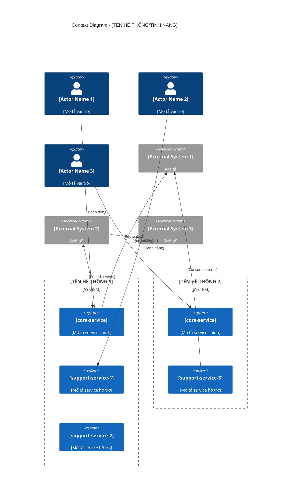

# 2. Context Diagram (Mermaid)

> **Hướng dẫn**: Sử dụng C4 Context Diagram để mô tả high-level view của hệ thống, các actors, và các external systems.

## C4 Context Diagram



---

## Hướng dẫn sử dụng C4 Elements

### Person (Actors)
```
Person(personAlias, "Display Name", "Description")
```
- Sử dụng cho human actors
- `personAlias`: ID dùng trong relationships
- Hiển thị với icon người

### System_Boundary (System Context)
```
System_Boundary(boundaryAlias, "Boundary Name") {
    System(...)
    System(...)
}
```
- Nhóm các systems liên quan
- Ví dụ: tenant boundary, domain boundary, deployment boundary

### System (Internal Systems)
```
System(systemAlias, "System Name", "Description")
```
- Các systems/services thuộc trong scope thiết kế
- Nằm trong System_Boundary

### System_Ext (External Systems)
```
System_Ext(systemAlias, "System Name", "Description")
```
- Các systems/services bên ngoài (third-party, platform services)
- Hiển thị với màu khác để phân biệt

### Rel (Relationships)
```
Rel(source, target, "Action/Description")
```
- Mô tả tương tác giữa các elements
- Mô tả ngắn gọn, rõ ràng về action

---

## Tips

1. **Giữ diagram đơn giản**: 5-10 systems là đủ, không vẽ quá chi tiết
2. **Focus vào scope**: Chỉ show các systems liên quan trực tiếp
3. **Consistent naming**: Dùng tên giống như trong System Context section
4. **Clear boundaries**: System_Boundary giúp phân biệt tenants/domains
5. **Validate diagram**: Test render trên Mermaid Live Editor trước khi commit

---

## Resources

- [Mermaid C4 Diagram Syntax](https://mermaid.js.org/syntax/c4c.html)
- [C4 Model](https://c4model.com/)


# 2.1 Giải thích các thành phần (Component Explanation)

> **Hướng dẫn**: Giải thích chi tiết từng component xuất hiện trong Context Diagram. Table này giúp readers hiểu rõ vai trò cụ thể của mỗi component.

## Bảng giải thích Components

| Thành phần | Loại | Mô tả chi tiết |
|------------|------|----------------|
| **[Component Name]** | [Type] | [Mô tả chi tiết về vai trò, chức năng, responsibility] |

---

## Phân loại Components

### System Boundaries

[Giải thích các boundaries và ý nghĩa của chúng]

| Boundary | Ý nghĩa | Components bên trong |
|----------|---------|---------------------|
| [Boundary Name] | [Tại sao nhóm như vậy] | [List components] |

**Ví dụ:**

| Boundary | Ý nghĩa | Components bên trong |
|----------|---------|---------------------|
| PRIVATE_SCHOOL EMS | Tenant boundary cho trường tư nhân | sf-product, sf-purchase, tf-class-management, tf-teacher-calendar |
| INDIVIDUAL EMS | Tenant boundary cho giáo viên tự do | sf-product, sf-sales, tf-teacher-profile, tf-calendar, lf-course |

---

### Core Services

[Liệt kê và giải thích các core services - services chịu trách nhiệm chính]

| Service | Responsibility | Key Functions |
|---------|---------------|---------------|
| [service-name] | [Primary responsibility] | [Function 1], [Function 2], [Function 3] |

**Ví dụ:**

| Service | Responsibility | Key Functions |
|---------|---------------|---------------|
| sf-product (PRIVATE_SCHOOL) | Quản lý PIM lifecycle | Create PIM, Publish PIM, Approve registrations, Finalize |
| sf-product (INDIVIDUAL) | Quản lý Registration | Register to PIM, Submit profile, Confirm schedule |

---

### Support Services

[Liệt kê các support services và vai trò hỗ trợ]

| Service | Supports | Provides |
|---------|----------|----------|
| [service-name] | [Core service(s)] | [Capability/Data] |

---

### External Systems

[Giải thích các external systems và integration points]

| System | Type | Integration Method | Purpose |
|--------|------|-------------------|---------|
| [system-name] | [SaaS/Platform/3rd-party] | [API/Event/SDK] | [Why we use it] |

**Ví dụ:**

| System | Type | Integration Method | Purpose |
|--------|------|-------------------|---------|
| Temporal | Workflow Platform | SDK (Java) | Orchestrate long-running PIM registration workflows |
| Kafka (MSK) | Messaging Platform | Kafka Client | Cross-tenant event-driven communication |
| Notification Hub | Internal Platform | REST API + Events | Centralized notification delivery |

---

## Component Dependencies (OPTIONAL)

[Nếu dependencies phức tạp, có thể vẽ dependency graph]

```
[Core Service A]
    ├── depends on → [Support Service 1]
    ├── depends on → [Support Service 2]
    └── integrates with → [External System]

[Core Service B]
    └── depends on → [External System]
```

---

## Lưu ý quan trọng

- **Core vs Support**: Phân biệt rõ services chính và hỗ trợ
- **Consistent naming**: Tên phải khớp với Context Diagram và System Context section
- **Multi-tenant note**: Nếu cùng service xuất hiện ở nhiều tenants, giải thích sự khác biệt
- **External integration**: Nêu rõ phương thức tích hợp cho external systems