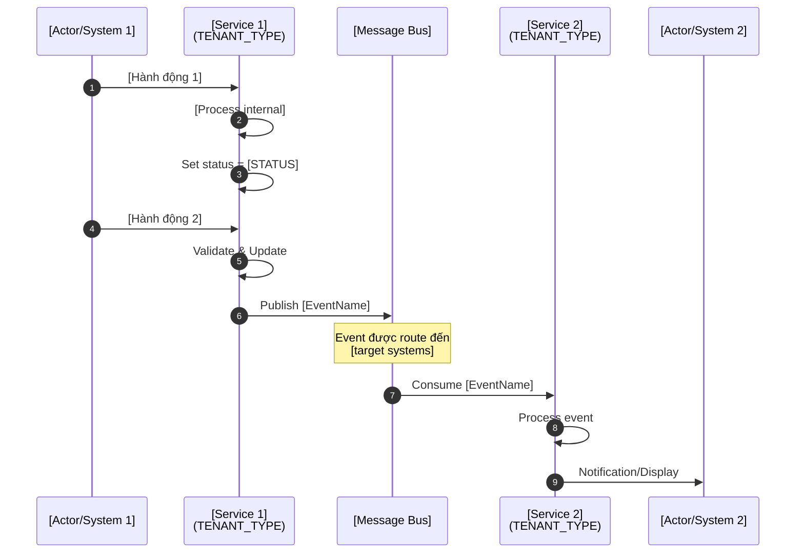
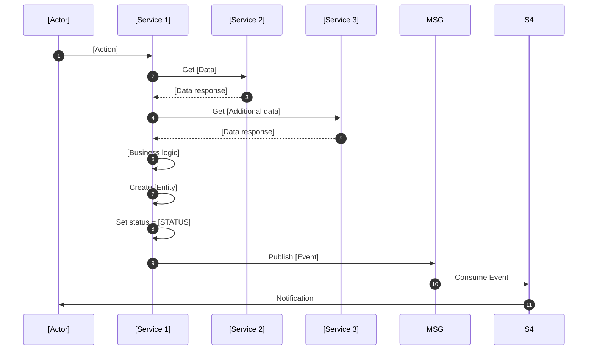
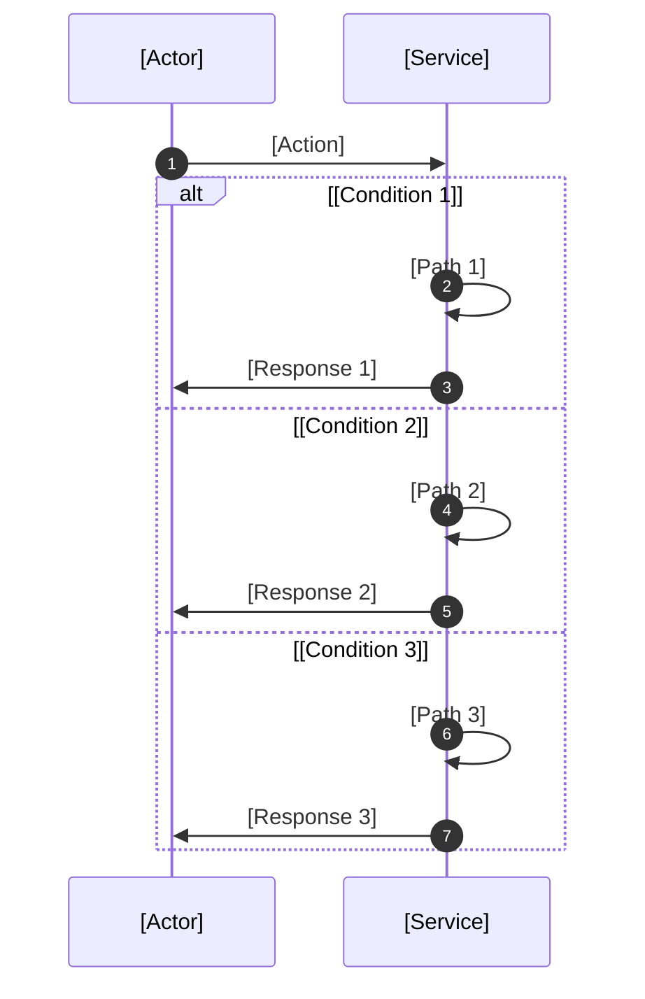
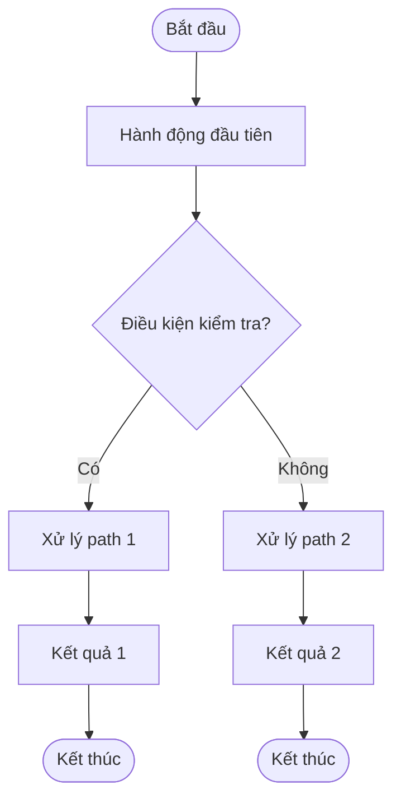

# 3.1 Sequence Diagram (Mermaid)

> **Hướng dẫn**: Tạo sequence diagrams cho các luồng nghiệp vụ chính. Mỗi luồng nên có 1 diagram riêng.

## Luồng 1: [TÊN LUỒNG CHÍNH]

**Mục đích**: [Mô tả ngắn gọn luồng này làm gì]

**Trigger**: [Sự kiện nào khởi tạo luồng]

**Outcome**: [Kết quả cuối cùng]


---

## Luồng 2: [TÊN LUỒNG PHỤ]

**Mục đích**: [Mô tả]

**Trigger**: [Trigger event]

**Outcome**: [Expected result]



---

## Luồng 3: [TÊN LUỒNG - với logic phân nhánh]

**Mục đích**: [Mô tả]



---

## Hướng dẫn vẽ Sequence Diagram

### Participants
```
participant alias as Display Name
participant alias as Multi-line<br/>Display Name
```

### Messages
```
A->>B: Synchronous call
A-->>B: Response (dashed)
A-)B: Async message
```

### Control flow
```
alt Condition
    ...
else Alternative
    ...
end

opt Optional
    ...
end

loop Loop description
    ...
end
```

### Notes
```
Note over A: Single note
Note over A,B: Note spanning multiple participants
Note right of A: Note on the right
Note left of A: Note on the left
```

### Auto numbering
```
autonumber
```
Đặt ở đầu diagram để tự động đánh số steps

---

## Tips

1. **Một diagram cho một luồng**: Không cố nhét nhiều flows vào 1 diagram
2. **Giới hạn participants**: 5-8 participants là đủ, quá nhiều sẽ khó đọc
3. **Self-calls cho internal logic**: `S1->>S1: Process`
4. **Use alt/opt/loop**: Giúp thể hiện logic điều kiện rõ ràng
5. **Notes cho clarification**: Dùng notes để giải thích chi tiết khi cần
6. **Consistent naming**: Dùng tên services như trong Context Diagram

---

## Resources

- [Mermaid Sequence Diagram](https://mermaid.js.org/syntax/sequenceDiagram.html)


# 3.2 Activity Diagram (Optional)

> **Hướng dẫn**: Sử dụng activity diagram (flowchart) để mô tả flow với nhiều decision points. Thường dùng bổ sung cho sequence diagram.

## Activity Diagram - [TÊN FLOW]


---

## Hướng dẫn vẽ Flowchart

### Node shapes

```
A[Rectangle - Process]
B([Rounded - Start/End])
C{Diamond - Decision}
D[(Database)]
E((Circle))
```

### Arrows

```
A --> B     Solid arrow
A -.-> B    Dotted arrow
A ==> B     Thick arrow
```

### Labels on arrows

```
A -->|Label| B
A -->|Yes| B
A -->|No| C
```

### Subgraphs (Grouping)

```
subgraph Title
    A --> B
    B --> C
end
```

### Direction

```
flowchart TD   Top to Down (default)
flowchart LR   Left to Right
flowchart RL   Right to Left
flowchart BT   Bottom to Top
```

---

## Khi nào dùng Activity Diagram?

✅ **Nên dùng khi**:
- Flow có nhiều decision points (if/else)
- Cần thể hiện parallel processes
- Cần nhóm activities theo domain/tenant
- Muốn high-level view của toàn bộ flow

❌ **Không nên dùng khi**:
- Flow đơn giản, tuần tự - dùng sequence diagram
- Cần thể hiện chi tiết interaction giữa systems
- Focus vào message passing

---

## Tips

1. **Subgraphs cho boundaries**: Dùng để phân biệt tenants, systems, domains
2. **Consistent styling**: Dùng shapes nhất quán (diamond cho decisions)
3. **Clear labels**: Labels trên arrows phải rõ ràng (Yes/No, Case 1/Case 2)
4. **Avoid crossing lines**: Sắp xếp nodes để minimize đường chéo nhau
5. **End nodes**: Luôn có clear end points

---

# 3.3 Workflow description (table)

> **Hướng dẫn**: Mô tả chi tiết từng bước trong workflow dưới dạng table. Table này bổ sung cho sequence/activity diagrams.

## Workflow Table - [TÊN WORKFLOW]

| Step | Actor | Action | System | Input | Output | Ghi chú |
|------|-------|--------|--------|-------|--------|---------|
| 1 | [Actor name] | [Hành động cụ thể] | [service-name (TENANT)] | [Input data/params] | [Output/Result] | [Ghi chú bổ sung] |
| 2 | [Actor name] | [Hành động] | [service-name] | [Input] | [Output] | [Notes] |
| 3 | System | [Automated action] | [service-name] | [Event/Trigger] | [Side effect] | [Async process] |
| 4a | [Actor] | [Option 1] | [service] | [Input] | [Output] | [Conditional path] |
| 4b | [Actor] | [Option 2] | [service] | [Input] | [Output] | [Alternative path] |
| 5 | System | [Next action] | [service] | [Input from 4] | [Final output] | [Notes] |

---

## Hướng dẫn điền Table

### Column: Step
- Đánh số tuần tự: 1, 2, 3, ...
- Dùng a, b, c cho branching: 4a, 4b, 4c (các options khác nhau)
- Phải match với numbering trong sequence diagram (nếu có)

### Column: Actor
- **Human actors**: School Admin, Teacher, User, etc.
- **System**: Cho automated processes
- Tên phải match với Actors section

### Column: Action
- Mô tả ngắn gọn hành động (3-7 từ)
- Dùng động từ: Tạo, Xem, Gửi, Approve, Process, etc.
- Rõ ràng, cụ thể

### Column: System
- Tên service xử lý action
- Format: `service-name (TENANT_TYPE)` nếu multi-tenant
- Tên phải match với System Context

### Column: Input
- Data/parameters cần để thực hiện action
- Có thể reference output của step trước
- List multiple inputs ngắn gọn

### Column: Output
- Kết quả của action
- Có thể là: entity created, status changed, event published
- Rõ ràng về state change

### Column: Ghi chú
- Business rules quan trọng
- Clarifications
- Cross-references
- Timeouts, retries
- Conditions

---

## Tips

1. **Match với diagrams**: Numbering phải khớp với sequence diagram
2. **Branching logic**: Dùng 3a, 3b, 3c cho các paths khác nhau
3. **System steps**: Đừng quên các automated steps (events, async processes)
4. **Cross-tenant**: Rõ ràng về tenant type trong System column
5. **Comprehensive**: Bao gồm cả happy path và error paths

---

## Khi nào cần Workflow Table?

✅ **Nên có khi**:
- Workflow có 5+ steps
- Có nhiều inputs/outputs phức tạp
- Cần document business rules chi tiết
- Multi-tenant flow cần phân biệt rõ ràng

❌ **Có thể bỏ qua khi**:
- Workflow đơn giản (< 5 steps)
- Sequence diagram đã đủ rõ ràng
- Không có business rules phức tạp
