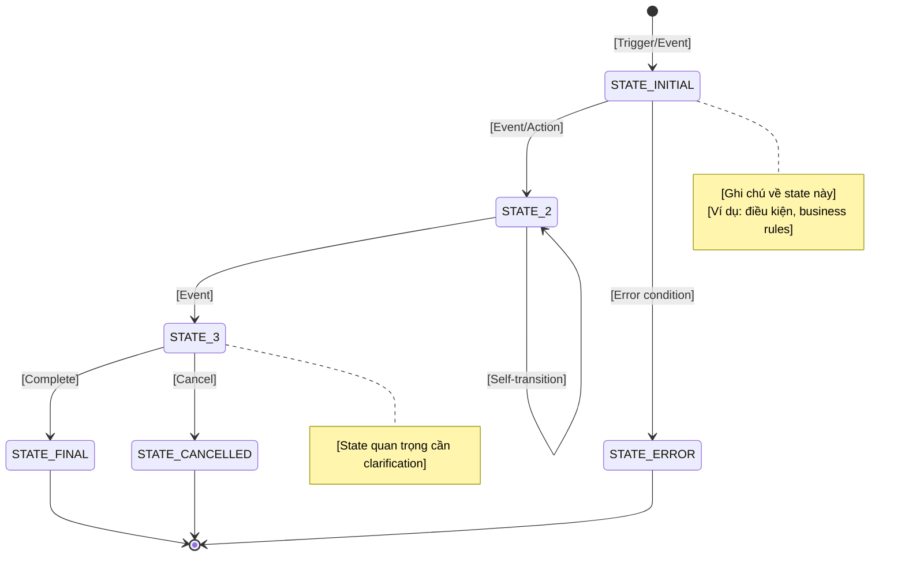
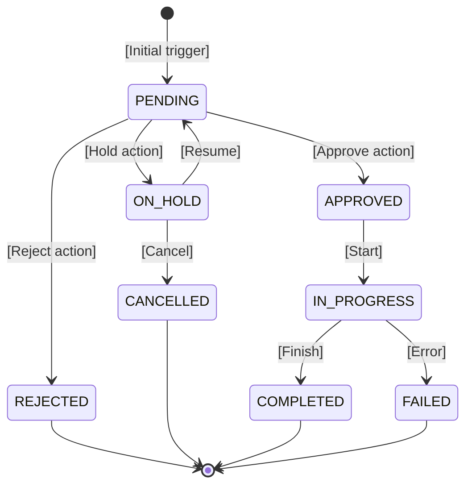

# 4.1 Mermaid State Diagram

> **Hướng dẫn**: Tạo state diagrams cho các entities có lifecycle phức tạp. Mỗi entity stateful nên có 1 diagram riêng.

## State Diagram 1: [TÊN ENTITY CHÍNH]

**Mô tả**: [Entity này quản lý gì và tại sao cần state machine]


---

## State Diagram 2: [TÊN ENTITY PHỤ]

**Mô tả**: [Mô tả entity]



---

## Hướng dẫn vẽ State Diagram

### Basic syntax

```
stateDiagram-v2
    [*] --> StateA: Initial
    StateA --> StateB: Event
    StateB --> [*]: End
```

### Self-transitions

```
StateA --> StateA: Self-update
```

### Multiple transitions

```
StateA --> StateB: Event1
StateA --> StateC: Event2
StateA --> StateD: Event3
```

### Notes

```
note right of StateA
    Description of this state
    Multiple lines OK
end note

note left of StateB
    Another note
end note
```

### Composite states (OPTIONAL)

```
state CompositeState {
    [*] --> SubState1
    SubState1 --> SubState2
    SubState2 --> [*]
}
```

---

## State naming conventions

✅ **Good state names**:
- `DRAFT`, `PUBLISHED`, `ARCHIVED`
- `PENDING`, `APPROVED`, `REJECTED`
- `ACTIVE`, `INACTIVE`, `SUSPENDED`
- All caps với underscore

❌ **Avoid**:
- Verb-based names: `Creating`, `Processing`
- Ambiguous names: `Ready`, `Done`
- Mixed case: `PendingReview`

---

## Tips

1. **Initial và Terminal states**: Luôn có `[*]` cho start và end
2. **Terminal states phải rõ ràng**: Mỗi ending scenario cần 1 terminal state
3. **Notes cho clarification**: Giải thích states phức tạp
4. **Simple is better**: Nếu có quá 10 states, consider phân tách entities
5. **Match với code**: State names nên khớp với enums trong code
6. **Validate logic**: Ensure không có dead states (states không thể đến được)

---

## Khi nào cần State Diagram?

✅ **Entities cần state machine**:
- Orders, Registrations, Bookings
- Documents với approval workflow
- Processes với multiple phases
- Entities với lifecycle > 3 states

❌ **Không cần**:
- Simple boolean states (Active/Inactive)
- Read-only entities
- Entities chỉ có CREATE và DELETE

---


# 4.2 State transition table

> **Hướng dẫn**: Mô tả chi tiết tất cả các state transitions dưới dạng table. Bổ sung thông tin mà state diagram không thể hiện được.

## State Transition Table 1: [TÊN ENTITY]

| Current State | Event/Action | Next State | Actor | Điều kiện | Side Effects |
|---------------|--------------|------------|-------|-----------|--------------|
| [STATE_FROM] | [Event/Action name] | [STATE_TO] | [Who can trigger] | [Preconditions] | [What happens] |

---

## State Transition Table 2: [TÊN ENTITY PHỤ]

| Current State | Event/Action | Next State | Actor | Điều kiện | Side Effects |
|---------------|--------------|------------|-------|-----------|--------------|
| [STATE] | [Event] | [STATE] | [Actor] | [Conditions] | [Effects] |

---

## Hướng dẫn điền Table

### Column: Current State
- State hiện tại của entity
- Dùng `-` hoặc `(None)` cho initial transition
- Must match state names trong state diagram

### Column: Event/Action
- Tên event hoặc action trigger transition
- Dạng: `VerbNoun` (e.g., ApproveOrder, CancelBooking)
- Hoặc past tense cho events (e.g., PaymentCompleted, OrderShipped)

### Column: Next State
- State sau khi transition
- Must exist in state diagram
- Rõ ràng, không mơ hồ

### Column: Actor
- Ai/cái gì trigger được transition này
- Options:
  - **User roles**: Admin, Teacher, Customer
  - **System**: Automated transitions
  - **External system**: Third-party triggers
  - **Timer/Schedule**: Time-based transitions

### Column: Điều kiện (Preconditions)
- Điều kiện cần để transition được phép xảy ra
- Business rules
- Data validation rules
- Authorization checks
- Có thể để trống (`-`) nếu không có điều kiện

### Column: Side Effects
- Những gì xảy ra KHI transition (besides state change)
- Options:
  - Publish events
  - Call external APIs
  - Send notifications
  - Update related entities
  - Start workflows/timers
  - Create audit logs

---

## State Transition Categories (OPTIONAL)

### Normal Flow Transitions
[Transitions trong happy path]

| Current State | Event/Action | Next State | Actor | Điều kiện | Side Effects |
|---------------|--------------|------------|-------|-----------|--------------|
| ... | ... | ... | ... | ... | ... |

### Error/Cancellation Transitions
[Transitions khi có lỗi hoặc cancel]

| Current State | Event/Action | Next State | Actor | Điều kiện | Side Effects |
|---------------|--------------|------------|-------|-----------|--------------|
| ... | ... | ... | ... | ... | ... |

### System/Automated Transitions
[Transitions tự động bởi system]

| Current State | Event/Action | Next State | Actor | Điều kiện | Side Effects |
|---------------|--------------|------------|-------|-----------|--------------|
| ... | ... | ... | ... | ... | ... |

---

## Tips

1. **Complete coverage**: Mỗi arrow trong state diagram = 1 row trong table
2. **Bidirectional transitions**: Nếu StateA <-> StateB, cần 2 rows
3. **Initial transition**: Đừng quên row cho transition từ initial state
4. **Terminal transitions**: Document cả transitions đến terminal states
5. **Side effects**: Chi tiết, specific - đây là phần quan trọng nhất
6. **Authorization**: Rõ ràng về who can trigger each transition
7. **Idempotency**: Note nếu transition có thể trigger nhiều lần an toàn

---

## Common Patterns

### Approval Pattern
```
PENDING -> APPROVED (by Approver, condition: valid data)
PENDING -> REJECTED (by Approver, condition: reason provided)
PENDING -> ON_HOLD (by System, condition: missing info)
```

### Lifecycle Pattern
```
DRAFT -> PUBLISHED (by Owner, condition: complete)
PUBLISHED -> ARCHIVED (by Owner, condition: no dependencies)
PUBLISHED -> SUSPENDED (by Admin, condition: violation detected)
```

### Workflow Pattern
```
SUBMITTED -> IN_REVIEW (by System, auto after submit)
IN_REVIEW -> CHANGES_REQUESTED (by Reviewer)
CHANGES_REQUESTED -> IN_REVIEW (by Submitter, after updates)
IN_REVIEW -> APPROVED (by Reviewer, all checks pass)
```

---

## Validation Checklist

- [ ] Mọi state trong diagram đều có ít nhất 1 incoming transition
- [ ] Mọi non-terminal state có ít nhất 1 outgoing transition
- [ ] Không có orphan states (states không thể reach được)
- [ ] Side effects rõ ràng, measurable
- [ ] Actors hợp lệ và có quyền
- [ ] Conditions testable
