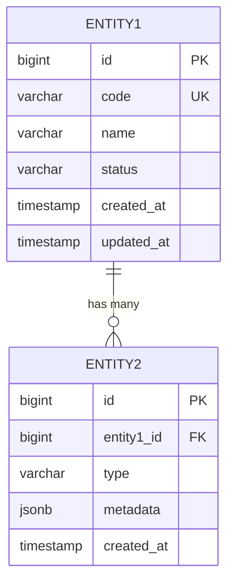

# 5.1 Mô hình dữ liệu vật lý

> **Hướng dẫn**: Tạo ERD (Entity Relationship Diagram) thể hiện tất cả tables và relationships. Sử dụng Mermaid ER Diagram.

## Biểu đồ quan hệ dữ liệu tổng quan



---

## Hướng dẫn vẽ ERD với Mermaid

### Relationships (Cardinality)

```
ENTITY1 ||--o{ ENTITY2 : "relationship"
```

**Cardinality symbols:**
- `||--||` : One to One (exactly one)
- `||--o{` : One to Many (one to zero or more)
- `}o--||` : Many to One (zero or more to exactly one)
- `}o--o{` : Many to Many (zero or more to zero or more)
- `||--o|` : One to Zero or One
- `}|--||` : One or more to exactly one

**Breakdown:**
- `||` : Exactly one
- `|o` : Zero or one
- `}o` : Zero or more
- `}|` : One or more

### Entity Definition

```
ENTITY_NAME {
    datatype field_name CONSTRAINTS
}
```

**Common constraints:**
- `PK` : Primary Key
- `FK` : Foreign Key
- `UK` : Unique Key
- `NOT NULL` : Not nullable
- `DEFAULT value` : Default value

### Relationship labels

```
PARENT ||--o{ CHILD : "has many"
CHILD }o--|| PARENT : "belongs to"
ORDER ||--o{ ORDER_ITEM : "contains"
```

---

## Tips for ERD

1. **Show key fields**: PK, FK, UK trong entity definition
2. **Relationship direction**: Arrow từ parent → child
3. **Relationship labels**: Rõ ràng, meaningful
4. **Field types**: Dùng actual database types (bigint, varchar, timestamp, etc.)
5. **Important fields only**: Không cần liệt kê tất cả fields - chỉ cần key fields và important business fields
6. **JSONB fields**: Dùng jsonb cho flexible/nested data
7. **Audit fields**: created_at, updated_at, created_by standard pattern

---

## Common Patterns

### Audit Pattern
```
{
    bigint id PK
    timestamp created_at
    timestamp updated_at
    bigint created_by
    bigint updated_by
}
```

### Soft Delete Pattern
```
{
    bigint id PK
    boolean is_deleted
    timestamp deleted_at
    bigint deleted_by
}
```

### Multi-tenant Pattern
```
{
    bigint id PK
    bigint tenant_id FK
    varchar code UK "unique within tenant"
}
```

### Optimistic Locking Pattern
```
{
    bigint id PK
    int version
    timestamp updated_at
}
```

### Snapshot Pattern
```
{
    bigint id PK
    bigint reference_id FK
    jsonb snapshot_data
    timestamp snapshot_at
}
```

---

## Validation Checklist

- [ ] Mọi table đều có PK
- [ ] FK relationships rõ ràng
- [ ] Unique constraints được đánh dấu (UK)
- [ ] Cardinality chính xác
- [ ] Relationship labels meaningful
- [ ] Không có circular dependencies (hoặc có note giải thích)
- [ ] Multi-tenant isolation rõ ràng (nếu áp dụng)

---

## Resources

- [Mermaid ER Diagram](https://mermaid.js.org/syntax/entityRelationshipDiagram.html)
- [Database Design Best Practices](https://www.postgresql.org/docs/current/ddl.html)

# 5.2 Định nghĩa chi tiết theo từng bảng

> **Hướng dẫn**: Document chi tiết schema cho từng table. Mỗi table cần: purpose, fields, constraints, và indexes.

## Bảng: `[table_name]`

**Mục đích:** [Mô tả rõ ràng table này lưu trữ gì và tại sao cần]

### Schema

| Field | Type | Description | Constraints | Indexing |
|-------|------|-------------|-------------|----------|
| id | BIGINT | Primary key, auto-generated | PK, NOT NULL | PRIMARY |
| [field_name] | [DATA_TYPE] | [Mô tả field] | [Constraints] | [Index info] |

### Indexes

- `idx_[table]_[fields]`: (field1, field2) - [Mục đích của index]
- `uk_[table]_[fields]`: UNIQUE (field1, field2) - [Unique constraint purpose]

### Business Rules

[Liệt kê các business rules quan trọng liên quan đến table này]

### Example Data (OPTIONAL)

[Nếu cần, thêm vài rows example data để minh họa]

---

## Bảng: `[child_table_name]`

**Mục đích:** [Purpose]

### Schema

| Field | Type | Description | Constraints | Indexing |
|-------|------|-------------|-------------|----------|
| id | BIGINT | Primary key | PK, NOT NULL | PRIMARY |
| parent_id | BIGINT | FK to parent table | NOT NULL, FK([parent_table].id) | INDEX |
| ... | ... | ... | ... | ... |

### Indexes

- `idx_[table]_[parent]`: (parent_id) - FK index

### Business Rules

[Rules]

---

## Hướng dẫn Document Tables

### Thứ tự Document

1. **Core entities** trước (main business entities)
2. **Child/dependent entities** sau
3. **Junction tables** (many-to-many) cuối cùng
4. **Audit/history tables** cuối cùng

### Field Documentation

**Field name:**
- Lowercase, snake_case
- Descriptive, meaningful
- Consistent với conventions

**Type:**
- Dùng database-specific types: `BIGINT`, `VARCHAR(n)`, `TIMESTAMP`, `JSONB`, etc.
- Specify length cho VARCHAR
- `TEXT` for unlimited length strings
- `JSONB` for JSON data (PostgreSQL)

**Description:**
- Rõ ràng, concise
- Giải thích business meaning, không chỉ technical
- Reference đến other entities nếu là FK

**Constraints:**
- `PK`: Primary Key
- `FK(table.field)`: Foreign Key
- `NOT NULL`: Required field
- `UNIQUE`: Unique constraint
- `UNIQUE(field1, field2)`: Composite unique
- `CHECK(condition)`: Check constraint
- `DEFAULT value`: Default value

**Indexing:**
- `PRIMARY`: Primary key index
- `INDEX`: Regular index
- `UNIQUE`: Unique index
- `GIN INDEX`: For JSONB/full-text (PostgreSQL)
- None/`-`: No specific index

### Index Naming Convention

```
idx_[table]_[field1]_[field2]      # Regular index
uk_[table]_[field1]_[field2]       # Unique index
fk_[table]_[parent_table]          # FK index
```

### Common Data Types

| Type | Usage |
|------|-------|
| `BIGINT` | IDs, large numbers |
| `INT` | Counts, small numbers |
| `VARCHAR(n)` | Short strings with max length |
| `TEXT` | Long strings, no limit |
| `BOOLEAN` | True/false |
| `TIMESTAMP` | Date and time |
| `DATE` | Date only |
| `DECIMAL(p,s)` | Money, precise numbers |
| `JSONB` | JSON data (PostgreSQL) |

---

## Common Patterns

### Audit Fields Template

```
| created_at | TIMESTAMP | Thời điểm tạo | NOT NULL, DEFAULT NOW() | - |
| updated_at | TIMESTAMP | Thời điểm cập nhật | NOT NULL, DEFAULT NOW() | - |
| created_by | BIGINT | User ID tạo | NOT NULL | - |
| updated_by | BIGINT | User ID cập nhật | NOT NULL | - |
```

### Multi-tenant Template

```
| id | BIGINT | Primary key | PK, NOT NULL | PRIMARY |
| tenant_id | BIGINT | Tenant isolation | NOT NULL, FK(tenant) | INDEX |
| code | VARCHAR(50) | Business key | NOT NULL, UNIQUE(tenant_id, code) | UNIQUE |
```

### Soft Delete Template

```
| is_deleted | BOOLEAN | Soft delete flag | NOT NULL, DEFAULT FALSE | INDEX |
| deleted_at | TIMESTAMP | Deletion time | - | - |
| deleted_by | BIGINT | Who deleted | - | - |
```

### Snapshot Table Template

```
| id | BIGINT | Primary key | PK, NOT NULL | PRIMARY |
| reference_id | BIGINT | Original entity ID | NOT NULL, FK | INDEX |
| snapshot_data | JSONB | Complete snapshot | NOT NULL | - |
| snapshot_at | TIMESTAMP | Snapshot time | NOT NULL, DEFAULT NOW() | INDEX |
```

---

## Tips

1. **Complete constraints**: Document tất cả PKs, FKs, UNIQUEs, CHECKs
2. **Index rationale**: Giải thích tại sao cần index
3. **Composite indexes**: Thứ tự fields trong composite index quan trọng
4. **JSONB fields**: Document structure của JSON trong description hoặc riêng section
5. **References**: Cross-reference với ERD diagram
6. **Data retention**: Document deletion/archival policy nếu có

---

## Validation Checklist

- [ ] Mọi table đều có PK
- [ ] Mọi FK đều có corresponding index
- [ ] Unique constraints rõ ràng
- [ ] Audit fields đầy đủ (created_at, updated_at, etc.)
- [ ] Multi-tenant isolation (nếu áp dụng)
- [ ] Appropriate indexes cho queries thường xuyên
- [ ] Data types phù hợp với business requirements
- [ ] CHECK constraints cho business rules


# 5.3 Table Catalog (Quick Reference)

> **Hướng dẫn**: Tạo quick reference table cho tất cả tables. Giúp readers nhanh chóng hiểu toàn bộ data model.

## Danh sách tất cả Tables

| Table Name | Purpose | Key Relationships | Notes |
|------------|---------|------------------|-------|
| [table_name] | [Mục đích chính] | [Parent/child relationships] | [Ghi chú đặc biệt] |

---

## Phân loại Tables

### Core Business Tables (3-5 tables)

[Main entities chứa business logic chính]

| Table | Entity Type | Lifecycle |
|-------|-------------|-----------|
| [table] | [Domain entity] | [Simple/Complex] |

---

### Supporting Tables (5-10 tables)

[Tables hỗ trợ core entities]

| Table | Supports | Cardinality |
|-------|----------|-------------|
| [table] | [parent_table] | [1-1, 1-many, many-many] |

---

### Snapshot Tables (OPTIONAL)

[Tables lưu immutable snapshots]

| Table | Snapshots | Reason |
|-------|-----------|--------|
| [snapshot_table] | [original_entity] | [Why snapshot] |

---

### History/Audit Tables (OPTIONAL)

[Tables lưu audit trails, history]

| Table | Tracks | Retention |
|-------|--------|-----------|
| [history_table] | [parent_table] | [Policy] |


---

### Junction Tables (many-to-many) (OPTIONAL)

[Tables kết nối 2 entities với many-to-many relationship]

| Table | Connects | Additional Data |
|-------|----------|-----------------|
| [junction_table] | [entity1] <-> [entity2] | [Extra fields] |


---

## Table Metrics (OPTIONAL)

[Estimated data volumes, growth]

| Table | Est. Rows | Growth Rate | Retention |
|-------|-----------|-------------|-----------|
| [table] | [Volume] | [Per month/year] | [Policy] |

---

## Table Dependencies (OPTIONAL)

[Dependency graph - useful for data migration, testing]

```
pim
├── pim_fee
├── pim_benefit
├── pim_teacher_requirement
├── pim_schedule_config
└── pim_registration
    ├── course_reference
    ├── teacher_profile_snapshot
    ├── registration_schedule
    ├── registration_status_history
    └── registration_negotiation
```

---

## External References (OPTIONAL)

[Tables ở external services mà hệ thống này reference]

| External Table | Service | Reference Method | Notes |
|----------------|---------|------------------|-------|
| [table] | [service-name] | [API/Event/Direct DB] | [Notes] |

---

## Database Sharding/Partitioning Strategy (OPTIONAL)

[Nếu có sharding/partitioning]

| Table | Strategy | Partition Key | Reason |
|-------|----------|---------------|--------|
| [table] | [Sharded/Partitioned/None] | [Key] | [Why] |

---

## Tips

1. **Alphabetical order** HOẶC **Logical grouping**: Chọn một cách sắp xếp nhất quán
2. **Consistent naming**: Tên table phải khớp với ERD và Table Definitions
3. **Clear purpose**: Purpose trong 1 câu, rõ ràng
4. **Key relationships**: Chỉ cần high-level, chi tiết có ở ERD
5. **Notes column**: Dùng cho thông tin quan trọng (core entity, immutable, soft delete, etc.)

---

## Validation Checklist

- [ ] Tất cả tables trong ERD đều có trong catalog
- [ ] Tất cả tables có purpose rõ ràng
- [ ] Core entities được identify
- [ ] Relationships high-level đúng
- [ ] External references documented (nếu có)
