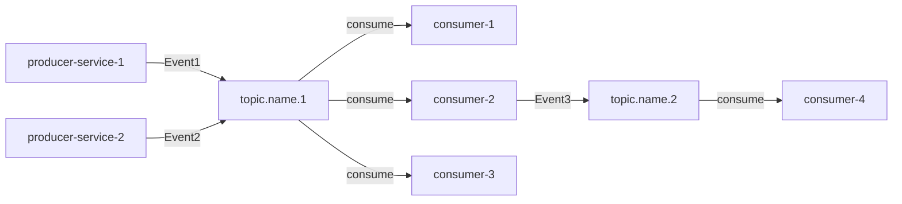
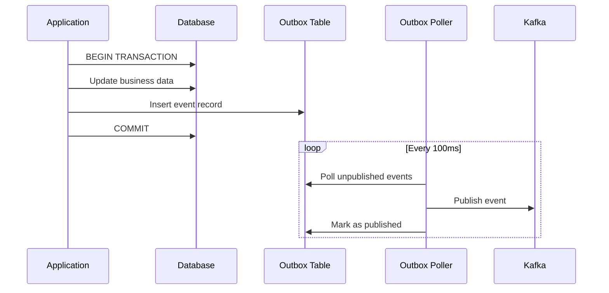

# 6.1 Danh sách sự kiện theo dạng bảng (Event list)

> **Hướng dẫn**: Liệt kê tất cả events trong hệ thống. Catalog này giúp hiểu event flow và dependencies.

## Event Catalog

| Event Name | Producer | Consumer(s) | Trigger | Topic |
|------------|----------|-------------|---------|-------|
| [EventName] | [producer-service] | [consumer-1], [consumer-2] | [What triggers this event] | [kafka.topic.name] |
---

## Events by Topic

### Topic: `[topic.name.1]`

**Purpose**: [Mục đích của topic này]

**Partition Strategy**: [Partition key strategy]

**Retention**: [Retention policy]

| Event Name | Producer | Consumer(s) | Trigger |
|------------|----------|-------------|---------|
| [Event1] | [producer] | [consumers] | [Trigger] |
| [Event2] | [producer] | [consumers] | [Trigger] |


---

## Event Flow Diagram (OPTIONAL)

[Sử dụng Mermaid để visualize event flow]



---

## Event Categories (OPTIONAL)

### Lifecycle Events
[Events tracking entity lifecycle]

| Event Name | Entity | State Transition |
|------------|--------|------------------|
| [Event] | [Entity] | [FROM_STATE] → [TO_STATE] |

### Domain Events
[Business-significant events]

| Event Name | Business Meaning | Triggered By |
|------------|------------------|--------------|
| [Event] | [What happened in business terms] | [Actor/System] |

### Integration Events
[Events for cross-service communication]

| Event Name | Purpose | Source System | Target System(s) |
|------------|---------|---------------|------------------|
| [Event] | [Why this integration] | [Source] | [Targets] |

---

## Event Dependencies

[Map out event chains - Event A triggers Event B triggers Event C]

```
UserRegisteredEvent
    └─> sends → WelcomeEmailEvent
    └─> triggers → ProfileCreationEvent
        └─> sends → ProfileCreatedEvent
```

---

## Event Naming Conventions

### Patterns

✅ **Past tense** (preferred):
- `OrderPlacedEvent`
- `PaymentCompletedEvent`
- `UserRegisteredEvent`

✅ **Noun-based** (for state changes):
- `OrderStatusChangedEvent`
- `InventoryUpdatedEvent`

❌ **Avoid**:
- Present tense: `OrderPlacing`, `PaymentCompleting`
- Command-like: `PlaceOrder`, `CompletePayment`

### Suffixes

- Always end with `Event`
- Be specific: `OrderCreatedEvent` better than `OrderEvent`

---

## Consumer Groups (OPTIONAL)

[Document consumer groups cho Kafka]

| Consumer Group | Service | Purpose | Processing Type |
|----------------|---------|---------|-----------------|
| [group-id] | [service-name] | [What it processes] | [Sync/Async] |

---

## Event Volume & Performance (OPTIONAL)

[Estimated event volumes]

| Event Name | Volume | Peak Rate | Avg Size |
|------------|--------|-----------|----------|
| [Event] | [events/day] | [events/second] | [KB] |

---

## Tips

1. **Consistent naming**: Follow naming convention xuyên suốt
2. **Clear triggers**: Trigger column phải rõ ràng what causes event
3. **All consumers**: List ALL consumers, including future planned ones
4. **Topic organization**: Group related events trong same topic
5. **Partition strategy**: Document partition key cho ordering
6. **Cross-reference**: Link events với state transitions, workflows

---

## Validation Checklist

- [ ] All events có clear, descriptive names
- [ ] Producer và consumers rõ ràng
- [ ] Triggers documented
- [ ] Topic assignments logical
- [ ] Partition strategy defined
- [ ] No orphan events (events không ai consume)
- [ ] Event dependencies mapped


# 6.2 Event schema (JSON)

> **Hướng dẫn**: Định nghĩa JSON schema cho events. Bao gồm base schema và concrete event examples.

## Base Event Schema

```json
{
  "$schema": "http://json-schema.org/draft-07/schema#",
  "title": "[SystemName]BaseEvent",
  "type": "object",
  "required": ["eventId", "eventType", "eventVersion", "timestamp", "source", "correlationId", "payload"],
  "properties": {
    "eventId": {
      "type": "string",
      "format": "uuid",
      "description": "Unique identifier for this event instance"
    },
    "eventType": {
      "type": "string",
      "description": "Type of the event (e.g., OrderPlacedEvent)"
    },
    "eventVersion": {
      "type": "string",
      "pattern": "^\\d+\\.\\d+\\.\\d+$",
      "description": "Semantic version of the event schema (e.g., 1.0.0)"
    },
    "timestamp": {
      "type": "string",
      "format": "date-time",
      "description": "ISO 8601 timestamp when event was created"
    },
    "source": {
      "type": "object",
      "required": ["service", "tenantId"],
      "properties": {
        "service": {
          "type": "string",
          "description": "Service that produced the event"
        },
        "tenantId": {
          "type": "integer",
          "description": "Tenant ID of the producer"
        },
        "tenantType": {
          "type": "string",
          "enum": ["[TYPE_1]", "[TYPE_2]"],
          "description": "Type of tenant (for multi-tenant systems)"
        }
      }
    },
    "correlationId": {
      "type": "string",
      "format": "uuid",
      "description": "ID to correlate related events (e.g., all events in a workflow)"
    },
    "causationId": {
      "type": "string",
      "format": "uuid",
      "description": "ID of the event that caused this event"
    },
    "metadata": {
      "type": "object",
      "description": "Additional metadata (e.g., traceId, spanId, user info)"
    },
    "payload": {
      "type": "object",
      "description": "Event-specific payload"
    }
  }
}
```

---

## Concrete Event 1: [EventName]

### Event Description

**Purpose**: [What this event represents]

**When Published**: [Trigger condition]

**Consumers**: [Who consumes this]

### JSON Example

```json
{
  "eventId": "550e8400-e29b-41d4-a716-446655440000",
  "eventType": "[EventName]",
  "eventVersion": "1.0.0",
  "timestamp": "2024-01-15T10:30:00Z",
  "source": {
    "service": "[service-name]",
    "tenantId": 1001,
    "tenantType": "[TENANT_TYPE]"
  },
  "correlationId": "660e8400-e29b-41d4-a716-446655440001",
  "metadata": {
    "traceId": "abc123",
    "spanId": "def456",
    "userId": 5001
  },
  "payload": {
    "field1": "value1",
    "field2": 12345,
    "field3": {
      "nested": "value"
    },
    "field4": ["array", "of", "values"]
  }
}
```

### Payload Schema

```json
{
  "type": "object",
  "required": ["field1", "field2"],
  "properties": {
    "field1": {
      "type": "string",
      "description": "[Description]"
    },
    "field2": {
      "type": "integer",
      "description": "[Description]"
    },
    "field3": {
      "type": "object",
      "description": "[Description]",
      "properties": {
        "nested": {"type": "string"}
      }
    }
  }
}
```

---

## Concrete Event 2: [AnotherEventName]

[Tương tự như trên]

---

## Event Versioning

### Version History

| Version | Date | Changes | Breaking? |
|---------|------|---------|-----------|
| 1.0.0 | 2024-01-01 | Initial version | N/A |
| 1.1.0 | 2024-02-01 | Added optional field `newField` | No |
| 2.0.0 | 2024-03-01 | Renamed `oldField` to `newFieldName` | Yes |

---

## Schema Evolution Rules

### Backward Compatible Changes (Minor version bump)

✅ **Allowed**:
- Add new optional fields
- Add new enum values (at the end)
- Make required fields optional
- Deprecate fields (but keep them)

### Breaking Changes (Major version bump)

⚠️ **Requires migration**:
- Remove fields
- Rename fields
- Change field types
- Make optional fields required
- Change enum values

### Non-Breaking Examples

```json
// v1.0.0
{
  "orderId": 123,
  "status": "PLACED"
}

// v1.1.0 - Added optional field
{
  "orderId": 123,
  "status": "PLACED",
  "priority": "HIGH"  // New optional field
}
```

### Breaking Examples

```json
// v1.0.0
{
  "orderId": 123,
  "orderStatus": "PLACED"
}

// v2.0.0 - Renamed field (BREAKING)
{
  "orderId": 123,
  "status": "PLACED"  // Renamed from orderStatus
}
```

---

## Common Payload Patterns

### Entity Created Pattern

```json
{
  "payload": {
    "entityId": 123,
    "entityCode": "ENTITY-001",
    "entityData": {
      // Full entity data
    },
    "createdBy": 5001,
    "createdAt": "2024-01-15T10:30:00Z"
  }
}
```

### Entity Updated Pattern

```json
{
  "payload": {
    "entityId": 123,
    "changes": {
      "field1": {
        "oldValue": "old",
        "newValue": "new"
      }
    },
    "updatedBy": 5001,
    "updatedAt": "2024-01-15T10:30:00Z"
  }
}
```

### State Changed Pattern

```json
{
  "payload": {
    "entityId": 123,
    "fromState": "PENDING",
    "toState": "APPROVED",
    "reason": "All checks passed",
    "changedBy": 5001,
    "changedAt": "2024-01-15T10:30:00Z"
  }
}
```

---

## Event Metadata Standards

### Tracing Fields

```json
{
  "metadata": {
    "traceId": "abc123",      // Distributed tracing
    "spanId": "def456",       // Current span
    "parentSpanId": "xyz789"  // Parent span
  }
}
```

### User Context

```json
{
  "metadata": {
    "userId": 5001,
    "userRole": "ADMIN",
    "sessionId": "sess_abc123"
  }
}
```

### Request Context

```json
{
  "metadata": {
    "requestId": "req_abc123",
    "ipAddress": "192.168.1.1",
    "userAgent": "Mozilla/5.0..."
  }
}
```

---

## Tips

1. **Validate JSON**: Use JSON Schema validators
2. **Required vs Optional**: Cẩn thận với required fields - khó change sau này
3. **Timestamps**: Always ISO 8601 format
4. **IDs**: Use UUID for globally unique IDs, integers for local IDs
5. **Enums**: Document all possible values
6. **Nested objects**: Avoid quá deep nesting (max 2-3 levels)
7. **Arrays**: Document if array có thể empty
8. **Null handling**: Rõ ràng về nullable fields

---

## Validation Checklist

- [ ] Base event schema documented
- [ ] All concrete events have examples
- [ ] Payload schemas complete with types and descriptions
- [ ] Required vs optional fields rõ ràng
- [ ] Enums documented
- [ ] Versioning strategy defined
- [ ] Breaking vs non-breaking changes clear
- [ ] JSON validates against schema

---

# 6.3 Eventing rules

> **Hướng dẫn**: Định nghĩa các quy tắc vận hành cho event system: ordering, retry, DLQ, idempotency, etc.

## 6.3.1 Ordering

| Rule | Mô tả | Implementation |
|------|-------|----------------|
| **Partition Key** | [Key dùng để partition events] | [How to extract partition key] |
| **Sequence Number** | [Có sequence number không?] | [How to implement] |
| **Ordering Guarantee** | [Level of ordering guaranteed] | [Technical approach] |

### Partition Strategy Details

```
Topic: pim.registration
Partitions: 10
Partition Key: registrationCode

Event flow:
REG-001 → hash(REG-001) % 10 = partition 3
REG-002 → hash(REG-002) % 10 = partition 7
REG-001 (next event) → partition 3 (same as before)
```

---

## 6.3.2 Schema Evolution

| Version Strategy | Mô tả |
|------------------|-------|
| **Semantic Versioning** | MAJOR.MINOR.PATCH (e.g., 1.0.0) |
| **Backward Compatible** | Thêm fields mới là optional, không xóa fields |
| **Schema Registry** | [Tool/Service dùng để manage schemas] |
| **Deprecation Policy** | [How long before removing deprecated fields] |

**Ví dụ từ SPS-PIM:**

| Version Strategy | Mô tả |
|------------------|-------|
| **Semantic Versioning** | MAJOR.MINOR.PATCH (e.g., 1.0.0) |
| **Backward Compatible** | Thêm fields mới là optional, không xóa fields |
| **Schema Registry** | Sử dụng Confluent Schema Registry để quản lý schemas |
| **Deprecation Policy** | Fields deprecated sẽ được giữ 2 versions trước khi remove |

### Version Evolution Example

```
v1.0.0: Initial schema
v1.1.0: Add optional field "priority" to PIMPublishedEvent
v1.2.0: Add optional field "tags" array
v2.0.0: Breaking change - rename "targetTenantIds" to "eligibleTenants" (requires migration)
```

---

## 6.3.3 Retry Policy

| Level | Max Retries | Backoff Strategy | Initial Delay | Max Delay |
|-------|-------------|------------------|---------------|-----------|
| Consumer | [number] | [Strategy] | [duration] | [duration] |
| Application | [number] | [Strategy] | [duration] | [duration] |
| Workflow (optional) | [number] | [Strategy] | [duration] | [duration] |

### Retry Configuration Example (Java/Spring)

```java
@Bean
public RetryTemplate kafkaRetryTemplate() {
    return RetryTemplate.builder()
        .maxAttempts(3)
        .exponentialBackoff(1000, 2.0, 30000)
        .retryOn(RetriableException.class)
        .build();
}
```

---

## 6.3.4 DLQ (Dead Letter Queue)

| Topic | DLQ Topic | Retention | Alert Threshold |
|-------|-----------|-----------|-----------------|
| [topic-name] | [topic-name].dlq | [duration] | [condition] |

### DLQ Processing Flow

1. Events đến DLQ sau khi exceed max retries
2. Alert được gửi đến operations team
3. Manual review và reprocess hoặc discard
4. Metrics được track: `dlq_messages_total`, `dlq_processing_time`

---

## 6.3.5 Idempotency

| Strategy | Implementation | Mô tả |
|----------|----------------|-------|
| **Event ID** | [Storage method] | [How to check duplicates] |
| **Idempotency Key** | [Key calculation] | [Detect duplicate strategy] |
| **TTL** | [Duration] | [Cleanup strategy] |
| **Database Constraint** | [Constraints] | [Prevent duplicate records] |

### Idempotency Implementation Example (Java)

```java
@Transactional
public void processEvent(PIMEvent event) {
    String idempotencyKey = generateKey(event);

    if (idempotencyStore.exists(idempotencyKey)) {
        log.info("Duplicate event detected: {}", event.getEventId());
        return; // Skip processing
    }

    try {
        // Process event
        processBusinessLogic(event);

        // Mark as processed
        idempotencyStore.save(idempotencyKey, event.getEventId(), Duration.ofHours(24));
    } catch (Exception e) {
        // Don't mark as processed on failure
        throw e;
    }
}
```

---

## 6.3.6 At-least-once vs Exactly-once

| Guarantee | Context | Implementation |
|-----------|---------|----------------|
| **At-least-once** | [Where used] | [How implemented] |
| **Effectively exactly-once** | [Where used] | [How implemented] |
| **Exactly-once** | [Where used] | [How implemented] |

### Transactional Outbox Pattern



---

## 6.3.7 Error Handling

### Non-Retryable Errors

[Errors mà không nên retry - gửi thẳng vào DLQ]

| Error Type | Example | Action |
|------------|---------|--------|
| Validation Error | Invalid payload schema | DLQ + Alert |
| Business Rule Violation | Duplicate registration | DLQ + Alert |
| Authorization Error | Insufficient permissions | DLQ + Alert |

### Retryable Errors

[Errors có thể retry]

| Error Type | Example | Retry Strategy |
|------------|---------|----------------|
| Network Error | Timeout | Exponential backoff, max 3 retries |
| Database Connection | Connection pool exhausted | Exponential backoff, max 5 retries |
| Temporary Unavailable | 503 Service Unavailable | Exponential backoff with jitter |

---

## 6.3.8 Monitoring & Alerting

### Metrics to Track

| Metric | Description | Alert Threshold |
|--------|-------------|-----------------|
| `events_published_total` | Total events published | - |
| `events_consumed_total` | Total events consumed | - |
| `events_failed_total` | Total failed events | > 10/minute |
| `dlq_messages_total` | Messages in DLQ | > threshold per topic |
| `consumer_lag` | Consumer lag (messages) | > 1000 |
| `processing_time` | Event processing time (ms) | p99 > 5000ms |

### Alerts

| Alert | Condition | Severity | Action |
|-------|-----------|----------|--------|
| High DLQ | DLQ messages > threshold | Critical | Page on-call engineer |
| Consumer Lag | Lag > 1000 messages | Warning | Investigate consumer |
| Processing Time | p99 > 5s | Warning | Check performance |
| Failed Events | Failures > 10/min | Critical | Check logs, rollback if needed |

---

## 6.3.9 Security

### Event Content Security

| Aspect | Policy | Implementation |
|--------|--------|----------------|
| **PII Data** | [Encrypt/Mask/Exclude] | [How to handle] |
| **Sensitive Fields** | [List fields] | [Masking strategy] |
| **Encryption** | [At-rest/In-transit] | [Method] |

---

## 6.3.10 Testing Strategy

### Integration Testing

```java
@Test
public void testEventPublishAndConsume() {
    // Publish event
    eventPublisher.publish(new PIMPublishedEvent(...));

    // Wait and verify consumption
    await().atMost(5, SECONDS)
        .until(() -> eventConsumer.hasProcessed(eventId));

    // Verify side effects
    verify(notificationService).sendNotification(...);
}
```

### Contract Testing

- Use schema registry for contract validation
- Consumer-driven contract tests
- Validate event schema compatibility

---

## Tips

1. **Partition key**: Chọn key đảm bảo ordering where needed, balanced distribution
2. **Idempotency**: ALWAYS implement - events có thể duplicate
3. **DLQ monitoring**: Set up alerts, review DLQ regularly
4. **Schema evolution**: Plan for changes, use backward compatible changes
5. **Error classification**: Rõ ràng retryable vs non-retryable
6. **Metrics**: Track everything, alert on anomalies
7. **Testing**: Test event flows end-to-end

---

## Validation Checklist

- [ ] Partition strategy defined và tested
- [ ] Idempotency implemented
- [ ] Retry policy configured appropriately
- [ ] DLQ setup với monitoring
- [ ] Schema versioning strategy clear
- [ ] Error handling classification done
- [ ] Metrics and alerts configured
- [ ] Security policies implemented
- [ ] Integration tests cover event flows

---