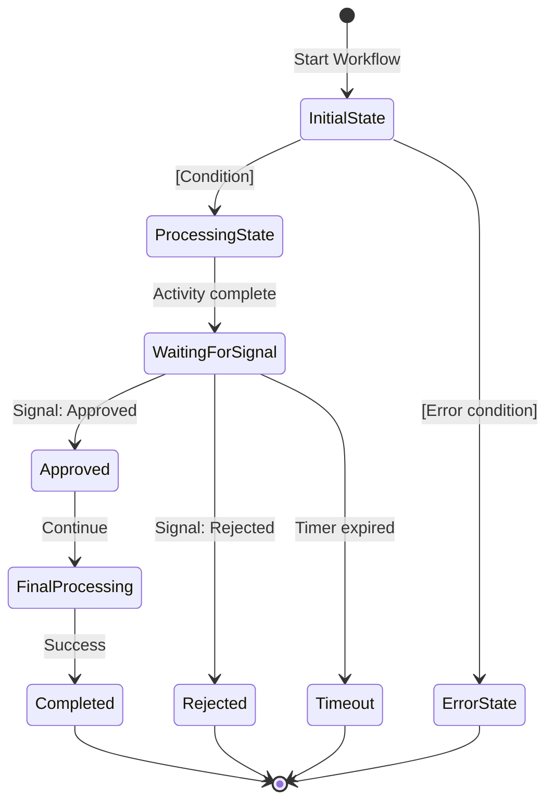
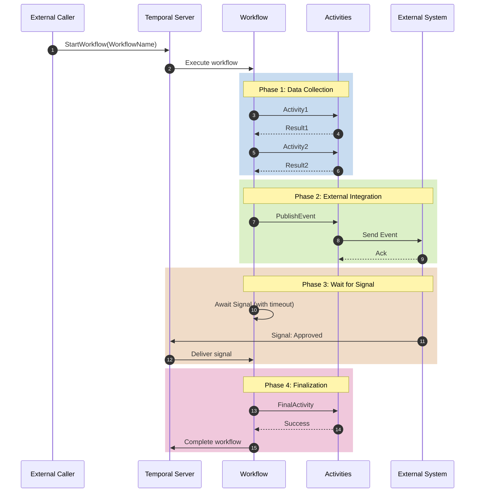
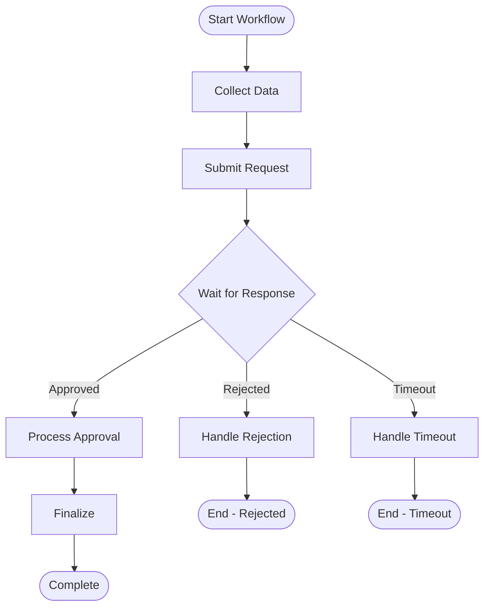

# 7.1 Tóm tắt về Workflow (Workflow summary)

> **Hướng dẫn**: Liệt kê tất cả workflows trong hệ thống. Section này dành cho systems sử dụng workflow orchestration (Temporal, Cadence, AWS Step Functions, etc.)

> **Lưu ý**: Section 7 (Workflow Orchestration) là OPTIONAL. Chỉ cần nếu hệ thống sử dụng workflow orchestration platform.

## Workflow Catalog

| Workflow | Mô tả | Trigger | Owner Service |
|----------|-------|---------|---------------|
| [WorkflowName] | [Mô tả mục đích của workflow] | [Event/Action khởi tạo workflow] | [Service chịu trách nhiệm] |

---

## Workflow Details

### Workflow 1: [WorkflowName]

**Purpose**: [Chi tiết về mục đích]

**Workflow Type**: [Long-running / Short-lived / Recurring]

**Duration**: [Expected duration]

**Trigger**: [What starts this workflow]

**Completion Criteria**: [When is workflow considered complete]

**Failure Scenarios**: [What causes workflow to fail]

**Key Activities**: [List 3-5 main activities]
1. [Activity 1]
2. [Activity 2]
3. [Activity 3]

**Signals**: [Signals this workflow can receive]
- `[SignalName]`: [Purpose]

**Timers**: [Timers used in workflow]
- `[TimerName]`: [Duration] - [Purpose]

**Child Workflows** (optional): [If this workflow spawns child workflows]
- `[ChildWorkflowName]`: [When/Why]

---

### Workflow 2: [AnotherWorkflowName]

[Tương tự như trên]

---

## Workflow Relationships (OPTIONAL)

[Nếu workflows có quan hệ với nhau]

```
ParentWorkflow
├── triggers → ChildWorkflow1
├── triggers → ChildWorkflow2
└── waits for → ExternalWorkflow
```

---

## Workflow State Persistence

[Mô tả cách workflow state được persist]

| Aspect | Implementation |
|--------|----------------|
| **State Storage** | [Where workflow state is stored] |
| **History Retention** | [How long to keep history] |
| **Archival Strategy** | [When/how to archive completed workflows] |

---

## Platform-Specific Info

### Temporal

**Temporal Server**: [URL/endpoint]

**Namespace**: [Namespace name]

**Task Queue**: [Task queue names]
- `[queue-name-1]`: [Purpose]
- `[queue-name-2]`: [Purpose]

**Worker Services**: [Services running workers]
- `[service-name]`: [Workflows/Activities it handles]

---

### AWS Step Functions (Alternative)

**State Machine ARN**: [ARN]

**Execution Role**: [IAM role]

**Triggers**: [EventBridge rules, Lambda, etc.]

---

## Tips

1. **Naming**: Workflow names nên end với "Workflow"
2. **Granularity**: Một workflow cho một business process
3. **Duration**: Document expected duration để set appropriate timeouts
4. **Signals**: Liệt kê tất cả signals workflow có thể receive
5. **Error handling**: Rõ ràng về failure scenarios
6. **Testing**: Có strategy để test workflows

---

# 7.2 Activities

> **Hướng dẫn**: Document tất cả activities được sử dụng trong workflows. Activities là units of work được execute bởi workflows.

## Activities by Workflow

### [WorkflowName] Activities

| Activity | Input | Output | Description | Timeout |
|----------|-------|--------|-------------|---------|
| [ActivityName] | [Input type/params] | [Output type] | [What it does] | [Duration] |
---

## Activity Categories

### Data Collection Activities

[Activities fetch data từ các services khác]

| Activity | Data Source | Purpose |
|----------|-------------|---------|
| [ActivityName] | [service-name] | [Why need this data] |

### Business Logic Activities

[Activities thực hiện business logic]

| Activity | Operation | Side Effects |
|----------|-----------|--------------|
| [ActivityName] | [What it does] | [Side effects] |

### Integration Activities

[Activities tích hợp với external systems]

| Activity | External System | Integration Method |
|----------|----------------|-------------------|
| [ActivityName] | [System name] | [API/Event/SDK] |

### Notification Activities

[Activities gửi notifications]

| Activity | Recipients | Channel |
|----------|-----------|---------|
| [ActivityName] | [Who receives] | [Email/SMS/Push] |

---

## Activity Patterns

### Simple Activity

```java
@ActivityInterface
public interface SimpleActivity {
    String doSomething(String input);
}

@ActivityMethod
public String doSomething(String input) {
    // Implementation
    return result;
}
```

### Activity with Retry

```java
@ActivityInterface
public interface RetryableActivity {
    @ActivityMethod(
        startToCloseTimeout = "30s",
        retryOptions = @RetryOptions(
            initialInterval = "1s",
            maximumInterval = "60s",
            backoffCoefficient = 2.0,
            maximumAttempts = 5
        )
    )
    Result processWithRetry(Input input);
}
```

### Async Activity

```java
@ActivityInterface
public interface AsyncActivity {
    @ActivityMethod(scheduleToCloseTimeout = "5m")
    CompletableFuture<Result> processAsync(Input input);
}
```

---

## Activity Configuration

### Timeouts

| Timeout Type | Description | Recommended Value |
|--------------|-------------|-------------------|
| **ScheduleToClose** | Max time from schedule to completion | 2x expected duration |
| **StartToClose** | Max time from start to completion | Expected duration + buffer |
| **ScheduleToStart** | Max time waiting in queue | Depends on worker capacity |
| **Heartbeat** | Heartbeat interval for long activities | 1/3 of StartToClose |

**Example Configuration:**

```java
ActivityOptions options = ActivityOptions.newBuilder()
    .setStartToCloseTimeout(Duration.ofSeconds(30))
    .setScheduleToCloseTimeout(Duration.ofMinutes(1))
    .setHeartbeatTimeout(Duration.ofSeconds(10))
    .setRetryOptions(retryOptions)
    .build();
```

---

## Activity Retry Configuration

### Retry Policies by Category

| Activity Category | Max Attempts | Initial Interval | Backoff Coefficient | Max Interval | Non-Retryable Errors |
|-------------------|--------------|------------------|---------------------|--------------|----------------------|
| Database Operations | 5 | 1s | 2.0 | 60s | ValidationException, NotFoundException |
| Kafka Publishing | 3 | 500ms | 2.0 | 30s | SerializationException |
| External Service Calls | 3 | 2s | 2.0 | 30s | AuthenticationException |
| Notification | 3 | 1s | 1.5 | 15s | InvalidRecipientException |

---

## Activity Best Practices

### Idempotency

✅ **MUST**: All activities MUST be idempotent
- Same input → Same output, no matter how many times called
- Safe to retry multiple times

❌ **Don't**:
- Increment counters without checking
- Send duplicate emails/notifications without dedup
- Create records without uniqueness check

### Heartbeating

For long-running activities (> 30s):

```java
@Override
public void longRunningActivity(Input input) {
    ActivityExecutionContext context = Activity.getExecutionContext();

    for (int i = 0; i < totalSteps; i++) {
        // Do work
        processStep(i);

        // Heartbeat to show progress
        context.heartbeat(i);
    }
}
```

### Error Handling

```java
@Override
public Result activityWithErrorHandling(Input input) {
    try {
        return processInput(input);
    } catch (ValidationException e) {
        // Non-retryable - throw application failure
        throw ApplicationFailure.newNonRetryableFailure(
            "Invalid input: " + e.getMessage(),
            "ValidationError"
        );
    } catch (TemporaryException e) {
        // Retryable - throw and let retry policy handle
        throw e;
    }
}
```

---

## Activity Testing

### Unit Test

```java
@Test
public void testActivity() {
    MyActivity activity = new MyActivityImpl();
    Result result = activity.doSomething(new Input("test"));
    assertEquals(expected, result);
}
```

### Integration Test

```java
@Test
public void testActivityWithDependencies() {
    TestWorkflowEnvironment testEnv = TestWorkflowEnvironment.newInstance();
    Worker worker = testEnv.newWorker("task-queue");
    worker.registerActivitiesImplementations(new MyActivityImpl(dependencies));

    // Test activity execution
    testEnv.start();
    MyWorkflow workflow = testEnv.getWorkflowClient()
        .newWorkflowStub(MyWorkflow.class);
    workflow.execute();

    testEnv.shutdown();
}
```

---

## Activity Monitoring

### Metrics to Track

| Metric | Description |
|--------|-------------|
| `activity_execution_count` | Total activity executions |
| `activity_execution_duration` | Duration per execution |
| `activity_failure_count` | Failed executions |
| `activity_retry_count` | Number of retries |

---

## Tips

1. **Idempotent**: All activities MUST be idempotent
2. **Stateless**: Activities should not maintain state across calls
3. **Focused**: One activity = one responsibility
4. **Timeouts**: Set appropriate timeouts
5. **Retry logic**: Configure retry for transient errors only
6. **Heartbeat**: Use for long-running activities
7. **Error types**: Distinguish retryable vs non-retryable errors

---

# 7.3 Signals & Timers

> **Hướng dẫn**: Document signals và timers được sử dụng trong workflows.

## 7.3.1 Signals

Signals cho phép external systems gửi messages vào running workflows.

### Signal Catalog

| Signal | Workflow | Sender | Description | Payload |
|--------|----------|--------|-------------|---------|
| [SignalName] | [WorkflowName] | [Who sends] | [Purpose] | [Data structure] |
---

### Signal Details

#### Signal: [SignalName]

**Workflow**: [WorkflowName]

**Sender**: [Service/Actor]

**Purpose**: [Why this signal exists]

**Payload Schema**:
```json
{
  "field1": "value",
  "field2": 123
}
```

**Workflow Behavior**:
- [What workflow does when receives this signal]
- [State changes triggered]
- [Activities executed]

**Example Usage**:
```java
// Sending signal from external service
workflowClient.newWorkflowStub(MyWorkflow.class, workflowId)
    .signalName(payload);
```

---

### Signal Implementation

#### Workflow Side

```java
@WorkflowInterface
public interface MyWorkflow {
    @WorkflowMethod
    void execute();

    @SignalMethod
    void registrationApproved(ApprovalData data);

    @SignalMethod
    void registrationRejected(RejectionData data);
}

@Override
public void execute() {
    // Wait for signal
    Workflow.await(() -> approvalReceived || rejectionReceived);

    if (approvalReceived) {
        // Handle approval
    } else {
        // Handle rejection
    }
}

@Override
public void registrationApproved(ApprovalData data) {
    this.approvalReceived = true;
    this.approvalData = data;
}
```

#### Sender Side

```java
// Get workflow stub
MyWorkflow workflow = workflowClient.newWorkflowStub(
    MyWorkflow.class,
    workflowId
);

// Send signal
workflow.registrationApproved(new ApprovalData(...));
```

---

## 7.3.2 Timers

Timers cho phép workflows wait một khoảng thời gian hoặc until một deadline.

### Timer Catalog

| Timer | Workflow | Duration | Trigger Condition | Action on Expire |
|-------|----------|----------|-------------------|------------------|
| [TimerName] | [WorkflowName] | [Duration/Deadline] | [When timer starts] | [What happens when expires] |

---

### Timer Details

#### Timer: [TimerName]

**Workflow**: [WorkflowName]

**Duration**: [Duration]

**Trigger**: [What starts the timer]

**Expiry Action**: [What happens when timer expires]

**Cancellation**: [Can be cancelled? Under what condition?]

---

### Timer Implementation

#### Simple Timer (Sleep)

```java
@Override
public void execute() {
    // Wait for 1 hour
    Workflow.sleep(Duration.ofHours(1));

    // Continue processing
}
```

#### Timer with Signal Race

```java
@Override
public void execute() {
    // Wait for signal OR timer (whichever comes first)
    boolean signalReceived = Workflow.await(
        Duration.ofDays(7),
        () -> confirmationReceived
    );

    if (signalReceived) {
        // Process confirmation
    } else {
        // Timer expired - auto decline
        autoDecline();
    }
}
```

#### Periodic Timer (Reminders)

```java
@Override
public void execute() {
    int maxReminders = 3;
    for (int i = 0; i < maxReminders; i++) {
        // Wait 1 day
        Workflow.sleep(Duration.ofDays(1));

        // Check if still pending
        if (confirmationReceived) {
            break;
        }

        // Send reminder
        activities.sendReminder(registrationId);
    }

    // Final check after all reminders
    if (!confirmationReceived) {
        autoDecline();
    }
}
```

#### Configurable Timer

```java
@Override
public void execute(RegistrationRequest request) {
    // Get deadline from PIM config
    int deadlineDays = request.getPimScheduleConfig()
        .getConfirmationDeadlineDays();

    // Wait for configured duration
    boolean confirmed = Workflow.await(
        Duration.ofDays(deadlineDays),
        () -> confirmationReceived
    );

    if (!confirmed) {
        autoDecline();
    }
}
```

---

## Signal & Timer Combinations

### Pattern 1: Signal with Timeout

```java
// Wait for approval signal with 7-day timeout
boolean approved = Workflow.await(
    Duration.ofDays(7),
    () -> approvalReceived || rejectionReceived
);

if (!approved && !rejectionReceived) {
    // Timeout - send reminder
    activities.sendReminderToApprover();
}
```

### Pattern 2: Multiple Signals with Timer

```java
// Wait for any of multiple signals OR timeout
Workflow.await(
    Duration.ofHours(24),
    () -> signal1Received || signal2Received || signal3Received
);

if (signal1Received) {
    // Handle signal 1
} else if (signal2Received) {
    // Handle signal 2
} else if (signal3Received) {
    // Handle signal 3
} else {
    // Timeout
    handleTimeout();
}
```

### Pattern 3: Cancellable Timer

```java
CancellationScope timerScope = Workflow.newCancellationScope(() -> {
    Workflow.sleep(Duration.ofDays(7));
    // Timer expired
    sendReminder();
});

timerScope.run();

// Wait for signal
Workflow.await(() -> confirmationReceived);

// Cancel timer if signal received
if (confirmationReceived) {
    timerScope.cancel();
}
```

---

## Best Practices

### Signals

1. **Idempotent**: Signal handlers should be idempotent
2. **State updates**: Signals usually update workflow state
3. **Validation**: Validate signal payload
4. **Ordering**: Be careful with signal ordering - multiple signals may arrive
5. **Signal names**: Use descriptive, action-oriented names

### Timers

1. **Configurable**: Make timer durations configurable, not hardcoded
2. **Business rules**: Timer durations should come from business config
3. **Cancellation**: Consider if timer should be cancellable
4. **Time zones**: Be explicit about timezones
5. **Testing**: Test timer expiry scenarios

---

## Testing

### Testing Signals

```java
@Test
public void testWorkflowWithSignal() {
    TestWorkflowEnvironment testEnv = TestWorkflowEnvironment.newInstance();
    Worker worker = testEnv.newWorker("task-queue");
    worker.registerWorkflowImplementationTypes(MyWorkflowImpl.class);
    testEnv.start();

    MyWorkflow workflow = testEnv.getWorkflowClient()
        .newWorkflowStub(MyWorkflow.class);

    // Start workflow async
    WorkflowClient.start(workflow::execute);

    // Send signal
    workflow.approveRegistration(approvalData);

    // Verify completion
    testEnv.shutdown();
}
```

### Testing Timers

```java
@Test
public void testWorkflowTimerExpiry() {
    TestWorkflowEnvironment testEnv = TestWorkflowEnvironment.newInstance();

    // Start workflow
    MyWorkflow workflow = testEnv.getWorkflowClient()
        .newWorkflowStub(MyWorkflow.class);
    WorkflowClient.start(workflow::execute);

    // Fast-forward time
    testEnv.sleep(Duration.ofDays(7));

    // Verify timeout behavior
    // ...

    testEnv.shutdown();
}
```

---

# 7.4 Retry policies

> **Hướng dẫn**: Document retry policies cho activities và workflows.

## Activity Retry Policies

| Activity Category | Max Attempts | Initial Interval | Backoff Coefficient | Max Interval | Non-Retryable Errors |
|-------------------|--------------|------------------|---------------------|--------------|----------------------|
| [Category] | [number] | [duration] | [coefficient] | [duration] | [Exception types] |
---

## Retry Configuration Examples

### Default Retry Policy

```java
private static final RetryOptions DEFAULT_RETRY_OPTIONS = RetryOptions.newBuilder()
    .setMaximumAttempts(5)
    .setInitialInterval(Duration.ofSeconds(1))
    .setBackoffCoefficient(2.0)
    .setMaximumInterval(Duration.ofMinutes(1))
    .setDoNotRetry(
        ValidationException.class.getName(),
        NotFoundException.class.getName(),
        BusinessRuleViolationException.class.getName()
    )
    .build();
```

### Category-Specific Policies

#### Database Operations

```java
private static final RetryOptions DATABASE_RETRY = RetryOptions.newBuilder()
    .setMaximumAttempts(5)
    .setInitialInterval(Duration.ofSeconds(1))
    .setBackoffCoefficient(2.0)
    .setMaximumInterval(Duration.ofMinutes(1))
    .setDoNotRetry(
        "ValidationException",
        "NotFoundException",
        "ConstraintViolationException"
    )
    .build();

private static final ActivityOptions DATABASE_ACTIVITY = ActivityOptions.newBuilder()
    .setStartToCloseTimeout(Duration.ofSeconds(30))
    .setRetryOptions(DATABASE_RETRY)
    .build();
```

#### External API Calls

```java
private static final RetryOptions API_RETRY = RetryOptions.newBuilder()
    .setMaximumAttempts(3)
    .setInitialInterval(Duration.ofSeconds(2))
    .setBackoffCoefficient(2.0)
    .setMaximumInterval(Duration.ofSeconds(30))
    .setDoNotRetry(
        "AuthenticationException",
        "AuthorizationException",
        "BadRequestException"
    )
    .build();
```

#### Messaging (Kafka/SQS)

```java
private static final RetryOptions MESSAGING_RETRY = RetryOptions.newBuilder()
    .setMaximumAttempts(3)
    .setInitialInterval(Duration.ofMillis(500))
    .setBackoffCoefficient(2.0)
    .setMaximumInterval(Duration.ofSeconds(30))
    .setDoNotRetry(
        "SerializationException",
        "InvalidTopicException"
    )
    .build();
```

---

## Error Classification

### Retryable Errors

[Errors nên retry - transient, temporary issues]

| Error Type | Examples | Retry Strategy |
|------------|----------|----------------|
| Network Errors | Timeout, Connection refused | Exponential backoff |
| Service Unavailable | 503, Throttling | Exponential backoff with jitter |
| Database Connection | Pool exhausted | Exponential backoff |
| Temporary Failure | Cache miss, Temporary unavailable | Linear/Exponential |

### Non-Retryable Errors

[Errors KHÔNG nên retry - permanent failures]

| Error Type | Examples | Action |
|------------|----------|--------|
| Validation Errors | Invalid input, Schema violation | Fail immediately, log for fix |
| Authorization | 401, 403, Permission denied | Fail immediately |
| Not Found | 404, Entity not found | Fail immediately or compensate |
| Business Rule Violation | Duplicate, Constraint violation | Fail immediately |

---

## Backoff Strategies

### Exponential Backoff

```
Attempt 1: initialInterval
Attempt 2: initialInterval * backoffCoefficient
Attempt 3: initialInterval * backoffCoefficient^2
...
Capped at: maximumInterval
```

**Example với initialInterval=1s, coefficient=2.0:**
- Attempt 1: 1s
- Attempt 2: 2s
- Attempt 3: 4s
- Attempt 4: 8s
- Attempt 5: 16s

### Exponential Backoff with Jitter

```java
// Add randomness to avoid thundering herd
private Duration calculateBackoff(int attempt, Duration initial, double coefficient) {
    Duration calculated = initial.multipliedBy((long) Math.pow(coefficient, attempt));
    long jitter = (long) (Math.random() * calculated.toMillis() * 0.1);
    return calculated.plus(Duration.ofMillis(jitter));
}
```

### Linear Backoff

```
Attempt 1: initialInterval
Attempt 2: initialInterval + increment
Attempt 3: initialInterval + 2 * increment
...
```

---

## Workflow-Level Retries

[Nếu cần retry toàn bộ workflow]

```java
@WorkflowInterface
public interface MyWorkflow {
    @WorkflowMethod(
        executionStartToCloseTimeout = "1h",
        retryOptions = @RetryOptions(
            initialInterval = "1m",
            maximumInterval = "10m",
            backoffCoefficient = 2.0,
            maximumAttempts = 3
        )
    )
    void execute();
}
```

**Khi nào dùng workflow-level retry:**
- Transient infrastructure failures
- Temporary platform issues
- Entire workflow can be safely retried

**Khi KHÔNG dùng:**
- Business logic errors
- Partial completion states
- Side effects already occurred

---

## Retry with Compensation

[Khi activities có side effects, cần compensation]

```java
@Override
public void execute() {
    boolean activitySuccess = false;

    try {
        // Try activity
        activities.performAction(data);
        activitySuccess = true;
    } catch (Exception e) {
        // Log error
        logger.error("Activity failed", e);

        // Decide: retry or compensate?
        if (isRetryable(e)) {
            throw e; // Let retry policy handle
        } else {
            // Compensate
            activities.compensateAction(data);
            throw e;
        }
    }
}
```

---

## Retry Metrics & Monitoring

### Metrics to Track

| Metric | Description | Alert Threshold |
|--------|-------------|-----------------|
| `activity_retry_count` | Number of retries per activity | > 2 retries frequent |
| `activity_max_attempts_reached` | Activities hitting max attempts | > 0 |
| `retry_backoff_time_total` | Total time spent in backoff | High values |

### Logging

```java
@Override
public Result activityWithLogging(Input input) {
    ActivityExecutionContext context = Activity.getExecutionContext();
    int attempt = context.getInfo().getAttempt();

    logger.info("Activity attempt {}: {}", attempt, context.getInfo().getActivityId());

    try {
        return processInput(input);
    } catch (Exception e) {
        logger.error("Activity failed on attempt {}: {}", attempt, e.getMessage());
        throw e;
    }
}
```

---

## Best Practices

1. **Conservative max attempts**: Don't retry forever - set reasonable limits
2. **Classify errors properly**: Clear distinction between retryable vs non-retryable
3. **Backoff strategy**: Exponential with jitter prevents thundering herd
4. **Idempotency**: REQUIRED for retries to be safe
5. **Monitoring**: Track retry metrics and alert on anomalies
6. **Timeouts**: Set timeouts shorter than retry intervals
7. **Documentation**: Document retry behavior in activity docs

---

## Testing Retry Logic

### Test Transient Failure

```java
@Test
public void testActivityRetryOnTransientFailure() {
    AtomicInteger attempt = new AtomicInteger(0);

    // Mock activity that fails first 2 times
    when(mockActivity.process(any()))
        .thenAnswer(invocation -> {
            if (attempt.incrementAndGet() < 3) {
                throw new TransientException("Temporary failure");
            }
            return successResult;
        });

    // Execute workflow
    workflow.execute();

    // Verify retry happened
    verify(mockActivity, times(3)).process(any());
}
```

### Test Non-Retryable Failure

```java
@Test(expected = ValidationException.class)
public void testActivityFailsImmediatelyOnValidationError() {
    when(mockActivity.process(any()))
        .thenThrow(new ValidationException("Invalid input"));

    workflow.execute();

    // Should fail immediately, not retry
    verify(mockActivity, times(1)).process(any());
}
```

---

# 7.5 Workflow diagram (Mermaid)

> **Hướng dẫn**: Visualize workflows bằng state diagrams và sequence diagrams.

## 7.5.1 Workflow State Diagram

Mô tả các states và transitions của workflow.



---

## 7.5.2 Workflow Sequence Diagram

Mô tả chi tiết interaction giữa workflow, activities, và external systems.



---

## 7.5.3 Workflow Flowchart (Alternative)

[Nếu prefer flowchart style]



---

## Diagram Best Practices

### State Diagram

✅ **Use for**:
- High-level workflow states
- State transitions and signals
- Terminal states

✅ **Tips**:
- Keep states at logical level (not too granular)
- Show major decision points
- Include timeout transitions
- Mark terminal states clearly

### Sequence Diagram

✅ **Use for**:
- Detailed activity execution flow
- Inter-system communication
- Phase-based workflows

✅ **Tips**:
- Group related steps with `rect` (colored boxes)
- Use autonumber for step tracking
- Show async vs sync clearly
- Include external system interactions

### Flowchart

✅ **Use for**:
- Decision-heavy workflows
- Alternative paths visualization
- Simpler workflows

---

## Combining Diagrams

**Recommended approach:**
1. **State Diagram**: High-level workflow lifecycle
2. **Sequence Diagram**: Detailed execution flow with phases
3. **Flowchart** (optional): Decision logic detail

---

## Tools & Validation

### Mermaid Live Editor

Test diagrams at: https://mermaid.live/

### VS Code Extensions

- Mermaid Preview
- Markdown Preview Mermaid Support

### Validation Checklist

- [ ] All states/steps có clear labels
- [ ] Transitions có labels (signals, conditions, timers)
- [ ] Terminal states clearly marked
- [ ] Phased execution shown (if applicable)
- [ ] Diagram renders correctly
- [ ] Consistent với workflow implementation

---

## Resources

- [Mermaid State Diagram](https://mermaid.js.org/syntax/stateDiagram.html)
- [Mermaid Sequence Diagram](https://mermaid.js.org/syntax/sequenceDiagram.html)
- [Mermaid Flowchart](https://mermaid.js.org/syntax/flowchart.html)
