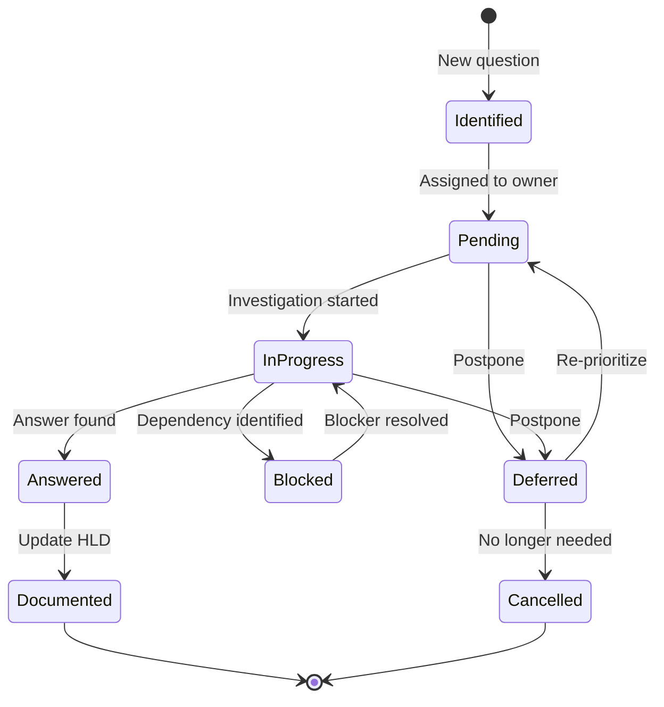

# A. Glossary

> **Hướng dẫn**: Định nghĩa tất cả thuật ngữ quan trọng trong tài liệu. Giúp readers hiểu terminology.

## Thuật ngữ

| Thuật ngữ | Định nghĩa |
|-----------|------------|
| **[THUẬT_NGỮ]** | [Định nghĩa rõ ràng, ngắn gọn] |

---

## Phân loại Glossary (OPTIONAL)

### Business Terms

[Thuật ngữ nghiệp vụ]

| Term | Definition |
|------|------------|
| [Business term] | [Business definition] |

### Technical Terms

[Thuật ngữ kỹ thuật]

| Term | Definition |
|------|------------|
| [Technical term] | [Technical definition] |

### Acronyms

[Các từ viết tắt]

| Acronym | Full Form | Definition |
|---------|-----------|------------|
| [ABC] | [Full name] | [What it means] |

---

## Domain-Specific Terms

[Thuật ngữ đặc thù của domain]

### Education Domain

| Term | Definition |
|------|------------|
| [Term] | [Definition] |

### E-commerce Domain

| Term | Definition |
|------|------------|
| [Term] | [Definition] |

### Financial Domain

| Term | Definition |
|------|------------|
| [Term] | [Definition] |

---

## State/Status Values

[Các giá trị state quan trọng]

| State | Entity | Meaning |
|-------|--------|---------|
| [STATE_VALUE] | [Entity name] | [What this state means] |

---

## Cross-References

[Thuật ngữ được định nghĩa ở nơi khác]

| Term | See | Section |
|------|-----|---------|
| [Term] | [Related term] | [Section number] |

---

## Tips

1. **Alphabetical order**: Sắp xếp theo thứ tự ABC để dễ tìm
2. **Concise definitions**: 1-2 câu, rõ ràng
3. **Context**: Provide context nếu thuật ngữ có multiple meanings
4. **Consistency**: Dùng thuật ngữ nhất quán xuyên suốt tài liệu
5. **Cross-reference**: Link đến sections có chi tiết hơn
6. **Avoid jargon**: Giải thích bằng ngôn ngữ đơn giản

---

## When to Add Terms

✅ **Add to glossary**:
- Domain-specific terms
- Acronyms
- Terms với special meaning trong system này
- Terms xuất hiện nhiều lần
- Technical terms không phổ biến

❌ **Don't add**:
- Common technical terms (API, Database, etc.)
- Self-explanatory terms
- Terms chỉ xuất hiện 1 lần

---

## Validation Checklist

- [ ] All major business terms defined
- [ ] All acronyms explained
- [ ] State values documented
- [ ] Domain terminology clear
- [ ] Alphabetical order (or logical grouping)
- [ ] Definitions concise and clear
- [ ] Cross-references accurate

# B. Assumptions

> **Hướng dẫn**: Document tất cả assumptions được make trong thiết kế. Rất quan trọng để avoid misunderstandings và plan for changes.

## Danh sách Assumptions

| ID | Assumption | Impact nếu sai |
|----|------------|----------------|
| A[n] | [Assumption statement] | [What happens if this assumption is wrong] |

---

## Phân loại Assumptions

### Infrastructure Assumptions

[Assumptions về infrastructure, platform, services]

| ID | Assumption | Current State | Impact if Wrong |
|----|------------|---------------|-----------------|
| [I-n] | [Infrastructure assumption] | [Is it true?] | [Impact] |

**Example:**

| ID | Assumption | Current State | Impact if Wrong |
|----|------------|---------------|-----------------|
| I1 | Temporal server available with 99.9% SLA | ✅ True | Need to implement fallback mechanism |
| I2 | Kafka cluster can handle 1000 msg/sec | ⚠️ To verify | Need to provision larger cluster |
| I3 | PostgreSQL supports JSONB queries efficiently | ✅ True | Need to redesign schema |

---

### Business Assumptions

[Assumptions về business logic, rules, processes]

| ID | Assumption | Validation Status | Impact if Wrong |
|----|------------|-------------------|-----------------|
| [B-n] | [Business assumption] | [Validated/Pending] | [Impact] |

**Example:**

| ID | Assumption | Validation Status | Impact if Wrong |
|----|------------|-------------------|-----------------|
| B1 | Teachers can register for multiple PIMs simultaneously | ✅ Validated with PO | No change needed |
| B2 | Schools review registrations within 7 days | ⚠️ To validate | May need longer timeout |
| B3 | Maximum 3 negotiation rounds allowed | 📝 Pending PO confirmation | Update workflow configuration |

---

### Technical Assumptions

[Assumptions về technical decisions, APIs, integrations]

| ID | Assumption | Owner Team | Impact if Wrong |
|----|------------|------------|-----------------|
| [T-n] | [Technical assumption] | [Team] | [Impact] |

**Example:**

| ID | Assumption | Owner Team | Impact if Wrong |
|----|------------|------------|-----------------|
| T1 | Teacher profile API returns data within 500ms | TeMS Team | Need caching layer |
| T2 | Course data is immutable after publication | LMS Team | Need versioning strategy |
| T3 | Event ordering guaranteed within same partition | Platform Team | Need sequence numbers |

---

### Data Assumptions

[Assumptions về data, volumes, growth]

| ID | Assumption | Estimated Value | Impact if Wrong |
|----|------------|-----------------|-----------------|
| [D-n] | [Data assumption] | [Value] | [Impact] |

**Example:**

| ID | Assumption | Estimated Value | Impact if Wrong |
|----|------------|-----------------|-----------------|
| D1 | Max 1000 PIMs per school per year | 1000 | Need database partitioning |
| D2 | Average 10 registrations per PIM | 10 | Review capacity planning |
| D3 | Event retention needs only 30 days | 30 days | Increase Kafka retention |

---

### Integration Assumptions

[Assumptions về external systems, APIs, contracts]

| ID | Assumption | External System | Impact if Wrong |
|----|------------|-----------------|-----------------|
| [E-n] | [Integration assumption] | [System name] | [Impact] |

---

## Assumption Status Tracking

| Status | Meaning | Action Required |
|--------|---------|-----------------|
| ✅ Validated | Confirmed as true | None - documented for reference |
| ⚠️ To Verify | Need to confirm | Schedule verification task |
| 📝 Pending | Waiting for info/decision | Follow up with stakeholders |
| ❌ Invalid | Proven wrong | Update design accordingly |
| 🔄 Changed | Was true, now changed | Assess impact and adapt |

---

## Assumption Risks

[Assumptions with high risk if wrong]

| Assumption ID | Risk Level | Mitigation Strategy |
|---------------|------------|---------------------|
| [A-n] | High/Medium/Low | [How to mitigate] |

**Example:**

| Assumption ID | Risk Level | Mitigation Strategy |
|---------------|------------|---------------------|
| A4 (POOLED model) | High | Design with abstraction layer for future SILO migration |
| A3 (Partnership exists) | Medium | Add validation check, graceful error handling |
| I2 (Kafka capacity) | Medium | Monitor metrics, plan for scaling |

---

## Validating Assumptions

### Checklist

Before finalizing design:

- [ ] All assumptions identified và documented
- [ ] High-risk assumptions validated
- [ ] Impact analysis complete
- [ ] Mitigation strategies defined
- [ ] Stakeholders reviewed assumptions
- [ ] Technical assumptions verified with owning teams
- [ ] Business assumptions confirmed với PO/BA

### Validation Methods

| Method | Use For |
|--------|---------|
| **Spike/POC** | Technical feasibility |
| **Data analysis** | Volume/performance assumptions |
| **Stakeholder interview** | Business rules/processes |
| **API documentation review** | Integration contracts |
| **Load testing** | Capacity/performance |

---

## Updating Assumptions

**When to update:**
- New information discovered
- Requirements change
- Technical constraints change
- External dependencies change

**Process:**
1. Update assumption status
2. Assess impact on design
3. Notify stakeholders
4. Update affected sections
5. Re-validate dependent assumptions

---

## Tips

1. **Be explicit**: Don't leave implicit assumptions undocumented
2. **Challenge assumptions**: Question each one
3. **Validate early**: Especially high-risk ones
4. **Track status**: Keep assumption status up-to-date
5. **Impact analysis**: Always document impact if wrong
6. **Mitigation**: Have plan B for risky assumptions

---

## Red Flags

⚠️ **Warning signs**:
- "We assume this will work" - Need validation
- "Probably the API supports this" - Verify contracts
- "Should be fast enough" - Need benchmarks
- "They said they'll have it ready" - Get commitment
- "Similar to our other system" - Verify differences

---

## Resources

- Link to related design decisions
- Link to ADRs (Architecture Decision Records)
- Contact info for assumption validation

# C. Open Questions

> **Hướng dẫn**: Track tất cả câu hỏi chưa có đáp án. CRITICAL để đảm bảo không bỏ sót decisions quan trọng trước khi implement.

## Danh sách Open Questions

| ID | Question | Status | Answer |
|----|----------|--------|--------|
| Q[n] | [Question statement] | [Pending/Answered/Deferred] | [Answer or "TBD"] |
---

## Phân loại Questions

### Critical Questions (Blocking)

[Questions PHẢI resolve trước khi implement]

| ID | Question | Owner | Target Date | Blocker For |
|----|----------|-------|-------------|-------------|
| [CQ-n] | [Critical question] | [Who should answer] | [Date] | [What it blocks] |

**Status indicators:**
- 🔴 **Blocking**: Must resolve immediately
- 🟡 **Important**: Should resolve soon
- 🟢 **Nice to have**: Can defer

**Example:**

| ID | Question | Owner | Target Date | Blocker For |
|----|----------|-------|-------------|-------------|
| CQ1 | How to handle payment failures? | Product Owner | 2024-01-20 | 🔴 Payment integration design |
| CQ2 | Can users cancel after confirmation? | Business Analyst | 2024-01-25 | 🟡 Cancellation workflow |

---

### Business Logic Questions

[Questions về business rules, processes]

| ID | Question | Department | Priority | Status |
|----|----------|-----------|----------|--------|
| [BQ-n] | [Business question] | [Which dept] | [High/Medium/Low] | [Status] |

**Example:**

| ID | Question | Department | Priority | Status |
|----|----------|-----------|----------|--------|
| BQ1 | What is the refund policy? | Finance | High | Pending |
| BQ2 | Can teachers work with competitors? | Legal | Medium | Answered: No |
| BQ3 | Minimum qualifications for teachers? | HR/Academics | High | Answered |

---

### Technical Questions

[Questions về technical implementation]

| ID | Question | Team | Priority | Status |
|----|----------|------|----------|--------|
| [TQ-n] | [Technical question] | [Team] | [Priority] | [Status] |

**Example:**

| ID | Question | Team | Priority | Status |
|----|----------|------|----------|--------|
| TQ1 | Which database for Temporal? | Platform | High | Answered: PostgreSQL |
| TQ2 | Kafka partition strategy? | Platform | High | Answered: By registrationCode |
| TQ3 | Need Redis for caching? | Backend | Medium | Pending evaluation |

---

### Integration Questions

[Questions về external systems, APIs]

| ID | Question | External Team | Status | Impact |
|----|----------|--------------|--------|--------|
| [IQ-n] | [Integration question] | [Team] | [Status] | [Impact if not resolved] |

**Example:**

| ID | Question | External Team | Status | Impact |
|----|----------|--------------|--------|--------|
| IQ1 | Teacher API rate limits? | TeMS Team | Pending | May need request batching |
| IQ2 | Course data update frequency? | LMS Team | Answered: Real-time | Use event-driven updates |

---

### Performance/Scalability Questions

[Questions về performance, capacity]

| ID | Question | Measurement Needed | Status |
|----|----------|-------------------|--------|
| [PQ-n] | [Performance question] | [How to measure] | [Status] |

**Example:**

| ID | Question | Measurement Needed | Status |
|----|----------|-------------------|--------|
| PQ1 | Expected load (requests/sec)? | Load test | Answered: 100 req/sec peak |
| PQ2 | Database query performance OK? | Query profiling | Pending benchmarks |

---

### Security/Compliance Questions

[Questions về security, privacy, compliance]

| ID | Question | Compliance Area | Priority | Status |
|----|----------|----------------|----------|--------|
| [SQ-n] | [Security question] | [GDPR/SOC2/etc] | [Priority] | [Status] |

---

## Question Status Guide

### Status Values

| Status | Meaning | Action |
|--------|---------|--------|
| **Pending** | Waiting for answer | Follow up with owner |
| **In Progress** | Being investigated | Monitor progress |
| **Answered** | Question resolved | Document answer |
| **Deferred** | Postponed to later phase | Document reason and target phase |
| **Blocked** | Waiting on dependency | Identify blocker |
| **Cancelled** | No longer relevant | Document why |

---

## Answer Documentation Template

When answering a question:

```markdown
**Question**: [Original question]

**Answer**: [The answer]

**Rationale**: [Why this answer]

**Decision Maker**: [Who decided]

**Date**: [When decided]

**Impact**:
- [Impact on design/implementation]
- [Follow-up actions needed]

**References**: [Links to meetings, docs, ADRs]
```

**Example:**

```markdown
**Question**: Giới hạn số vòng negotiation là bao nhiêu?

**Answer**: 3 vòng

**Rationale**: Balance giữa flexibility và efficiency. Quá nhiều vòng sẽ delay process.

**Decision Maker**: Product Owner (Jane Doe)

**Date**: 2024-01-15

**Impact**:
- Add MAX_NEGOTIATION_ROUNDS = 3 to workflow config
- Update workflow logic to enforce limit
- Add to business rules documentation

**References**: Meeting notes 2024-01-15, Slack thread #product-decisions
```

---

## Question Tracking Workflow



---

## Meeting Notes Template

[Track questions discussed in meetings]

### Meeting: [Meeting Name] - [Date]

**Attendees**: [Names]

**Questions Discussed**:

| Question ID | Discussion Summary | Decision | Follow-up |
|-------------|-------------------|----------|-----------|
| Q1 | [Summary] | [Decision made] | [Actions] |

---

## Tips

1. **Don't be shy**: Document ALL questions, even "dumb" ones
2. **Track diligently**: Update status regularly
3. **Assign owners**: Every question needs an owner
4. **Set deadlines**: Especially for blocking questions
5. **Document answers**: Don't just close - record the answer
6. **Review regularly**: Weekly review in team meetings
7. **Link to decisions**: Connect answers to ADRs or design docs

---

## Red Flags

⚠️ **Warning signs**:
- Too many "Pending" questions - Not enough progress
- Critical questions unanswered near implementation - Risk of rework
- Same questions recurring - Need better documentation
- Questions without owners - Will be forgotten
- Old questions still open - Need resolution or deferral

---

## Before Implementation Checklist

- [ ] All CRITICAL questions answered
- [ ] All HIGH priority questions resolved
- [ ] Blocking questions have clear owners and deadlines
- [ ] Deferred questions documented with rationale
- [ ] Answers incorporated into HLD
- [ ] Stakeholders aligned on answers
- [ ] Technical feasibility validated

---

## Resources

- Meeting schedules and attendees
- Contact information for question owners
- Links to decision-making forums (Slack channels, etc.)
- ADR (Architecture Decision Record) repository
